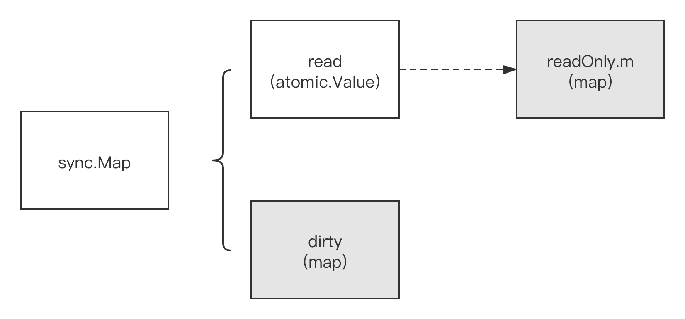
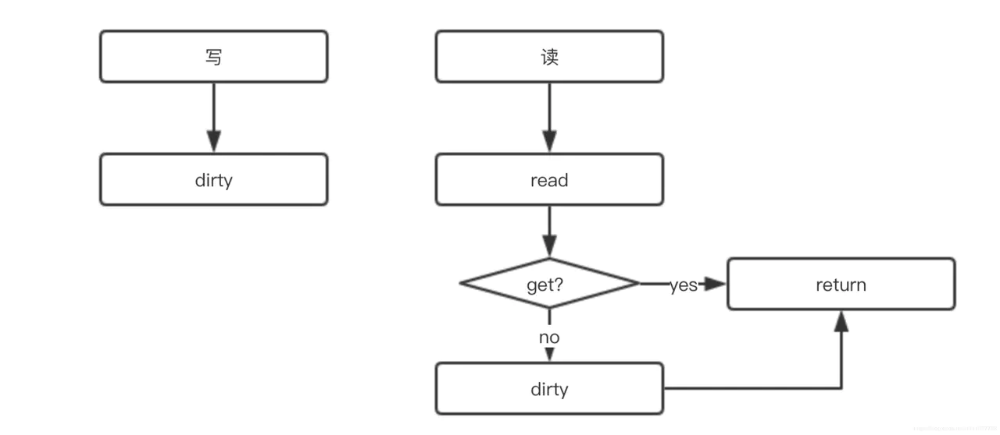
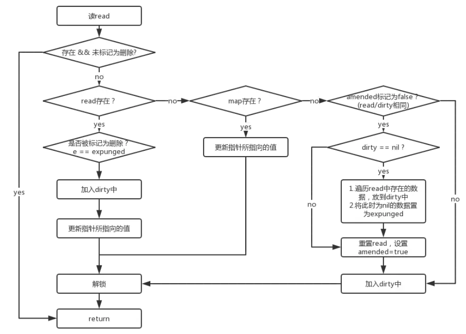
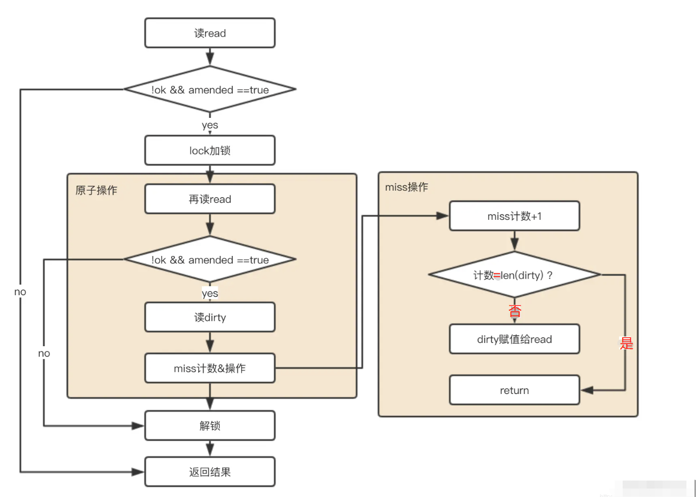

# 前言

在 golang 开发过程中,很多时候用到了协程,并想要在协程处理任务之后,把结果聚合到 map 中,但是 go 的原生 map 是非线程安全的,所以方案就有
- map+mutex,写入前加锁,写完后释放锁 (在读多写少的场景下,锁的粒度太大存在效率问题:影响其他的元素操作)
- sync.map (减少加锁时间,读写分离,降低锁粒度,空间换时间,降低影响范围)

# 数据结构
```go
// sync.Map的核心数据结构
type Map struct {
    mu Mutex                        // 对 dirty 加锁保护，线程安全
    read atomic.Value                 // readOnly 只读的 map，充当缓存层
    dirty map[interface{}]*entry     // 负责写操作的 map，当misses = len(dirty)时，将其赋值给read
    misses int                        // 未命中 read 时的累加计数，每次+1
}

// 上面read字段的数据结构
type readOnly struct {
    m  map[interface{}]*entry // 
    amended bool // Map.dirty的数据和这里read中 m 的数据不一样时，为true
}

// 上面m字段中的entry类型
type entry struct {
    // 可见value是个指针类型，虽然read和dirty存在冗余情况（amended=false），但是由于是指针类型，存储的空间应该不是问题
    p unsafe.Pointer // *interface{}
}
```

## sync.Map 原理分析



数据结构中的read 好比整个sync.Map的一个“高速缓存”，当goroutine从sync.Map中读数据时，sync.Map会首先查看read这个缓存层是否有用户需要的数据（key是否命中），
如果有（key命中）， 则通过原子操作将数据读取并返回，这是sync.Map推荐的快路径(fast path)，也是sync.Map的读性能极高的原因。

- 写操作：直接写入dirty（负责写的map）
- 读操作：先读read（负责读操作的map），没有再读dirty（负责写操作的map）




1. 通过 read 和 dirty 两个字段实现数据的读写分离，读的数据存在只读字段 read 上，将最新写入的数据则存在 dirty 字段上
2. 读取时会先查询 read，不存在再查询 dirty，写入时则只写入 dirty
3. 读取 read 并不需要加锁，而读或写 dirty 则需要加锁
4. 另外有 misses 字段来统计 read 被穿透的次数（被穿透指需要读 dirty 的情况），超过一定次数则将 dirty 数据更新到 read 中（触发条件：misses=len(dirty)）

## 优缺点

- 优点：Go官方所出；通过读写分离，降低锁时间来提高效率；
- 缺点：不适用于大量写的场景，这样会导致 read map 读不到数据而进一步加锁读取，同时dirty map也会一直晋升为read map，整体性能较差，甚至没有单纯的 map+mutex 高。
- 适用场景：读多写少的场景。

## 新增/修改过程

新增和修改操作比较复杂,需要先看下 read 中值的状态,然后再看 dirty 中的状态, 在 dirty == nil 的时候,还涉及搬迁过程



```go
func (m *Map) Store(key, value interface{}) {
    // 如果m.read存在这个key，并且没有被标记删除，则尝试更新。
    read, _ := m.read.Load().(readOnly)
    if e, ok := read.m[key]; ok && e.tryStore(&value) {
        return
    }
    
    // 如果read不存在或者已经被标记删除
    m.mu.Lock()
    read, _ = m.read.Load().(readOnly)
   
    if e, ok := read.m[key]; ok { // read 存在该key
    // 如果read值域中entry已删除且被标记为expunge，则表明dirty没有key，可添加入dirty，并更新entry
        if e.unexpungeLocked() { 
            // 加入dirty中，这里是指针
            m.dirty[key] = e
        }
        // 更新value值
        e.storeLocked(&value) 
        
    } else if e, ok := m.dirty[key]; ok { // dirty 存在该 key，更新
        e.storeLocked(&value)
        
    } else { // read 和 dirty都没有
        // 如果read与dirty相同，则触发一次dirty刷新（因为当read重置的时候，dirty已置为 nil了）
        if !read.amended { 
            // 将read中未删除的数据加入到dirty中
            m.dirtyLocked() 
            // amended标记为read与dirty不相同，因为后面即将加入新数据。
            m.read.Store(readOnly{m: read.m, amended: true})
        }
        m.dirty[key] = newEntry(value) 
    }
    m.mu.Unlock()
}

// 将read中未删除的数据加入到 dirty中
func (m *Map) dirtyLocked() {
    if m.dirty != nil {
        return
    }
    
    read, _ := m.read.Load().(readOnly)
    m.dirty = make(map[interface{}]*entry, len(read.m))
    
    // 遍历read。
    for k, e := range read.m {
        // 通过此次操作，dirty中的元素都是未被删除的，可见标记为expunged的元素不在dirty中！！！
        if !e.tryExpungeLocked() {
            m.dirty[k] = e
        }
    }
}

// 判断entry是否被标记删除，并且将标记为nil的entry更新标记为expunge
func (e *entry) tryExpungeLocked() (isExpunged bool) {
    p := atomic.LoadPointer(&e.p)
    
    for p == nil {
        // 将已经删除标记为nil的数据标记为expunged
        if atomic.CompareAndSwapPointer(&e.p, nil, expunged) {
            return true
        }
        p = atomic.LoadPointer(&e.p)
    }
    return p == expunged
}

// 对entry尝试更新 （原子cas操作）
func (e *entry) tryStore(i *interface{}) bool {
    p := atomic.LoadPointer(&e.p)
    if p == expunged {
        return false
    }
    for {
        if atomic.CompareAndSwapPointer(&e.p, p, unsafe.Pointer(i)) {
            return true
        }
        p = atomic.LoadPointer(&e.p)
        if p == expunged {
            return false
        }
    }
}

// read里 将标记为expunge的更新为nil
func (e *entry) unexpungeLocked() (wasExpunged bool) {
    return atomic.CompareAndSwapPointer(&e.p, expunged, nil)
}

// 更新entry
func (e *entry) storeLocked(i *interface{}) {
    atomic.StorePointer(&e.p, unsafe.Pointer(i))
}

```


## 查询过程

>图片是网上找的,过程其实可以看源码,核心就是双重加锁 + miss 计数后替换



## 删除过程

删除过程氛围两部,第一步是直接删除 dirty 里面的数据,第二步其实是软删除,先标记read 里面的值为 nil,后删除

# 总结

通过阅读源码我们发现sync.Map是通过冗余的两个数据结构(read、dirty),实现性能的提升。为了提升性能，load、delete、store等操作尽量使用只读的read；
为了提高read的key击中概率，采用动态调整，将dirty数据提升为read；对于数据的删除，采用延迟标记删除法，只有在提升dirty的时候才删除。