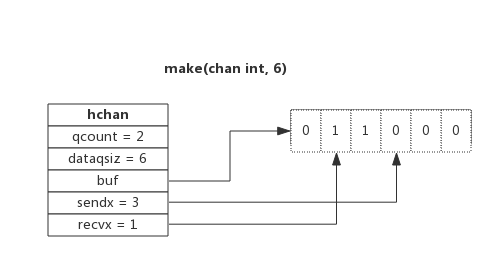
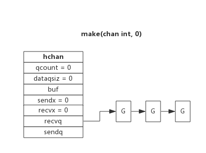
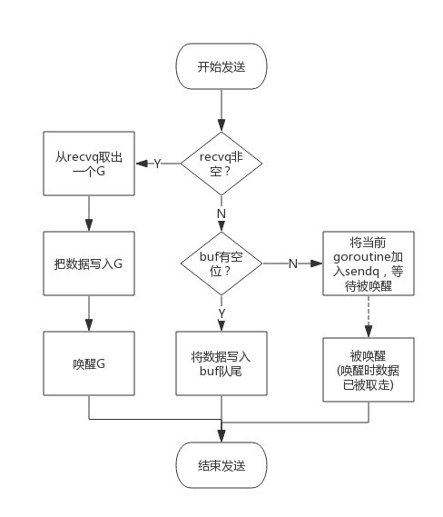
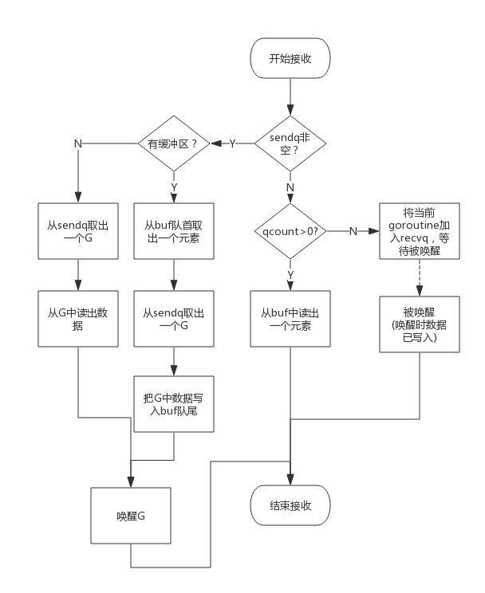

## 前言

>本文图片全部来自于 [Go专家编程](https://rainbowmango.gitbook.io/) 一书，非常幸运能发现这本书

"不要通过共享内存来通信，而应该通过通信来共享内存"

风靡golang社区的一句话，channel就是在Go语言里面用于goroutine间的通信，这篇文章从源码的角度分析chan
## channel的数据结构

源码在src/runtime/chan.go中定义了channel的数据结构
	
	type hchan struct {
        qcount   uint           // 当前队列中剩余元素个数
        dataqsiz uint           // 环形队列长度，即克存放元素个数
        buf      unsafe.Pointer // 环形队列的指针
        elemsize uint16			// 元素大小
        closed   uint32			// 队列是否关闭标示
        elemtype *_type 		// 元素类型
        sendx    uint   		// 队列下标，元素写入时存放的位置
        recvx    uint   		// 队列下标，元素读出时的位置
        recvq    waitq  		// 等待读消息的goroutine队列
        sendq    waitq  		// 等待写消息的goroutine队列
        lock mutex				// 互斥锁，chan对外表现是线程安全的
    }

### 环形队列

channel内部使用一个环形队列来作为缓冲区，队列的长度是make chan的时候指定的

用一个图片表示一个缓冲区大小为6的channel

1. qcount 表示现在chan里面有两个元素
2. dataqsiz = 6 表示队列缓冲区大小为6，克放6个元素
3. buf 是指向队列的内存
4. sendx = 3 表示下一个写入数据存储的位置
5. recvx = 1 表示下一个读出数据的位置

### 等待队列

从channel中读取数据，如果chan没有缓冲区或者缓冲区为空，当前goroutine会阻塞，向channel中写数据，如果chan没有缓冲区或者缓冲区已满，当前goroutine也会阻塞

被阻塞的goroutine会挂在channel的等待队列中

下图展示了一个没有缓冲区的channel，有等待队列的情况

1. 因为读阻塞的goroutine会被向channel中写数据的goroutine所唤醒
2. 因为写阻塞的goroutine会被从channel中读数据的goroutine所唤醒

**一般情况下，recvq和sendq至少一个会为空，除了使用select，一个case从channel中读，另一个case向同一个channel里面写**

### 类型信息

elemtype表示元素的类型，elemsize表示元素的大小，用于在buf中查询元素的位置

### 锁

一个channel只能允许一个goroutine进行读写，后面讲解锁的文章会说明

## channel读写

### channel的创建
  
  创建channel也就是初始化hchan结构的过程，其中类型和缓冲区长度由make的时候指定，buf的大小与元素大小和类型共同决定
  
  下面是创建hchan时候的伪代码
  
  	func makechan(t *chantype,size int)*chan{
      	var c *hchan
          c = new(hchan)
          c.buf = malloc(sizeof(元素类型)*size)
          c.elemtype = 元素类型
          c.elemsize = 元素类型大小
          c.dataqsiz = size
      }
      
### 向channel写入数据

1. 首先判断recvq队列是否为空
   1. 如果不为空，则代表没有缓冲区或者缓冲区没有数据
	  1. 从recvq队列中取出一个goroutine，把数据写入到这个goroutine中，然后唤醒这个goroutine，结束发送
   2. 如果队列为空
	  1. 有缓冲区并且有位置，则把数据写入到缓冲区，结束发送
      2. 有缓冲区无位置和没有缓冲区，则把goroutine挂到sendq队列中，等待被唤醒
    
大概流程如图所示

### 从channel中读取数据

1. 首先判断sendq队列是否为空
    1. 队列不为空，则说明缓冲区已满或者没有缓冲区
	   1. 有缓冲区的话，就从buf头部读取数据，然后从sendq队列取出一个goroutine，把这个goroutine的数据额写入buf队尾，然后唤醒goroutine
       2. 没有缓冲区对话，直接从sendq队列取出一个goroutine，然后把这个goroutine数据写入当前协程，然后唤醒goroutine
    2. 如果队列为空
	   1. 有缓冲区的话并且缓冲区有数据的话，即qcount > 0 ，直接读取buf头部的数据,然后结束
       2. 没有缓冲区或者缓冲区没有数据的话，就把当前goroutine挂在recvq队列上，等待被唤醒（唤醒的时候，数据已经被写入此goroutine）
   
简单流程图如下

### 关闭channel

关闭channel的时候，并同时唤醒recsq队列里面全部的goroutine，本该写入goroutine的数据位置为nil，把sendq队列中的goroutine全部唤醒，但这些goroutine会panic

除此之外，panic出现的常见场景还有：
1. 关闭值为nil的channel
2. 关闭已经关闭的channel（后面关于锁的章节会解释）
3. 想已经关闭的channel写入数据

## 常见用法

### 单向channel
顾名思义，单向channel指只能用于发送或接收数据，实际上也没有单向channel。

单向channel只是对channel对一种限制

### select

看到select就会联想到linux上对I/O多路复用，意思差不多一个意思

使用一个select监听多个chan，当有chan发生数据变化的时候，就会走当前当case，并且select是随机选择case的，关于select可以查看专门的select的文章解释

select的case语句读channel不会阻塞，尽管channel中没有数据。这是由于case语句编译后调用读channel时会明确传入不阻塞的参数，此时读不到数据时不会将当前goroutine加入到等待队列，而是直接返回。

### range

通过range可以持续的从channel中读取数据，就好像遍历一个数据一样，当channel中没有数据时会阻塞当前goroutine，与读channel时阻塞处理机制一样

	func chanRange(chanName chan int) {
        for e := range chanName {
            fmt.Printf("Get element from chan: %d\n", e)
        }
    }
    
注意： 如果向此channel写数据当goroutine退出时，系统检测到这种情况会panic，否则range会永远的执行下去