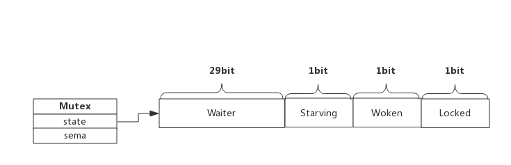
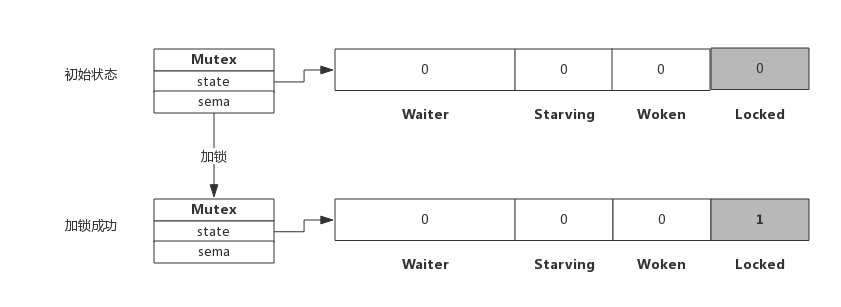
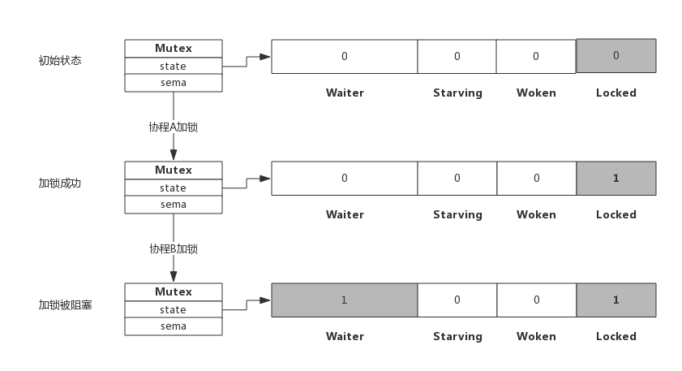
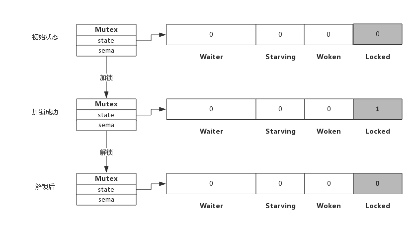
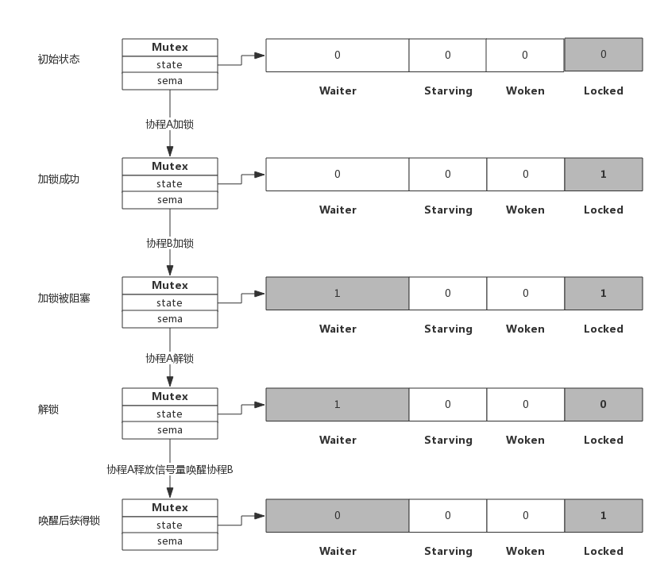
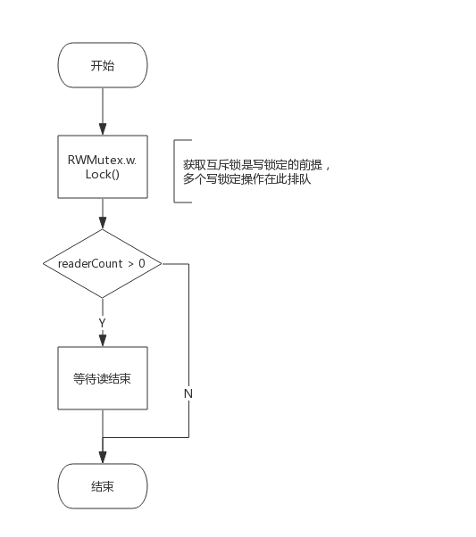
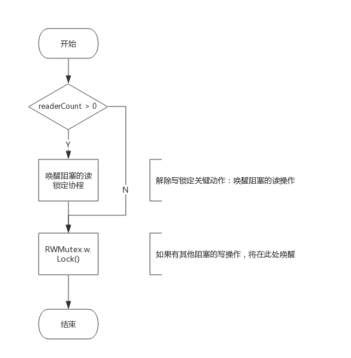
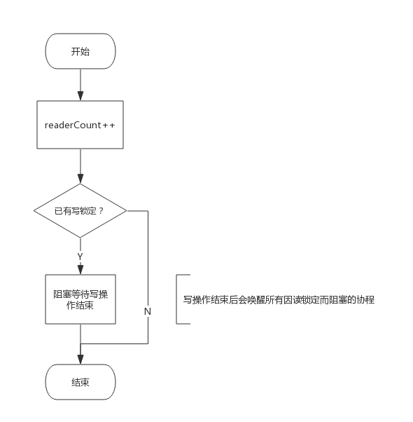
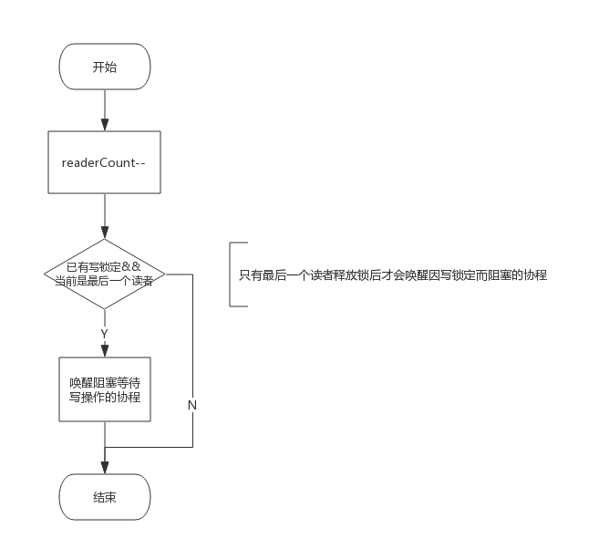
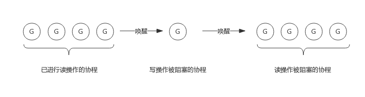

## 前言

互斥锁是并发程序中对共享资源进行访问控制对手段，对此Go语言提供了非常简单易用对互斥锁-Mutex

Mutex是一个结构体类型，实现了Lock()和Unlock()两个方法进行加锁和解锁

Mutrx用起来特别方便，但其中内部实现却非常复杂，包括Mutex的几种状态，Mutex重复解锁产生panic的原因

## Mutex的数据结构

### Mutex结构体

源码包src/sync/mutex.gp Mutex定义了互斥锁的数据结构

	type Mutex struct{
    	state	int32	
        sema	uint32
    }

- Mutex.state 表示互斥锁的状态，是否锁定
- Mutex.sema 表示互斥锁的信号量，协程阻塞等待的信号量，解锁的协程会释放信号量从而唤醒等待信号量的协程

Mutex.state 是一个32位的整形数字，其中分为四块，代表Mutex的四种状态

- Locked 表示互斥锁是否被锁定，1锁定0未锁定
- Woken 表示是否有协程已被唤醒 0没有1已有协程唤醒，正在加锁过程中
- Starving 表示是否是饥饿状态，0没有饥饿1饥饿状态，说明有协程阻塞超过了1ms
- Waiter 表示阻塞等待锁的协程数量，协程解锁时根据此值是否大于0来判断是否释放信号量

协程之间抢锁实际上是抢给Locked赋值的权利，能给Locked预置1，就说明抢锁成功，抢不到的话就阻塞，等待Mutex.sema信号
量，一旦有持锁的协程解锁，等待的协程就会被唤醒

Woken与Starving主要用于控制协程间抢锁的过程，后面再详细解释

### Mutex方法

Mutex对外有两个方法
- Lock() 加锁方法
- Unlock() 解锁方法

下面我们分析一下加锁解锁的过程，加锁分为成功失败两种，成功获取锁，失败后当前协程阻塞，同样，解锁也分是否有协程等待两种处理

## 加解锁过程

### 简单加锁

假定当前只有一个协程在加锁，没有其他协程在干扰，过程入下图所示

加锁过程会去判断当前Locked位是否为0，如果是0把Locked变为1，代表加锁成功，从上图可见，加锁成功后，Locked位为1

### 加锁被阻塞

假定加锁的时候，锁被其他协程锁持有，则如图所示

从上图看到，当协程B试图获取锁的时候，当前Locked为1，所以加锁被阻塞，Waiter加1，此时协程B将被阻塞，知道Locked值变成0的时候才会被唤醒（暂不考虑自旋，后面单独讲自旋）

### 简单解锁

假定解锁时，没有其他协程阻塞，Waiter=0，解锁如下：

由于没有其他协程在阻塞，所以直接把Locked位改成0，不需要释放信号量

### 解锁并唤醒协程

假设解锁时有1个或者多个协程在阻塞，此时解锁如下图所示

协程A解锁过程发生两个步骤，一是把Locked位变为0,二是查看到Waiter>0，所以释放一个信号量，唤醒一个阻塞的协程，被唤醒的协程B把Locked置为1，于是协程B获得锁

## 自旋过程

协程加锁时，如果当前Locked位是1，说明该锁被其他协程获取到，尝试加锁的协程不是马上转入阻塞，而是会持续的探测Locked是否变为0，这个过程称之为--自旋

自旋时间很短，但如果在自旋过程中发现锁已经被释放，那么该协程会立马获取锁，此时即便有阻塞的协程也无法获取锁，只能再次阻塞

自旋的好处是，当加锁失败的时候不必立即转为阻塞，这样可以避免协程的切换

### 什么是自旋

自旋对应的是cpu的PAUSE指令，cpu对该指令什么都不做，相当于cpu空转，对程序而言相当于sleep来一小段时间，时间非常短，当前实现是30个时钟周期

自旋过程中会持续探测Locked是否变为0，连续两次探测间隔就是执行这些PAUSE指令，它不同于sleep，不需要将协程转为睡眠

### 自旋的条件

加锁时程序会自动判断是否可以自旋，无限制的自旋会给cpu带来很大的压力，所以判断是否可以自旋就很重要了

自旋必须满足一下条件：
- 自旋的次数要足够小，通常为4次，即自旋次数最多4次
- cpu的核数要大于1，否则没有意义，因为此时不可能有其他协程释放锁
- 协程的调度机制中Process数量要大于1，比如使用GOMAXPROCS()将处理器设置为1就不能启用自旋了
- 协程调度机制中的可运行队列必须为空，否则会延迟协程调度

可见，实现自旋的条件是很苛刻的，总而言之就是不忙的时候才会自旋

### 自旋的优势

自旋的优势是更加处分的利用cpu，尽量避免协程切换，因为当前申请加锁的协程此刻拥有cpu，如果经过短时间的自旋可以获取锁，当前协程可以继续运行，不必进入阻塞状态

### 自旋的问题

如果自旋过程中获取锁，那么之前阻塞的协程将无法获取锁，如果加锁的协程特别多，每次都通过自旋获得锁，那么之前被阻塞的协程将很难获取锁，从而进饥饿状态

所以为了避免协程长时间无法获取锁，自1.8版本以来增加了一个状态，即Mutex.state的Starving状态，这个状态下不会自旋，一旦有协程释放锁，一定会释放信号量，然后唤醒一个协程并成功加锁

## Mutex模式

前面分析加锁和解锁过程中只关注了Waiter和Locked的变化，现在我们看一下Starving位的作用

每个Mutex都有两种模式，Normal和Starving，下面解释一下两个模式

### normal模式

默认情况下，Mutex的状态是normal

该模式下，协程如果加锁不成功不会立即转入阻塞，而是判断是否符合自旋条件，如果条件满足，则会启动自旋，尝试加锁

### starvation模式

自旋过程中能抢到锁，一定意味着同一时刻有协程释放了锁我们知道释放锁的同时如果发现有被阻塞的协程，会释放信号量来唤醒一个等待的协程，被唤醒的协程得到cpu后开始运行，此时发现锁已经被自旋的协程抢占，只好再次进入阻塞，不过阻塞前会判断自上次阻塞到本次阻塞经过了多长时间，**超过1ms，会讲Mutex标记为Straving状态，然后再阻塞。**

处于饥饿模式下，不会启动自旋过程，也即一旦有协程释放了锁，那么一定会唤醒协程，被唤醒的协程将成功获取锁，同时也会把Waiter等待计数减1

## Woken状态

Woken状态用于加锁和解锁过程中的通信，举个例子，同一时刻，有两个协程，一个在加锁，一个在解锁，加锁的协程处于自旋过程中，此时把Woken标记为1，用于通知释放锁的协程不必再释放信号量，我马上拿到锁了

## 为什么重复解锁会panic

为什么Go语言不能健壮一些，重复解锁不再panic

理解了Mutex的原理就可以想通了，每次Unlock的过程是分为两个步骤，先把Locked位标记位0，再判断Waiter的数量，如果大于0就会释放信号量

如果多次Unlock，那么可能每次都会释放一个信号量，每次都会唤醒协程，多个协程会抢占lock，这样会增加Lock()函数里面的复杂度，也引起不必要的协程切换

## 读写锁RWMutex

前面聊了互斥锁Mutex，所谓的读写锁，完整的表述应该是读写互斥锁，可以说是Mutex的一个改进版，在某些场景下可以发挥的更加灵活，比如：读数据频率远超写数据频率

例如，程序中写操作少而读操作多，简单的说，如果执行过程是1次写入然后N次读取没使用Mutex，这个过程将是串行的，因为即便N
次读操作之间互不影响，但也都需要持有Mutex后才可以操作，如果使用读写锁，多个读操作之间可以同时持有锁，并发能力将大大提升

## 读写锁的数据结构

### 类型定义

源码包 src/sync/rwmutex.go RWMutex 定义了读写锁的数据结构

	type RWMutex struct{
    	w			mutex		// 用于控制多个写锁，获得写锁首先要获取该锁，若果有一个写锁在进行，那么再到来的写锁将会阻塞于此
        writerSem	uint32		// 写阻塞等待的信号量，最后一个读者释放锁的时候，会释放次信号量
        readerSem	uint32		// 读阻塞等待的信号量，持有写锁的协程释放锁后会释放次信号量
        readerCount	int32		// 读等待的协程个数
        readerWait	int32		// 记录  写阻塞时  读等待协程的个数(为什么写锁不会被饿死处使用)
    }

由以上的数据结构可见，读写锁内部仍有一个互斥锁，用于将两个写操作隔离开，其他几个都是用于隔离读操作和是写操作

下面我们简单看下RWMutex的四个接口，后面再根据实际场景来讲解他们是怎么配合工作的

### 接口定义

RWMutex提供四个简答的接口来提供服务
- Rlock() 	// 读锁定
- RUnlock() // 解除读锁定
- Lock()	// 写锁定，与Mutex完全一致
- Unlock()	// 解除写锁的，与Mutex完全一致

#### Lock()实现逻辑

写锁的操作需要做的两件事：
- 获取互斥锁
- 阻塞等待所有读操作结束(如果有的话)

所以 func(rw *RWMutex) Lock()接口实现的流程图如下：

#### Unlock()实现逻辑

解除写锁的操作有两件事要做：
- 唤醒因读锁定而阻塞的协程(如果有的话)
- 解除互斥锁

所以 func(rw *RWMutex) Unlock() 接口实现流程如下：

#### RLock()实现逻辑

读锁定需要做的两件事：
- readerCount++ 增加读操作计数
- 等到写操作结束(如果有的话)

所以 func (rw *RWMutex) RLock() 所实现的流程如下：

#### RUnlock()实现逻辑

解除读锁定有两件事要做：
- readerCount --
- 唤醒等待写操作的协程

所以func (rw *RWMutex)RUnlock() 实现的流程如下：

> 注意：并不是每一个读操作解除锁定的时候都会唤醒写阻塞的协程，而是最后一个解除读锁定的协程才会释放信号量将该协程唤醒，因为只有所有读操作的协程释放锁之后才可以唤醒协程

## 场景分析

上面我们简单看来下四个接口的实现，记下来我们看一下是如何解决前面提到的几个问题

### 写操作是如何阻止写操作的

读写锁包含一个互斥锁，写操作锁定的时候必须获取该互斥锁，如果该互斥锁已经被协程A获取(或者协程A在阻塞等待读结束)，意味着协程A获取了互斥锁，那么协程B只能阻塞等待该互斥锁

所以，写操作依赖互斥锁阻止其他的写操作

### 写操作是如何阻止读操作的

这个是读写锁实现最精妙的技巧

我们知道readerCount是一个int32位的整型，用于表示读者的数量，每增加一个读readerCount+1，释放一个读锁
readerCount-1，所以readerCount的取值是[o,N],N为读者个数，实际上最大可支持2^30个并发读

当写锁定进行时，会先将readerCount - 2^30，从而readerCount 变成了负值，此时再有读锁定到来时检测到readerCOunt为负值，便知道有写操作在进行，只好阻塞等待，而真是的读操作个数也不会丢失，只需要将readerCount再加上2^30即可获得

所以，写操作是将readerCount变成负值来阻止读操作的

### 读操作是如何阻止写操作的

读锁定会先将readerCount+1，此时写操作到来时发现读者的数量不为0，会阻塞等待所有的读操作结束

所以，读操作是通过readerCount大于0来阻止写操作的

### 为什么写操作不会被饿死

我们知道，写操作要等待读操作全部释放锁之后，也就是readerCount=0的时候，才会获取锁，但是写操作的期间，也可能会有新的读操作进来，而读操作是不阻塞的，readerCount会增加，写操作可能会饿死，但是go是通过readerWait来解决这个问题的

写操作到来时，如果前面还有读操作，会先把readerCount的值拷贝进readerWait，用于标记排在自己前面的读操作个数

前面的读操作结束回，除了递减readerCount，还会递减readerWait，当readerWait值变为0的时候，唤醒写操作

所以，写操作就相当于把一段连续的读操作划分成两部分，前面的读操作结束后唤醒写操作，写操作结束后，唤醒后面半部分的读操作，如下图所示：

## 关于源码

关于读写锁的实现源码，有位大佬已经写了大量的中文注释，，有兴趣的可以自行查看，地址是 https://github.com/RainbowMango/GoComments

## 编程Tips

### 使用defer解锁

加锁后立即使用defer解锁，可以有效的避免死锁

### 加锁和解锁应成对出现

加锁和解锁最好出现在同一个代码块，比如同一个函数，这样也增加了代码可读性，排查问题的时候也容易找到问题

重复的解锁会产生panic 应该避免这种操作的可能性