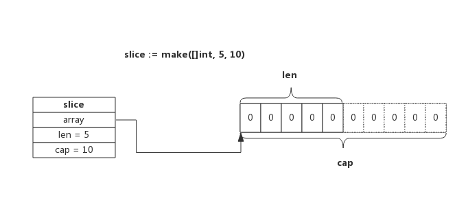
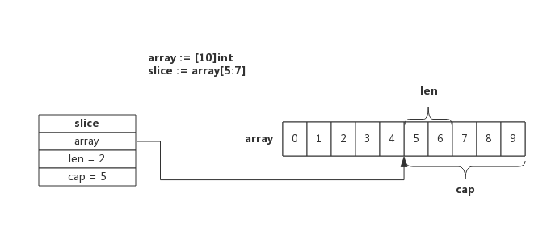
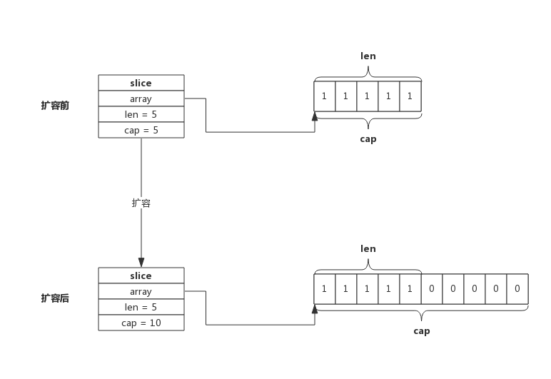

## 前言

>本文图片全部来自于 [Go专家编程](https://rainbowmango.gitbook.io/) 一书，非常幸运能发现这本书

slice又称切片，依托数组实现，可以方便的进行扩容、传递，实际使用中比数组更灵活

正因为灵活，如果不了解其中的内部实现机制，就会遭遇莫名的现象

## slice实现原理

slice依托数组实现，底层数组对用户屏蔽，当底层数组容量不足时，可以实现自动扩容，重新申请存储空间，新存储空间将是原来的2倍或1.25倍（取决于扩展原空间大小）

### slice的数据结构

源码包 src/runtime/slice.go 中 slice定义了数据结构

	type slice truct{
    	array unsafe.Pointer
        len int
        cap int
    }

从数据结构上可以看出来，slice底层是一个数组，len是长度，cap是容量

### slice的创建

使用make创建，可以同时指定长度和容量，创建时会分配一个数组，数组的长度就是容量

例如 slice := make([]int ,5,10) 创建的slice 就如下图所示

长度是5，容量是10，表示后续添加元素不必重新分配内存

### 使用数组创建slice

使用数组创建切片，切片会与愿数组共用一部分内存

slice := array[5:7]

切片从数组array[5]开始，到数组array[7]结束（不含array[7]），即切片长度为2，数组后面的内容都作为切片的预留内存，即capacity为5。

>数组和切片操作可能作用于同一块内存，这也是使用过程中需要注意的地方。

### slice扩容

使用append向slice添加元素的时候，有可能会发生扩容，扩容就是重新分配一块更大的内存，然后把数组拷贝到新的内存里面

例如一个cap为5的，切len也为5的slcie再追加元素的时候，就会发生扩容，如图

扩容操作只关心容量，会把元slice拷贝到新的slice，**追加数据由扩容后完成**，扩容后slice长度仍然是5，但是容量变成了10，原来slice的数据也被拷贝进了新的slice，然后追加新数据

扩容遵循下面的原则：
- 如果原来slice容量小于1024，则新的容量扩大为原来的2倍
- 如果原来slice容量大于1024，则新的容量扩大为原来的1.25倍

使用append()向Slice添加一个元素的实现步骤如下： 
1. 假如Slice容量够用，则将新元素追加进去，Slice.len++，返回原Slice 
2. 原Slice容量不够，则将Slice先扩容，扩容后得到新Slice 
3. 将新元素追加进新Slice，Slice.len++，返回新的Slice

### slice copy

使用copy()函数拷贝两个切片的时候，会将原来的切片的数据拷贝到新的切片里面去，拷贝的数据取两个切片长度的最小值

例如一个长度10的切片拷贝到长度5的切片，最后之后拷贝前五个元素

也就是，copy不会发生扩容

### 特殊slice

跟据数组或切片生成新的切片一般使用slice := array[start:end]方式，这种新生成的切片并没有指定切片的容量，实际上新切片的容量是从start开始直至array的结束。

比如下面两个切片，长度和容量都是一致的，使用共同的内存地址：

	sliceA := make([]int, 5, 10)
	sliceB := sliceA[0:5]
    
根据数组或切片生成切片还有另一种写法，即切片同时也指定容量，即slice[start:end:cap], 其中cap即为新切片的容量，当然容量不能超过原切片实际值，如下所示：    

	sliceA := make([]int, 5, 10)  //length = 5; capacity = 10
    sliceB := sliceA[0:5]         //length = 5; capacity = 10
    sliceC := sliceA[0:5:5]       //length = 5; capacity = 5
    
这切片方法不常见，在Golang源码里能够见到，不过非常利于切片的理解。

## 编程Tips

- 创建切片时可跟据实际需要预分配容量，尽量避免追加过程中扩容操作，有利于提升性能；
- 切片拷贝时需要判断实际拷贝的元素个数
- 谨慎使用多个切片操作同一个数组，以防读写冲突

## slice总结

- 每个切片都指向一个底层数组
- 每个切片都保存了当前切片的长度、底层数组的可用容量
- 使用len()计算切片长度的时候，时间复杂度是O(1),不需要遍历切片
- 使用cap()计算切片容量的时候，时间复杂度是O(1),不需要遍历切片
- 通过函数传递切片的时候，不会拷贝整个切片，因为切片本身只是一个结构体而已
- 使用append()函数追加元素又可能发生扩容，扩容会生产新的切片，内存地址也会改变