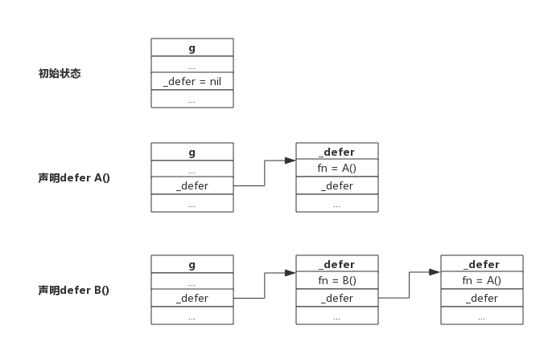

## 前言

>本文图片全部来自于 [Go专家编程](https://rainbowmango.gitbook.io/) 一书，非常幸运能发现这本书

defer语句用于延迟函数的调用，每次defer都会把函数雅茹一个栈中，函数返回的前，会把延迟函数取出并执行

## 案例说明

### 案例1

	func deferFuncParameter() {
        var aInt = 1
        defer fmt.Println(aInt)
        aInt = 2
        return
    }

上面的函数会输出1，因为defer 声明这句 fmt.PrintLn(aInt)的时候，传入的参数 aInt是一个**值拷贝**，后面这一句aInt = 2 已经和传入fmt.PrintLn(aInt) 的aInt没有关系了，所以输出的时候，输出了1

### 案例2

	package main
    import "fmt"
    func printArray(array *[3]int) {
        for i := range array {
            fmt.Println(array[i])
        }
    }
    func deferFuncParameter() {
        var aArray = [3]int{1, 2, 3}
        defer printArray(&aArray)
        aArray[0] = 10
        return
    }
    func main() {
        deferFuncParameter()
    }

输出10，2，3 三个数，因为在defer printArray(&aArray) 传入是数组的指针，并且defer是延迟执行，经过下面一句aArray[0] = 10，延迟函数执行的时候数组值已经改变，所以输出的时候值也会改变

### 案例3

	func deferFuncReturn() (result int) {
        i := 1
        defer func() {
           result++
        }()
        return i
    }
   
输出2，因为Go语言函数的**return这一句并不是原子操作**，而是分解成为两个步骤，设置返回值-->ret，defer语句实际执行在返回前，即拥有defer的函数返回过程是，设置返回值-->执行defer-->ret.所以return语句**先是把result设置成i的值**，即result = 1，然后执行defer函数 result++ ，result = 2，然后返回result，即最终输出2

## defer规则

Golang官方博客离总结了defer的行为规则，一共三条，我们围绕这三条来说明

### 规则1

**延迟函数的参数在defer语句出现时就已经确定下来了**

官方给出一个例子：

	func a() {
        i := 0
        defer fmt.Println(i)
        i++
        return
    }
    
defer语句中的fmt.Println()参数i在defer出现的时候就已经确定下来了，实际上是拷贝了一份i，后面对变量i的修改对defer fmt.Println(i) 里面的i并不影响，仍然打印0

> 注意：对于指针类型的函数，规则仍然适用，只不过延迟函数的参数是一个地址值，这种情况下defer后面的语句对变量的修改可能会影响延迟函数

### 规则2

**延迟函数执行按后进先出的顺序执行，即先出现的defer后执行**

这个规则很好理解，定义defer类似于入栈操作，执行defer类似于出栈操作。

设计defer的初衷是简化函数返回时资源清理的动作，资源往往有依赖顺序，比如先申请A资源，再跟据A资源申请B资源，跟据B资源申请C资源，即申请顺序是:A-->B-->C，释放时往往又要反向进行。这就是把defer设计成LIFO的原因。

每申请到一个用完需要释放的资源时，立即定义一个defer来释放资源是个很好的习惯

### 规则3

**延迟函数可能操作主函数的具名返回值**

定义defer的函数,即主函数可能有返回值，返回值有没有名字没有关系，defer所作用的函数可能会影响返回值

下面我们理解一下函数是如何返回的就可以理解什么时候延迟函数会影响返回值了

### 函数返回过程

有一个事实必须了解，关键词 *return* 不是一个原子操作，实际上 *return* 致代理汇编指令ret，即将跳转程序执行，比如语句`return i`,实际上分两步进行，即将i值存入栈中作为返回值，然后执行跳转，而defer的执行时机正是跳转前，所以说defer执行时还是有机会修改返回值的

举个例子：

	func deferFuncReturn() (result int) {
        i := 1
        defer func() {
           result++
        }()
        return i
    }

该函数的return语句可以拆分为下面的过程：

	result = i
    return
    
而延迟函数执行在return之前，即加入defer后的执行过程为：

	result = i
    result ++ 
    return
    
所以上面返回的是i++值

关于主函数有不同的返回方式，但返回机制就如上面介绍的，只要把return的语句拆开都可以很好的理解，下面举例子说明

### 主函数拥有匿名返回值，返回字面值

一个主函数拥有一个匿名返回值，返回时使用字面值，比如返回"1","2","Hello",这样的值，这种情况下defer语句是午饭操作返回值的

如下：

    func foo() int {
        var i int
        defer func() {
            i++
        }()
        return 1
    }

函数执行过程，直接把1写入栈中，然后执行defer函数，并不能改变返回值，所以就无法影响返回值

### 主函数拥有匿名返回值，返回变量

一个主函数拥有匿名返回值，返回使用本地或者全局变量，这种情况下defer语句可以引用到返回值，但不会改变返回值

一个返回本地变量的函数，如下：

	func foo() int {
        var i int
        defer func() {
            i++
        }()
        return i
    }

上面的函数，返回一个局部变量，同时defer函数也会操作这个变量，对于匿名返回值来说，可以假定仍然有一个变量存储返回值，假定返回值变量为"anony"，上面的返回语句可以拆分为下面过程：

	annoy = i
    i++
    return annoy
由于i是整形，会讲值拷贝给annoy，所以defer执行的i++，不会影响annoy的值，对函数的返回值并不会造成影响

### 主函数拥有具名返回值

主函数声明语句中带有名字的返回值，会被初始化成一个局部变量，函数内部可以像使用局部变量一样使用该返回值，如果defer操作这哥返回值，可能会改变返回结果

举个例子：

    func foo() (ret int) {
        defer func() {
            ret++
        }()
        return 0
    }

此函数过程分解为：

	ret = 0；
    ret++
    return ret

所以最后返回值为1，改变了返回值

## defer实现原理

### defer数据结构

源码包 `src/src/runtime/runtime2.go _defer` 定义了defer的数据结构

	type _defer struct {
        sp      uintptr   //函数栈指针
        pc      uintptr   //程序计数器
        fn      *funcval  //函数地址
        link    *_defer   //指向自身结构的指针，用于链接多个defer
    }
    
我们知道defer后面一定要跟一个函数的，所以defer的数据结构跟一般函数类似，也有栈地址、程序计数器、函数地址等等

与函数不同的一点它有一个指针，指向另一个defer，每个goroutine数据结构中实际上也有一个defer指针，该指针指向一个defer链表，每次声明一个defer，就会将defer函数插入表头，每次指向defer就会从表头取下来一个defer执行

下图展示了多个defer被链接的过程：

从上图可以看出，新生命的defer总是在链表头部

函数返回前指向defer是从链表首部依次取出执行

一个goroutine可能连续调用多个函数，defer添加过程跟上述过程一致，进入函数添加defer，离开函数取出defer，即便调用多个函数，也会保证FIFOf方式执行

### defer的创建和执行

源码包 `src/runtime/panic.go` 定义了两个方法分别创建defer和执行defer

- deferproc():在声明defer出调用，其将defer函数存入goroutine链表中
- deferreturn():在return指令，准确讲是在ret指令前调用，其将defer从goroutine链表中取出并执行

可以简单这么理解，在编译阶段，在声明defer出插入了函数deferproc(),在函数return前加入了函数deferreturn()

## 总结

- defer定义的延迟函数参数在defer语句出现时就已经确定下来了
- defer定义顺序与执行顺序相安
- return不是原子操作，执行过程是：保存返回值(若有)-->执行defer(若有)-->执行ret跳转
- 申请资源后理解defer关闭资源是好习惯