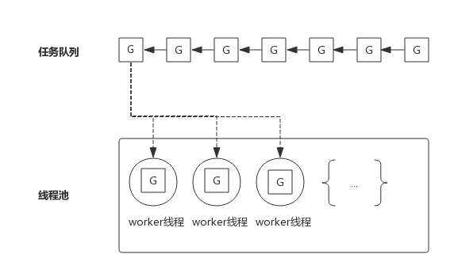
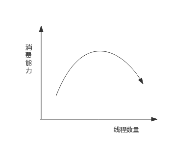
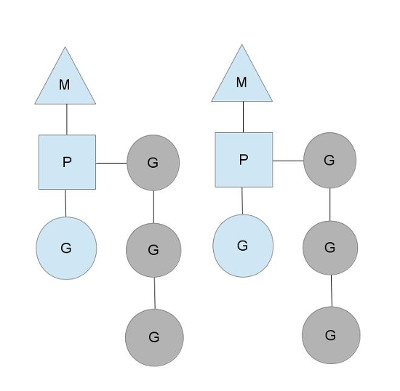
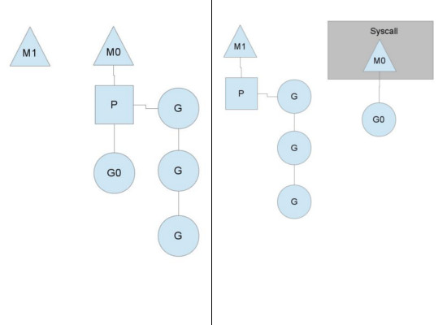
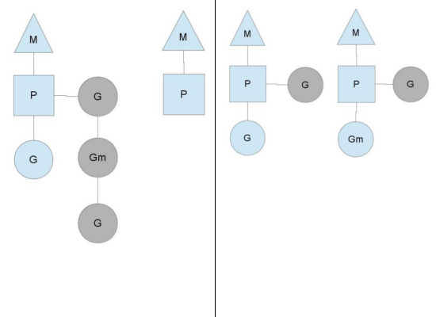

## 前言

>本文图片全部来自于 [Go专家编程](https://rainbowmango.gitbook.io/) 一书，非常幸运能发现这本书

Goroutine是一个很复杂的调度机制，下面尝试使用通俗一点的语言和代码来说明一下他的机制

## 线程池的缺陷

在高并发的场景下，我们会频繁的创建和销毁线程，所以有来线程池，会减小线程切换的开销，下图一个经典的线程池：

<!--more-->
为了方便下面的叙述，我们把任务队列里面的每一个任务称之为G，而G往往都代表一个函数，线程池中的worker会不断的从任务队列里面取出任务并执行，而worker线程的调度就交给操作系统

如果worker线程在执行G任务的时候发生了系统调用，则操作系统就会把当前worker线程置为阻塞状态，也意味着消费任务队列的worker线程减少了，也就是说线程的线程池的消费能力就变弱了

如果任务队列里面大多数任务都会发生系统调用，则会让这种状态恶化，大部分woeker进入阻塞状态，从而任务队列就会堆积大量的任务

解决这个问题就是重新审视这个线程池，增加一部分的线程数量，但是线程数量增加，就意味这过多的线程会争抢CPU，消费能力会有上限，甚至出现消费能力下降，如下图所示

## Goroutine调度器

线程数量过多，意味着操作系统要频繁的切换线程，频繁的上下文切换就成了性能瓶颈，Go提供一种机制，可以在线程中自己实现调度，上下文切换变得轻量，从而达到了线程数少，而并发数并不少的效果，而线程中调度的就是Goroutine

Goroutine主要概念如下：
- G（Goroutine）：即Go协程，每个go关键字就会开启一个协程
- M（Machine）：工作线程，在Go里面称为Machine
- P（Processor）：处理器（Go里面的概念，不是指CPU），包含运行Go代码所需要的必要资源，也有调度goroutine的能力

M必须拥有一个P才能执行G里面的代码，而G只由P来管理（还有全局队列），P会维护一个G的队列，P可以调度G交给M执行G的代码，其关系如图所示：

图中M是交给操作系统调度的线程，M持有一个P，P将G调度进M中执行，P同时还维护这一个包含G的队列（图中灰色部分），可以按照一定的策略将G调度到M中执行

P的个数在程序启动的时候就决定了，默认情况下等同于cpu的核数，由于M必须持有一个P才能运行Go代码，所以线程数量一般等同于cpu的核数，已达到尽可能的使用cpu而又不至于产生过多的线程切换开销（实际情况是会略大于cpu核数）

程序中可以使用`runtime.GOMAXPROCS()`设置P的个数，在某些IO密集型的场景下可以在一定程度上提高性能，这个后面再详细介绍

## Goroutine调度策略

### 队列轮转

上图中可见每个P都维护着一个包含多个G的队列，不考虑G进入系统调用或者IO操作的情况下，P周期性的从队列首部提取一个G，交给M进行执行一段时间，然后保存上下文后，插入到队列，然后从队列首部重新取出一个G进行调度

除了每个P维护的G队列以外，还有一个全局的队列，每个P会周期性的检测全局队列是否有带运行的G，并将其调度到自己的M中执行，全剧队列的G的来源，主要有从系统调用中恢复的G，之所以P会周期性检测全局队列，也是为了防止全剧队列中的G被饿死

### 系统调用

上面说到P的个数默认等于cpu的核数，每个M要有一个P才可以执行G，一般情况下M的个数会略大于P的个数，这多出来的M将会在G产生系统调用时发挥作用，类似线程池，Go也提供一个M的池子，需要时从池子中获取，用完放回池子，不够用时再创建一个

当M运行的某个G产生系统调用的时候，如下图所示：

如图所示，当G0发生系统调用的时候，M0将释放P，进而P会找到一个空闲的M1获取P，继续执行P队列剩下的G，而M0因为陷入系统调用而阻塞，M1接替M0的工作，只要P不空闲，就可以保证充分利用cpu

M1的来源可能是M的缓存池，也可能是新建的，当G0完成系统调用的时候，根据M0是否还能获取到P分为不同的处理
- 如果有空闲的P，则获取一个P，继续执行G0
- 如果没有空闲的P，则将G0放入全局队列中，等待被其他P所调度，然后M0进入睡眠

### 工作量窃取

多个P维护多个G的队列，就有可能任务不均衡

竖线左侧中，右边的P执行完了G，就会去查询全局队列是否有G，如果有，就调度来执行，如果没有，而另一个M中除了正在运行的G之外还有3个G带运行，此时，空闲的P会将一部分G偷取一部分过来，一般每次偷取一半，偷取完如右图所示

## GOMAXPROCS设置对性能的影响

一般来讲，程序运行时就将GOMAXPROCS大小设置为CPU核数，可让Go程序充分利用CPU。 在某些IO密集型的应用里，这个值可能并不意味着性能最好。 理论上当某个Goroutine进入系统调用时，会有一个新的M被启用或创建，继续占满CPU。 但由于Go调度器检测到M被阻塞是有一定延迟的，也即**旧的M被阻塞和新的M得到运行之间是有一定间隔的**，所以在IO密集型应用中不妨把GOMAXPROCS设置的大一些，或许会有好的效果。

## 参考文章

> 《The Go scheduler》http://morsmachine.dk/go-scheduler