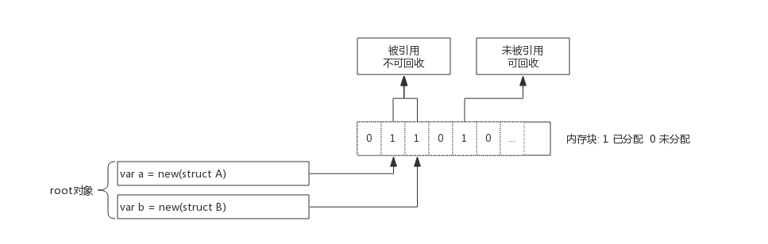
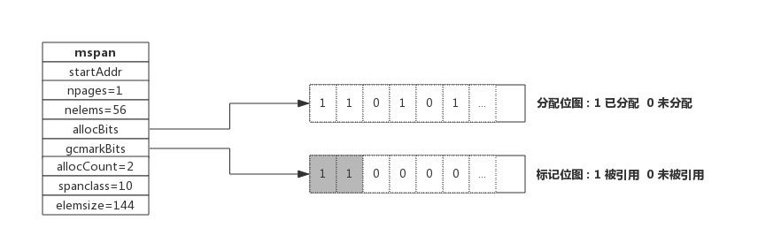
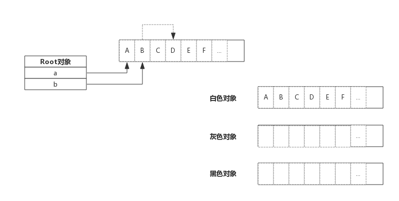
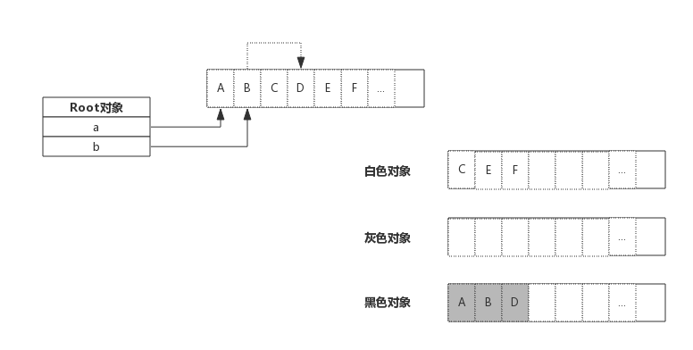

## 前言

所谓垃圾就是不再需要的内存块，这些垃圾如果不清理就没办法再次被分配使用，在不支持垃圾回收的编程语言里，这些垃圾内存就是泄露的内存。

Golang的垃圾回收（GC）也是内存管理的一部分，了解垃圾回收最好先了解前面介绍的内存分配原理。

## 垃圾回收算法

- 引用计数：对每个对象维护一个引用计数，当引用该对象的对象被销毁时，引用计数减1，当引用计数器为0是回收该对象。
	- 优点：对象可以很快的被回收，不会出现内存耗尽或达到某个阀值时才回收。
	- 缺点：不能很好的处理循环引用，而且实时维护引用计数，有也一定的代价。
	- 代表语言：Python、PHP、Swift
- 标记-清除：从根变量开始遍历所有引用的对象，引用的对象标记为"被引用"，没有被标记的进行回收。
	- 优点：解决了引用计数的缺点。
	- 缺点：需要STW，即要暂时停掉程序运行。
	- 代表语言：Golang(其采用三色标记法混合写屏障)
- 分代回收：按照对象生命周期长短划分不同的代空间，生命周期长的放入老年代，而短的放入新生代，不同代有不能的回收算法和回收频率。
	- 优点：回收性能好
	- 缺点：算法复杂
	- 代表语言： JAVA
	
## Golang垃圾回收

### 垃圾回收原理

简单来说，垃圾回收的核心就是标记出哪些内存还在使用中（即被引用到），哪些内存不再使用了（即未被引用到）把未被引用到的内存回收掉，以供后续内存分配时使用

下图展示了一段内存，内存心中既有以分配掉的内存，也有为分配的内存，垃圾回收的目标就是把哪些已经分配但是没有对象引用的内存找出来并回收掉

上图中，内存块1、2、4号位上的内存块已被分配(数字1代表已被分配，0 未分配)。变量a, b为一指针，指向内存的1、2号位。内存块的4号位曾经被使用过，但现在没有任何对象引用了，就需要被回收掉。

垃圾回收开始时从root对象开始扫描，把root对象引用的内存标记为"被引用"，考虑到内存块中存放的可能是指针，所以还需
要递归的进行标记，全部标记完成后，只保留被标记的内存，未被标记的全部标识为未分配即完成了回收。

### 内存标记(Mark)
前面介绍内存分配时，介绍过span数据结构，span中维护了一个个内存块，并由一个位图allocBits表示每个内存块的分配情况。
在span数据结构中还有另一个位图gcmarkBits用于标记内存块被引用情况。

如上图所示，allocBits记录了每块内存分配情况，而gcmarkBits记录了每块内存标记情况。标记阶段对每块内存进行标记，
有对象引用的内存标记为1(如图中灰色所示)，没有引用到的保持默认为0.

allocBits和gcmarkBits数据结构是完全一样的，标记结束就是内存回收，回收时将allocBits指向gcmarkBits，则代表标记过的才是存活的，gcmarkBits则会在下次标记时重新分配内存，非常的巧妙。

### 三色标记法

前面介绍了对象标记状态的存储方式，还需要一个队列来存放标记的对象，可以简单想象成把对象从标记队列中取出，将对象的
引用状态标记在span的gcmarkBits位图，把对象引用到的其他对象再放入到等待队列中等待被标记

三色只是抽象出来的颜色

- 灰色：对象还在标记队列中等待
- 黑色：对象已被标记，gcmarkBits对应的位为1（该对象不会在本次GC中被清理）
- 白色：对象未被标记，gcmarkBits对应的位为0（该对象将会在本次GC中被清理）

初始状态下都是白色

接着开始扫描根对象a、b

由于根对象引用到了AB，那么AB两个变色灰色，接下来开始分析灰色对象，分析A时，A没有引用其他对象迅速转成黑色，B引用了D，B转入黑色的同时把D放在标记队列中，也就是把D标记成灰色，进行接下来的分析：

上图中灰色对象只有D，由于D没有引用其他对象，所以D转入黑色，标记过程结束

最终黑色的对象会被保留下来，白色对象会被回收掉

### Stop The World

印度电影《苏丹》中有句描述摔跤的一句台词是：“所谓摔跤，就是把对手控制住，然后摔倒他。”

对于垃圾回收来说，回收过程中也需要控制住内存的变化，否则回收过程中指针传递会引起内存引用关系变化，如果错误的回收了还在使用的内存，结果将是灾难性的。

Golang中的STW（Stop The World）就是停掉所有的goroutine，专心做垃圾回收，待垃圾回收结束后再恢复goroutine。

STW时间的长短直接影响了应用的执行，时间过长对于一些web应用来说是不可接受的，这也是广受诟病的原因之一。

为了缩短STW的时间，Golang不断优化垃圾回收算法，这种情况得到了很大的改善。

## 垃圾回收优化

### 写屏障(Write Barrier)

前面说过STW目的是防止GC扫描时内存变化而停掉goroutine，而写屏障就是让goroutine与GC同时运行的手段。虽然写屏障不能完全消除STW，但是可以大大减少STW的时间。

写屏障类似一种开关，在GC的特定时机开启，开启后指针传递时会把指针标记，即本轮不回收，下次GC时再确定。

GC过程中新分配的内存会被立即标记，用的并不是写屏障技术，也即GC过程中分配的内存不会在本轮GC中回收。

### 辅助GC(Mutator Assist)

为了防止内存分配过快，在GC执行过程中，如果goroutine需要分配内存，那么这个goroutine会参与一部分GC的工作，即帮助GC做一部分工作，这个机制叫作Mutator Assist。

## 垃圾回收触发时机

### 内存分配量达到阀值触发GC

每次内存分配时都会检查当前内存分配量是否已达到阀值，如果达到阀值则立即启动GC。

`阀值 = 上次GC内存分配量 * 内存增长率`

内存增长率由环境变量GOGC控制，默认为100，即每当内存扩大一倍时启动GC。

### 手动触发

程序代码中也可以使用runtime.GC()来手动触发GC，这主要用于Gc性能测试和统计

### GC性能优化

GC性能与对象数量负相关，对象越多GC性能越差，对程序影响也越大

所以GC性能优化的思路之一就是减少对象分配个数，比如对象复用或使用大对象组合多个小对象等

另外，由于内存逃逸现象，有些隐式的内存分配也会产生，也有可能成为GC的负担

关于GC性能优化的具体方法，后面单独结束

## 参考

https://rainbowmango.gitbook.io/