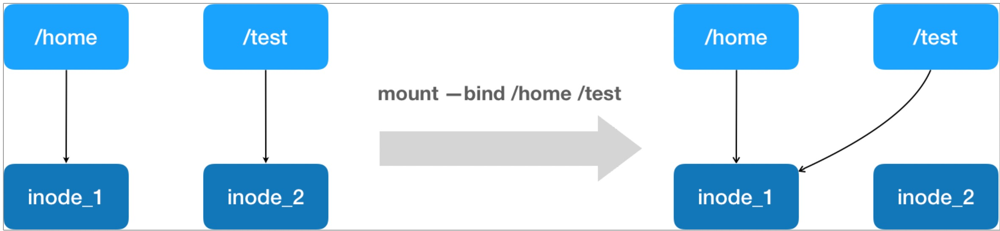
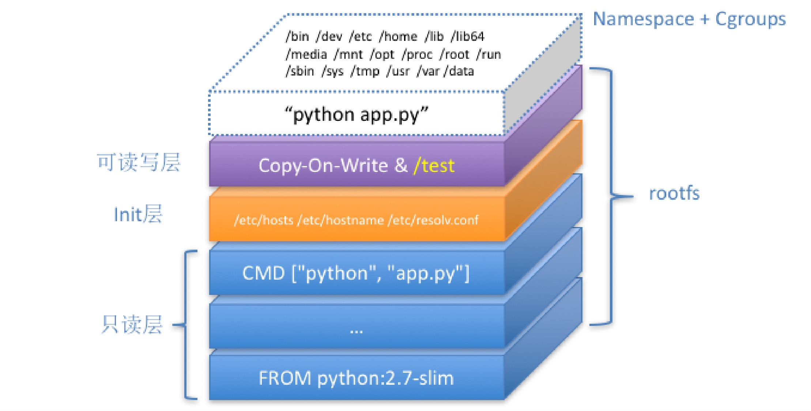

## 由进程说起

容器本身没有价值，有价值的是"容器编排"

- 容器其实就是一种沙盒技术，把应用给装起来，应用于应用之间没有了边界
- 容器计数的核心功能，其实就是通过约束和修改进程的动态表现，从而为其创造出来一个"边界"
- 对于Docker等技术来说，**Cgroups技术**是用来制造约束的主要手段，**Namespace技术**是用来制造边界的主要手段
- 每当我们在宿主机上 `docker run ` 一个容器，其实就是启动了一个进程，他拥有实际的进程id 比如100，但是在这个容器本身来看，他自己就是一个pid=1的进程，这就是Linux的** PID Namespace技术**实现的
- 除了Pid Namespace Linux还提供了 Mount、UTS、IPC、Network和User这些Namespace，比如Mount Namespace用来隔离进程的挂载点信息，Network Namespace 用来隔离进程的网络信息
- 虚拟机技术，直接通过Hypervisor的硬件虚拟化技术，模拟出了一个Guest OS，拥有OS需要的各种硬件，比如内存、I/O设备、CPU，而docke如使用一个docker engine 替代了hypervisor，更轻量级了
> 容器其实就是一种特殊的进程，一个"单进程"模型

## 隔离与限制

1. Namespace 技术实际上修改了应用进程看待整个计算机的"视图"，即它的"视线"被操作系统做了限制，只能"看到"某些指定的内容
2. Namespace 技术 相比虚拟机技术的不足是：**隔离的不彻底**：多个容器之间使用的还是同一个宿主机的系统内核
3. 在Linux内核中，有很多资源是不能被Namespace 化的，比如：时间，多个容器的时间使用的是一个宿主机的时间
4. Cgroups技术的主要作用是，限制一个进程组能够使用的资源上限，包括CPU、内存、磁盘、网络带宽等等
5. Cgroups技术主要是通过linux的cpu管理的关键词：cfs_period和cfs_quote，标识在cfs_period的一段时间内，只能被分配cfs_quote的CPU时间
6. Cgroups的本质就是在一个子系统目录加上一组资源限制文件的组合
7. Cgroups的不足提及最多的就是 /proc文件系统的问题，/proc是存储宿主机的内核运行状态的一系列特殊文件，在容器里面执行top命令，其实展示的还是宿主机的CPU和内存数据

## 容器镜像
1. Mount Namespace技术就是改变容器对于挂载点的的认知，但是在容器执行挂载之前，容器还是继承宿主机的各个挂载点的 **Mount Namespace技术跟其他的Namespace不同，它对容器"视图"的改变一定是跟随挂载操作(mount)才能生效的**
2. 实际上，Mount Namespace技术就是跟随chroot的不断改良才被发明的，他是Linux操作系统的第一个Namespace
3. 挂载在容器根目录上，用来为容器提供隔离后执行环境的文件系统，就是所谓的"容器镜像"，他还有一个更专业的名字叫：rootfs(根文件系统)
4. 最常见的rootfs，会包括下列一些目录和文件：/bin /etc /proc 等等
```
   > ls /
   > bin dev etc home lib lib64 mnt opt proc root run sbin sys tmp usr var
```
5. rootfs只是包括操作系统的文件、配置和目录，并不包括**系统内核**，在Linux中，这两部分是分开存放的，OS只有在开机才会加载内核镜像
6. 正是rootfs的存在，容器才有一个被反复宣传至今的重要特性：一致性，在rootfs中打包的并不只有应用，而是整个操作系统的文件和目录，也就是说**应用以及它所有的依赖环境都被封装在一起了**
7. 这种深入操作系统级别的运行环境一致性，打通了应用在本地开发和远端执行环境之间难以逾越的鸿沟

!> docker在镜像设计中，引入的层的概念，用户制作镜像的每一步操作，都会生成一个层，也就是一个增量的rootfs，使用的技术叫做联合文件系统(Uinon File System)

8. rootfs分为:只读层、init层、可读可写层
9. 只读层包含上面ls出来的一些目录，代表了操作系统；
10. 可读可写层，用户新增文件，修改产生的内容会以增量的方式出现在这个层，用户在这里删除文件，其实是创建了一个whiteout文件，把只读层里的文件"遮挡"起来了，docker commit+docker push 可以将这个修改过的容器上传到docker hub上去
11. init层，夹在可读可写层和只读层中间，是docker项目单独生成的一个内部层，专门存放/etc/hosts /etc/resolv.conf等信息，docker commit 并不会把这部分给提交了，属于这个容器独有的部分

> 一个进程，可以选择加入到某个进程的Namespace当中，这就是docker exec 的实现原理
>> docker exec 其实是利用了Linux的一个setns()系统调用，进入了一个"进程(容器)"中

## 容器卷
- 挂载其实就是一个inode替换的过程，在Linux系统中，inode可以理解为存放文件内容的"对象"，而dentry也叫目录项，是访问这个inode所使用的指针

- 如上图所示，容器挂载/test 到宿主机/home的过程其实就是修改/test的指针，指向/home的inode，但是这个/test本身并不会被docker commit掉

## 总结



1. 这个容器进程“python app.py”，运行在由 Linux Namespace 和 Cgroups 构成的隔离环境里；而它运行所需要的各种文件，比如 python，app.py，以及整个操作系统文件，则由多个联合挂载在一起的 rootfs 层提供。
2. 这些 rootfs 层的最下层，是来自 Docker 镜像的只读层。
3. 在只读层之上，是 Docker 自己添加的 Init 层，用来存放被临时修改过的 /etc/hosts 等文件。
4. 而 rootfs 的最上层是一个可读写层，它以 Copy-on-Write 的方式存放任何对只读层的修改，容器声明的 Volume 的挂载点，也出现在这一层。

> 一个运行的容器可以被看做
>>1. 一组联合挂载在/var/lib/docker/aufs/mnt上的roofs，这一部分我们称之为"容器镜像"，是容器的静态视图
>>2. 一个由Namespace+Cgroup构成的隔离环境，这一部分我们称之为"容器运行时"，是容器的动态视图