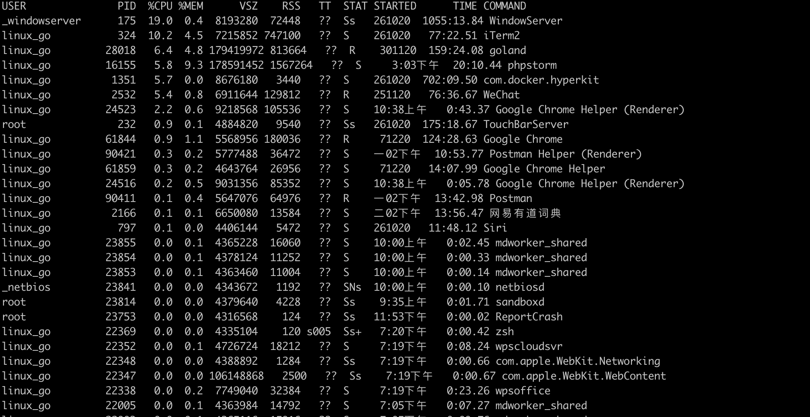

## ps 

linux上进程有5种状态:
1. 运行(正在运行或在运行队列中等待)
2. 中断(休眠中, 受阻, 在等待某个条件的形成或接受到信号)
3. 不可中断(收到信号不唤醒和不可运行, 进程必须等待直到有中断发生)
4. 僵死(进程已终止, 但进程描述符存在, 直到父进程调用wait4()系统调用后释放)
5. 停止(进程收到SIGSTOP, SIGSTP, SIGTIN, SIGTOU信号后停止运行运行)

- ps a 显示终端下所有程序，包括其他用户程序
- ps -A 显示所有程序
- ps c 列出所有程序，显示每个程序的真正指令名，而不包含路径，参数或常驻服务的标识
- ps -e 同-A
- ps e 列出程序时，显示每个程序所使用的环境变量
- ps f 用ASCII字符显示树状结构，表达程序间的相互关系
- ps u 以用户为主的格式来显示程序状况。
- ps x 显示所有程序，不以终端机来区分。

## ps aux



- USER:进程的属主
- PID:进程pid
- PPID:父进程pid
- %CPU:进程占用的cpu百分比
- %MEM:进程占用的内存百分比
- VSZ:进程使用的虚拟内存代销(KB)
- RSS:进程占用的固定内存大小(KB)(驻留中页的数量)
- TTY:进程在哪个终端运行(登陆者终端)，若与终端无关，显示(?)
- STAT:进程状态
    1. D:无法终端的休眠状态(通常是IO的进程)
    2. R:正在运行
    3. S:静止状态
    4. T:暂时执行
    6. X:死掉的进程
    7. Z:僵尸进程
    8. <:高优先进程
    9. N:低优先进程
    10. L:有些页被锁进内存；
    11. s:进程的领导者，它有子进程
    13. +:位于后台的进程组
- START:进程启动时间
- TIME:进程实际使用CPU的运行时间
- COMMAND:命令的名称和参数

## grep
文本搜索工具，可以使用正则表达式

### 命令格式
grep [option] filename

### 参数

- -a:不要忽略二进制的数据
- -A:显示行号 
- -c:计算符合样式的列数
- -C:除了显示符合样式的那一行之外，并显示该行之前后的内容
- -d:当指定要查找的是目录而非文件时，必须使用这项参数，否则grep指令将回报信息并停止动作
- -e:指定字符串做为查找文件内容的样式
- -E:将样式为延伸的正则表达式来使用
- -f:指定规则文件，其内容含有一个或多个规则样式，让grep查找符合规则条件的文件内容，格式为每行一个规则样式。
- -F:将样式视为固定字符串的列表。
- -G:将样式视为普通的表示法来使用。
- -h:在显示符合样式的那一行之前，不标示该行所属的文件名称。
- -H:在显示符合样式的那一行之前，表示该行所属的文件名称。
- -i:忽略字符大小写的差别。
- -l 或 --file-with-matches : 列出文件内容符合指定的样式的文件名称。
- -L 或 --files-without-match : 列出文件内容不符合指定的样式的文件名称。
- -n 或 --line-number : 在显示符合样式的那一行之前，标示出该行的列数编号。
- -o 或 --only-matching : 只显示匹配PATTERN 部分。
- -q 或 --quiet或--silent : 不显示任何信息。
- -r 或 --recursive : 此参数的效果和指定"-d recurse"参数相同。
- -s 或 --no-messages : 不显示错误信息。
- -v 或 --invert-match : 显示不包含匹配文本的所有行。
- -V 或 --version : 显示版本信息。
- -w 或 --word-regexp : 只显示全字符合的列。
- -x --line-regexp : 只显示全列符合的列。
- -y : 此参数的效果和指定"-i"参数相同。

## awk
AWK 是一种处理文本文件的语言，是一个强大的文本分析工具。

### 语法
awk [参数] 'script' var=value file(s) 

或 awk [参数] -f scriptfile var=value file(s)

### 参数

- -F fs :指定输入文件拆分分隔符，fs是一个字符串或者是一个正则表达式，如-F:
- -v var=value : 复制一个用户定义的变量
- -f scriptfile 从脚本文件中读取awk命令
- -mf nnn and -mr nnn: 对nnn值设置内在限制，-mf选项限制分配给nnn的最大块数目；-mr选项限制记录的最大数目，这两个功能是bell实验室版awk的扩展功能，在标准awk中不适用
- -W compact or --compat:在兼容模式下运行awk。所以gawk的行为和标准的awk完全一样，所有的awk扩展都被忽略。
- -W help or --help:打印全部awk选项和每个选项的简短说明

### 基本用法

log.txt文本内容如下
```
2 this is a test
3 Are you like awk
This's a test
10 There are orange,apple,mongo
```
#### 用法1
awk '{[pattern] action}' {filename} // 行匹配语句 awk '' 只能用单引号
#### 实例
```
# 每行按空格或TAB分割，输入文本中的1、4项

$ awk '{print $1 $4}' log.txt
-------------------------------------
2 a
3 like
This's 
10 orange
-------------------------------------
# 格式化输出

$ awk '{print "%-8s %-10s\n",$1,$4}' log.txt
-------------------------------------
 2        a
 3        like
 This's
 10       orange,apple,mongo
-------------------------------------
```
#### 用法2
awk -F // -F相当于内置变量FS,指定分割字符
#### 实例
```
# 使用","分割

$ awk -F, '{print $1,$2}' log.txt
//  或者使用内建变量 FS
$ awk 'BEGIN{FS=","} {print $1,$2}' log.txt
-------------------------------------
2 this is a test
3 Are you like awk
This's a test
10 There are orange apple  // 只有这一行进行了分割
-------------------------------------
// 用多个分隔符.先使用空格分割，然后对分割结果再使用","分割
$ awk -F '[ ,]' {print $1,$2,$5}' log.txt
-------------------------------------
2 this test
3 Are you
This's a
 10 There apple
-------------------------------------
```
#### 用法3
awk -v  设置变量
#### 实例
```
$ awk -va=1, '{print $1,$1+a}' log.txt
-------------------------------------
2 3
3 4
This's 1
10 11
-------------------------------------
$ awk -va=1 -vb=s {print $1,$1+a,$1b}' log.txt
-------------------------------------
2 3 2s
3 4 3s
This's 1 This'ss
10 11 10s
-------------------------------------
```
#### 用法4
awk -f {awk脚本} {文件名}
#### 实例
```
$ awk -f cal.awk log.txt
```

#### 运算
```
// 过滤第一列大于2的行
$ awk '$1>2' log.txt   
#输出
3 Are you like awk
This's a test
10 There are orange,apple,mongo
-----------------------------------------
// 过滤第一列等于2的行
$ awk '$1==2 {print $1,$3}' log.txt  
#输出
2 is
-----------------------------------------
// 过滤第一列大于2并且第二列等于'Are'的行

$ awk '$1>2 && $2 =="Are" {print $1,$2,$3} log.txt
#输出
3 Are you
```


