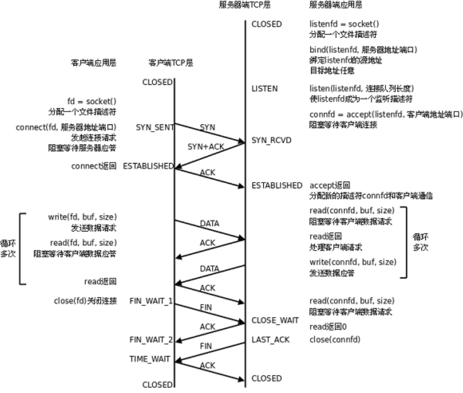

## Socket编程

### 套接字概念
>在Linux环境下，用于表示进程间网络通信的特殊文件类型。本质为内核借助缓冲区形成的伪文件。

既然是文件，那么理所当然的，我们可以使用文件描述符引用套接字。与管道类似的，Linux系统将其封装成文件的目的是为了统一接口，使得读写套接字和读写文件的操作一致。区别是管道主要应用于本地进程间通信，而套接字多应用于网络进程间数据的传递。

来描述网络连接的一对一关系。

!>在网络通信中，套接字一定是成对出现的

一端的发送缓冲区对应对端的接收缓冲区。我们使用同一个文件描述符索发送缓冲区和接收缓冲区。

TCP/IP协议最早在BSD UNIX上实现，为TCP/IP协议设计的应用层编程接口称为socket API。本章的主要内容是socket API，主要介绍TCP协议的函数接口，最后介绍UDP协议和UNIX Domain Socket的函数接口。

## 预备知识

### 网络字节序

我们已经知道，内存中的多字节数据相对于内存地址有大端和小端之分，磁盘文件中的多字节数据相对于文件中的偏移地址也有大端小端之分。网络数据流同样有大端小端之分，那么如何定义网络数据流的地址呢？发送主机通常将发送缓冲区中的数据按内存地址从低到高的顺序发出，接收主机把从网络上接到的字节依次保存在接收缓冲区中，也是按内存地址从低到高的顺序保存，因此，**网络数据流的地址应这样规定：先发出的数据是低地址，后发出的数据是高地址。**

!>TCP/IP协议规定，网络数据流应采用大端字节序，即低地址高字节

例如上一节的UDP段格式，地址0-1是16位的源端口号，如果这个端口号是1000（0x3e8），则地址0是0x03，地址1是0xe8，也就是先发0x03，再发0xe8，这16位在发送主机的缓冲区中也应该是低地址存0x03，高地址存0xe8。

但是，如果发送主机是小端字节序的，这16位被解释成0xe803，而不是1000。因此，发送主机把1000填到发送缓冲区之前需要做字节序的转换。

同样地，接收主机如果是小端字节序的，接到16位的源端口号也要做字节序的转换。如果主机是大端字节序的，发送和接收都不需要做转换。

同理，32位的IP地址也要考虑网络字节序和主机字节序的问题。

为使网络程序具有可移植性，使同样的C代码在大端和小端计算机上编译后都能正常运行

**可以调用以下库函数做网络字节序和主机字节序的转换。**

	#include <arpa/inet.h>
    uint32_t htonl(uint32_t hostlong);
    uint16_t htons(uint16_t hostshort);
    uint32_t ntohl(uint32_t netlong);
    uint16_t ntohs(uint16_t netshort);
	h表示host，n表示network，l表示32位长整数，s表示16位短整数。
    
如果主机是小端字节序，这些函数将参数做相应的大小端转换然后返回，如果主机是大端字节序，这些函数不做转换，将参数原封不动地返回。

## socket模型创建流程图

### socket函数
	#include <sys/types.h> /* See NOTES */
    #include <sys/socket.h>
    int socket(int domain, int type, int protocol);
    domain:
        AF_INET 这是大多数用来产生socket的协议，使用TCP或UDP来传输，用IPv4的地址
        AF_INET6 与上面类似，不过是来用IPv6的地址
        AF_UNIX 本地协议，使用在Unix和Linux系统上，一般都是当客户端和服务器在同一台及其上的时候使用
    type:
        SOCK_STREAM 这个协议是按照顺序的、可靠的、数据完整的基于字节流的连接。这是一个使用最多的socket类型，这个socket是使用TCP来进行传输。
        SOCK_DGRAM 这个协议是无连接的、固定长度的传输调用。该协议是不可靠的，使用UDP来进行它的连接。
        SOCK_SEQPACKET该协议是双线路的、可靠的连接，发送固定长度的数据包进行传输。必须把这个包完整的接受才能进行读取。
        SOCK_RAW socket类型提供单一的网络访问，这个socket类型使用ICMP公共协议。（ping、traceroute使用该协议）
        SOCK_RDM 这个类型是很少使用的，在大部分的操作系统上没有实现，它是提供给数据链路层使用，不保证数据包的顺序
    protocol:
        传0 表示使用默认协议。
    返回值：
    	成功：返回指向新创建的socket的文件描述符，失败：返回-1，设置errno
        
socket()打开一个网络通讯端口，如果成功的话，就像open()一样返回一个文件描述符，应用程序可以像读写文件一样用read/write在网络上收发数据，如果socket()调用出错则返回-1。对于IPv4，domain参数指定为AF_INET。对于TCP协议，type参数指定为SOCK_STREAM，表示面向流的传输协议。如果是UDP协议，则type参数指定为SOCK_DGRAM，表示面向数据报的传输协议。protocol参数的介绍从略，指定为0即可。

### bind函数
	#include <sys/types.h> /* See NOTES */
    #include <sys/socket.h>
    int bind(int sockfd, const struct sockaddr *addr, socklen_t addrlen);
    sockfd：
        socket文件描述符
    addr:
        构造出IP地址加端口号
    addrlen:
        sizeof(addr)长度
    返回值：
        成功返回0，失败返回-1, 设置errno

服务器程序所监听的网络地址和端口号通常是固定不变的，客户端程序得知服务器程序的地址和端口号后就可以向服务器发起连接，因此服务器需要调用bind绑定一个固定的网络地址和端口号。

bind()的作用是将参数sockfd和addr绑定在一起，使sockfd这个用于网络通讯的文件描述符监听addr所描述的地址和端口号。前面讲过，struct sockaddr *是一个通用指针类型，addr参数实际上可以接受多种协议的sockaddr结构体，而它们的长度各不相同，所以需要第三个参数addrlen指定结构体的长度。如：

	struct sockaddr_in servaddr;
    bzero(&servaddr, sizeof(servaddr));
    servaddr.sin_family = AF_INET;
    servaddr.sin_addr.s_addr = htonl(INADDR_ANY);
    servaddr.sin_port = htons(6666);

首先将整个结构体清零，然后设置地址类型为**AF_INET，网络地址为INADDR_ANY，这个宏表示本地的任意IP地址**，因为服务器可能有多个网卡，每个网卡也可能绑定多个IP地址，这样设置可以在所有的IP地址上监听，直到与某个客户端建立了连接时才确定下来到底用哪个IP地址，端口号为6666。

### listen函数
    include <sys/types.h> /* See NOTES */
    #include <sys/socket.h>
    int listen(int sockfd, int backlog);
    sockfd:##
        socket文件描述符
    backlog:
        排队建立3次握手队列和刚刚建立3次握手队列的链接数和
查看系统默认backlog

		cat /proc/sys/net/ipv4/tcp_max_syn_backlog
        
典型的服务器程序可以同时服务于多个客户端，当有客户端发起连接时，服务器调用的accept()返回并接受这个连接，如果有大量的客户端发起连接而服务器来不及处理，尚未accept的客户端就处于连接等待状态，listen()声明sockfd处于监听状态，并且最多允许有backlog个客户端处于连接待状态，如果接收到更多的连接请求就忽略。listen()成功返回0，失败返回-1。

### accept函数
    #include <sys/types.h> 		/* See NOTES */
    #include <sys/socket.h>
    int accept(int sockfd, struct sockaddr *addr, socklen_t *addrlen);
    sockdf:
        socket文件描述符
    addr:
        传出参数，返回链接客户端地址信息，含IP地址和端口号
    addrlen:
        传入传出参数（值-结果）,传入sizeof(addr)大小，函数返回时返回真正接收到地址结构体的大小
    返回值：
        成功返回一个新的socket文件描述符，用于和客户端通信，失败返回-1，设置errno
        
三方握手完成后，服务器调用accept()接受连接，如果服务器调用accept()时还没有客户端的连接请求，**就阻塞等待直到有客户端连接上来**。addr是一个传出参数，accept()返回时传出客户端的地址和端口号。addrlen参数是一个传入传出参数（value-result argument），传入的是调用者提供的缓冲区addr的长度以避免缓冲区溢出问题，传出的是客户端地址结构体的实际长度（有可能没有占满调用者提供的缓冲区）。如果给addr参数传NULL，表示不关心客户端的地址  

    while (1) {
        cliaddr_len = sizeof(cliaddr);
        connfd = accept(listenfd, (struct sockaddr *)&cliaddr, &cliaddr_len);
        n = read(connfd, buf, MAXLINE);
        ......
        close(connfd);
    }
    
整个是一个while死循环，每次循环处理一个客户端连接。由于cliaddr_len是传入传出参数，每次调用accept()之前应该重新赋初值。accept()的参数listenfd是先前的监听文件描述符，而accept()的返回值是另外一个文件描述符connfd，之后与客户端之间就通过这个connfd通讯，最后关闭connfd断开连接，而不关闭listenfd，再次回到循环开头listenfd仍然用作accept的参数。accept()成功返回一个文件描述符，出错返回-1。

### connect函数

    #include <sys/types.h> 					/* See NOTES */
    #include <sys/socket.h>
    int connect(int sockfd, const struct sockaddr *addr, socklen_t addrlen);
    sockdf:
        socket文件描述符
    addr:
        传入参数，指定服务器端地址信息，含IP地址和端口号
    addrlen:
        传入参数,传入sizeof(addr)大小
    返回值：
        成功返回0，失败返回-1，设置errno
        
客户端需要调用connect()连接服务器，connect和bind的参数形式一致，区别在于bind的参数是自己的地址，而connect的参数是对方的地址。connect()成功返回0，出错返回-1。

## C/S模型-TCP

下图是基于TCP协议的客户端/服务器程序的一般流程：

### 连接建立过程
服务器调用socket()、bind()、listen()完成初始化后，调用accept()阻塞等待，处于监听端口的状态，客户端调用socket()初始化后，调用connect()发出SYN段并阻塞等待服务器应答，服务器应答一个SYN-ACK段，客户端收到后从connect()返回，同时应答一个ACK段，服务器收到后从accept()返回。

### 数据传输过程
建立连接后，**TCP协议提供全双工的通信服务**，但是一般的客户端/服务器程序的流程是由客户端主动发起请求，服务器被动处理请求，一问一答的方式。因此，服务器从accept()返回后立刻调用read()，读socket就像读管道一样，如果没有数据到达就阻塞等待，这时客户端调用write()发送请求给服务器，服务器收到后从read()返回，对客户端的请求进行处理，在此期间客户端调用read()阻塞等待服务器的应答，服务器调用write()将处理结果发回给客户端，再次调用read()阻塞等待下一条请求，客户端收到后从read()返回，发送下一条请求，如此循环下去。

如果客户端没有更多的请求了，就调用close()关闭连接，就像写端关闭的管道一样，服务器的read()返回0，这样服务器就知道客户端关闭了连接，也调用close()关闭连接。注意，任何一方调用close()后，连接的两个传输方向都关闭，不能再发送数据了。如果一方调用shutdown()则连接处于半关闭状态，仍可接收对方发来的数据。

在学习socket API时要注意应用程序和TCP协议层是如何交互的： 应用程序调用某个socket函数时TCP协议层完成什么动作，比如调用connect()会发出SYN段 应用程序如何知道TCP协议层的状态变化，比如从某个阻塞的socket函数返回就表明TCP协议收到了某些段，再比如read()返回0就表明收到了FIN段

