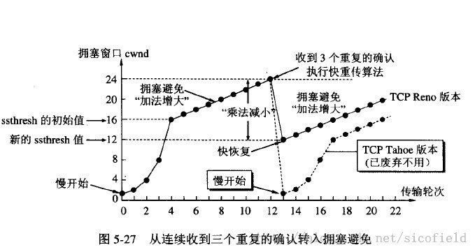

## 综述

1. 确认和重传：接收方收到报文会发送确认信号，发送方长时间没有收到确认信号，会重传
2. 数据校验
3. 数据合理分片和排序：tcp会按MTU合理分片，接收方会缓存未按序到达的数据，重新排序后再交给应用层
4. 流量控制：滑动窗口
5. 拥塞控制：慢开始-拥塞避免，快重传-快恢复
- cwnd就是拥塞窗口大小。
- 快重传：收到3个同样的确认就立刻重传，不等到超时；
- 快恢复：cwnd不是从1重新开始
6. ARQ协议：ARQ等待停止协议：每发完一个分组后，就停止发送，等待对方确认，在收到确认后再发下一个分组

