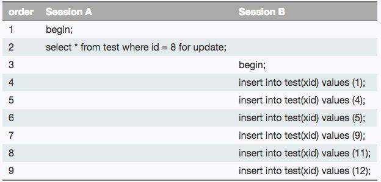

## MVCC

mvcc 多版本并发控制，innodb的数据库默认隔离级别是不可重复度，就是用mvcc实现的

mvcc有两种读形式，快照读和当前读，利用的是undoLog事务回滚日志和隐藏列:DB_TRX_ID(当前行的最后一次事务id)、DB_ROL_PTR(回滚指针)

1. 快照读:读取的只是当前事务的可见版本，不用加锁
2. 当前读:读取的是最新的版本，需要加锁

mvcc就是利用了多版本的思想，写操作更新最新的版本快照，而读操作去读旧版本的快照，没有互斥关系，类似CopyOnWrite

mvcc 每次insert/update/delete 都会新增一个版本快照，并且在该记录的隐藏列，更新DB_TRX_ID为最新的事务id

## read-view

读视图,用来记录当前数据库里面的事务信息

- up-limit-id : 当前未提交的事务里面 最小的一个事务id
- alive-trx-list = 当前未提交的事务id列表 [2,3,4,5]
- low-limit-id = read-view生成时刻，目前已出现的事务ID的最大值 + 1 

## undoLog

MVCC 的多版本指的是多个版本的快照，快照存储在 Undo 日志中，该日志通过回滚指针 ROLL_PTR 把一个数据行的所有快照连接起来。


## 快照读过程

> 每当数据库的一行记录被更新之后，就会更新当前事务id到该行记录的隐藏列：最近的一次事务id DB_TRX_ID，并且回滚指针DB_ROL_PTR指向之前的一个快照版本

1. 当查询到这一行的时候，首先找到这一行的隐藏列--最近的一次事务id:DB_TRX_ID,与当前的事务版本号进行比较，如果DB_TRX_ID小于当前事务版本号，说明这行记录是当前事务开启前就有的，那就可以读取
2. 如果DB_TRX_ID大于当前事务id，并且在未提交的事务列表alive-trx-list中，那么这行记录就是未提交的记录，在innodb的隔离级别为不可重复读的时候，此行记录就不可读，然后会拿着DB_ROL_PTR找寻上个版本的记录继续执行对比直到拿到数据，或者DB_ROL_PTR指针为null
3. 如果DB_TRX_ID大于low-limit-id，那么该数据快照是在事务启动之后被更改的，直接就不可使用了

!> 所以说mvcc实现了innodb的隔离级别--可重复读

## 幻读如何解决
### 幻读
幻读与不可重复读很像，主要是数量上的区别，比如事务A在事务期间更新了整个表的某一列为2，此时事务B插入一条新数据到表中，该列为1，对于事务A来说，此时再查询当前表之后，出现了一条不为2，就好像出现幻觉了一样

在可重复度的隔离级别中，如果只是select的话，是不会出现幻读的，因为select是快照读，只会读取记录的事务id小于当前事务id的数据，所以在其他事务删除了该行数据后，该事务还是能查询到该行，用的就是mvcc的快照读

但是在更新的情况下，就会出现幻读，比如

1. 开始事务A,查询 id = 3的数据，出现 id = 3,name = 张三
2. 开始事务B，查询 id = 3，出现 id = 3,name = 张三  (没毛病)
3. 事务B，delete from table where id = 3,
4. 事务B select * from table ,此时无记录，然后commit，提交事务 (没毛病)
5. 事务A此时select * from table ，出现 id = 3,name = 张三， (此时还是没毛病，使用的快照读)
6. 事务A delete from table where id = 3,此时数据库提示**OK，0 rows affected**，说明此时没有找到id = 3的记录，因为写操作是直接操作最新的快照，所以符合mvcc的概念
7. 事务A select * from table ,此时出现了出现 id = 3,name = 张三，这时候就矛盾了，删除的时候提示无记录，但是查询的时候确查询出来了，此时就是幻读出现了

!> 所以说mvcc实现了innodb的隔离级别--可重复读，但是没有解决幻读

### 幻读的解决-Next-Key Locks

1. Record Locks 锁定一个记录上的索引，而不是记录本身
2. Gap Locks 锁定索引之间的间隙，但是不包含索引本身
3. Next-Key Locks 就是 Record Locks 和 Gap Locks 的结合，不近索引一个记录上的索引，也锁定了索引之间的间隙

1. 事务A执行 UPDATE table SET money = 10000 WHERE id >= 1 AND id <= 3; 
2. 事务B执行 insert into table values(20000)，此时一直会阻塞，等到间隙锁释放后
3. 此时如果A一直不提交或者因为其他因为阻塞了十几秒，事务B会一直等
4. 事务A执行commit后，事务B才插入成功

在高并发的系统里面，最怕的就是长时间阻塞，所以间隙锁是有危害的

> 当查询的索引含有唯一属性时，会将next-key lock优化降级为record key
> Gap锁设计的目的是为了阻止多个事务将记录插入到同一范围内，而这会导致幻读问题的产生
> 有两种方式显式关闭gap锁：A. 将事务隔离级别设置为RC B. 将参数innodb_locks_unsafe_for_binlog设置为1

### 间隙锁的应用



1. 事务A会锁定 (5,8],(8,11] 这个区间
2. 事务B 执行到第三个sql就会阻塞，然后跳过，一直到第五步才会插入，第六步也会插入成功，然后剩下的只能等事务A提交之后才能插入

## 总结
mvcc没有解决幻读，幻读的解决需要手动加行(X)锁，加了行锁之后不管这个记录到底有没有，都会锁住，这样子其他事务就不能操作
这个行了，也就避免了幻读
```sql
select * from ..... for update 或者
select * from ..... lock in share model
```

其实这样子就属于串行化了，mysql最高隔离级别 serializable (序列化) 其实就是隐式的帮我们加了行锁和间隙锁了

最后还是那样子，隔离级别越高、安全性就越高，但是并发量就会下降
