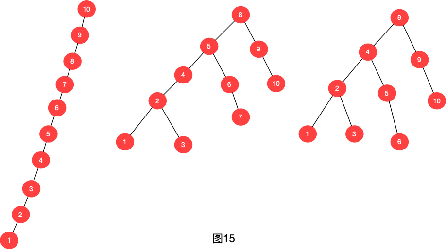
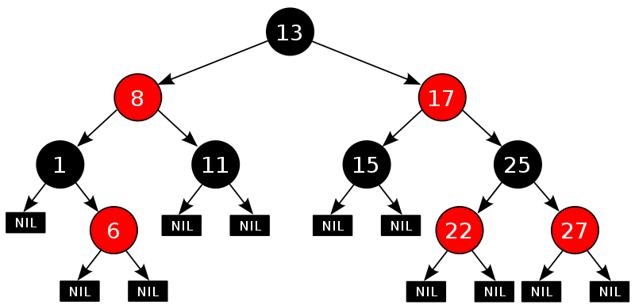
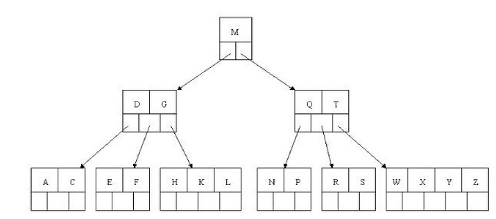
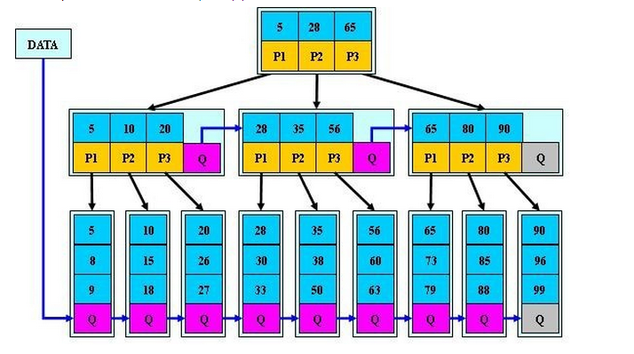

## 概念解析

关于什么是树、二叉树、多叉树、满二叉树、二叉搜索树的概念这里就不讲了，如果不懂这些概念的同学，这篇文章也帮不了你。。。。你先弄明白那些概念吧

首先我们了解以下什么是B-tree树、B+tree树、平衡二叉树、红黑树...

### 平衡二叉查找树

我们知道二叉查找树有很强的搜索功能，二叉查找树的中序遍历后就是一个有序数组，所以利用二分查找的性质可以很快的查找到所需要的信息

但是有一些极端的情况就是二叉查找树会退化为链表，比如如下情况

上图最左边的情况就是二叉查找树退化成了链表形式，查询时间复杂度从O(logN)变成了O(N),所以出现了上图最右边的解决方案，平衡二叉查找树

平衡二叉查找树的特性为：

- 其左子树和右子树都是高度平衡的二叉树
- 左子树和右子树的高度之差的绝对值不超过1。
- 非叶子节值大于左边子节点、小于右边子节点

平衡二叉查找树又称为AVL树

局限性：
- 由于维护这种高度平衡所付出的代价比从中获得的效率收益还大，故而实际的应用不多，更多的地方是用追求局部而不是非常严格整体平衡的红黑树。当然，如果应用场景中对插入删除不频繁，只是对查找要求较高，那么AVL还是较优于红黑树。

### 红黑树

一种二叉查找树，但在每个节点增加一个存储位表示节点的颜色，可以是red或black。通过对任何一条从根到叶子的路径上各个节点着色的方式的限制，红黑树确保没有一条路径会比其它路径长出两倍。它是一种弱平衡二叉树(由于是弱平衡，可以推出，相同的节点情况下，AVL树的高度低于红黑树)，相对于要求严格的AVL树来说，它的旋转次数变少，所以对于搜索、插入、删除操作多的情况下，我们就用红黑树。

红黑树的性质：

1. 每个节点非红即黑； 
2. 根节点是黑的； 
3. 每个叶节点(叶节点即树尾端NULL指针或NULL节点)都是黑的； 
4. 如果一个节点是红的,那么它的两儿子都是黑的； 
5. 对于任意节点而言，其到叶子点树NULL指针的每条路径都包含相同数目的黑节点； 
6. 每条路径都包含相同的黑节点；

红黑树的应用：

1. 红黑树应用于大部分的C++的STL中，Map和Set都是用红黑树实现的
2. 著名的Linux进程调度Completely Fair Scheduler，用红黑树管理进程控制块，进程的虚拟内存区域都存储在一颗红黑树上，每个虚拟地址区域都对应红黑树的一个节点，左指针指向相邻的地址虚拟存储区域，右指针指向相邻的高地址虚拟地址空间；
3. IO多路复用epoll的实现采用红黑树组织管理sockfd，以支持快速的增删改查； 
4. Nginx中用红黑树管理timer，因为红黑树是有序的，可以很快的得到距离当前最小的定时器； 
5. Java中TreeMap的实现

### B树

B树和平衡二叉树稍有不同的是B树属于多叉树又名**平衡多路查找树**（查找路径不只两个），数据库索引技术里大量使用者B树和B+树的数据结构，让我们来看看他有什么特点;

1. 排序方式：所有节点关键字是按递增次序排列，并遵循左小右大原则
2. 子节点数：非叶节点的子节点数>1，且<=M ，且M>=2，空树除外（注：M阶代表一个树节点最多有多少个查找路径，M=M路,当M=2则是2叉树,M=3则是3叉）
3. 关键字数：枝节点的关键字数量大于等于ceil(m/2)-1个且小于等于M-1个（注：ceil()是个朝正无穷方向取整的函数 如ceil(1.1)结果为2)
4. 所有叶子节点均在同一层、叶子节点除了包含了关键字和关键字记录的指针外也有指向其子节点的指针只不过其指针地址都为null对应下图最后一层节点的空格子

简单叙述下B树的查找过程：

如果查找上图的E字母：

- 取根节点的关键字进行比较，当前根节点关键字为M，E<M（26个字母顺序），所以往找到指向左边的子节点（二分法规则，左小右大，左边放小于当前节点值的子节点、右边放大于当前节点值的子节点）；
- 拿到关键字D和G，D<E<G 所以直接找到D和G中间的节点；
- 拿到E和F，因为E=E 所以直接返回关键字和指针信息（如果树结构里面没有包含所要查找的节点则返回null）；

B树的插入和删除过程，会导致树的不平衡，所以会触发平衡树的操作，平衡树的操作会带来不小的开销，所以B树适合一些查询操作多的业务，不适合修改操作多的业务

### B+树

B+树和B树的结构大多类似，但是B+树更适合文件系统，这是因为B+树的所有数据都存放在叶子节点上，而非叶子结点只存储关键字，而B树的非叶子结点也存储了数据信息，每个叶子节点也都存储的指向下个叶子结点的指针，所以在B+树的叶子层，也可以看作是一个链表，进行范围查询的时候，只需遍历链表就行了，而B树进行范围查询还需中序遍历B树来解决

下图展示了B+树的大概模型

### 为什么Mysql使用B+树？

>计算机又一个著名的局部性理论,意思是一块内存的数据需要被使用时，与他相邻地址的数据也会马上被使用，所以计算机每次进行IO的适合，不只是取出你要的数据，他会把周围的数据一并读取出来

由于上面介绍的局部性原理，因为磁盘的读取和内存的读取时间上相差好几个数量级，所以为了减少磁盘IO，每次读取磁盘的时候，会进行磁盘预读，数据库系统的设计者巧妙利用了磁盘预读原理，将一个节点的大小设为等于一个页，这样每个节点只需要一次I/O就可以完全载入，大大降低了磁盘IO次数

在实际实现B-Tree还需要使用如下技巧：

每次新建节点时，直接申请一个页的空间，这样就保证一个节点物理上也存储在一个页里，加之计算机存储分配都是按页对齐的，就实现了一个node只需一次I/O。

为什么B+树的存储效率更高？

1. B树的节点含有指向关键字具体信息的指针，B+树中确没有，因此内部节点相对于B树来说更新，这样一来把所有同一内部节点的关键字放在同一磁盘块中，那么同一磁盘块所能容纳的关键字数量就越多，相对读写磁盘IO的次数也就降低了

2. B+树查询效率更为稳定，因为所有数据都在叶子结点上存储着，每次查询必须查必须走一条从根节点到叶子结点的一条路，所以的关键字查询效率相同

3. 由于B+树的数据在叶子结点上，分支节点都为索引，方便扫库，并且叶子结点都含有指向下个叶子结点的指针，进行范围查询的时候，遍历叶子结点就行了，而B树在分支节点上面页有数据，范围查询需要中序遍历，效率不如B+树

## 总结

- B树在提高了IO性能的同时并没有解决元素遍历的我效率低下的问题，正是为了解决这个问题，B+树应用而生。B+树只需要去遍历叶子节点就可以实现整棵树的遍历。而且在数据库中基于范围的查询是非常频繁的，而B树不支持这样的操作或者说效率太低。
- mysql的索引会把根节点缓存到内存中去，减少一次磁盘的IO
- mysql的innode于myisam的索引都是用B+树，区别在于innodb用的是聚簇索引而myisam用的是非聚集索引，所谓聚集索引是物理地址连续存放的索引，在取区间的时候，查找速度非常快，但同样的，插入的速度也会受到影响而降低。聚集索引的物理位置使用链表来进行存储。
- 聚集索引一个表只有一个，一般是主键，没有主键，会默认第一个部位null的唯一索引为主键，还没有的话，innodb会自动生成一个隐式列，叫rowid作为聚集索引
- 非聚集索引存储的就是主键的id，非聚集索引搜索会进行回表，就是利用非聚簇索引找到主键，然后根据主键找到真正的数据
- 聚集索引是在物理地址上的连续位置，进行范围查询的时候，查询效率飞快

## 个人感悟

- B+树肯定是为了提升查找效率的，顺序查找的话在数据量上来了如千万数据的时候，就非常慢了，所以有了二分查找
- 但是二分查找的瓶颈在于树的深度，有时候需要查找到树的最深处，所以我们就需要一个**矮胖**的结构，所以有了B/B+树
- B+树的节点只存储索引key值，具体信息的地址存在于叶子节点的地址中。这就使以页为单位的索引中可以存放更多的节点。减少更多的I/O支出。因此，B+树成为了数据库比较优秀的数据结构

## 参考

- https://blog.csdn.net/jacke121/article/details/78268602
- https://www.cnblogs.com/tiancai/p/9024351.html
- https://www.kancloud.cn/kancloud/theory-of-mysql-index/41850