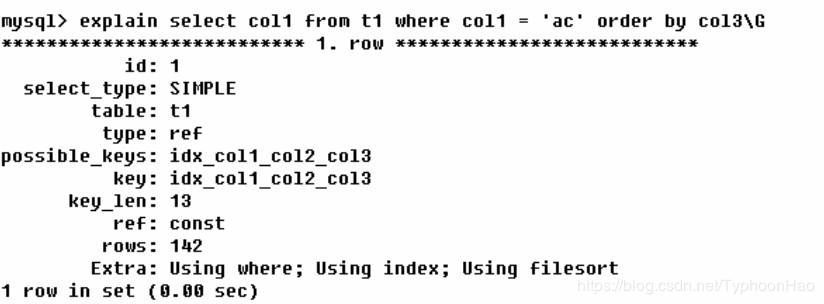

## MySQL Query Optimizer
MySQL Optimizer是一个专门负责优化SELECT 语句的优化器模块，它主要的功能就是通过计算分析系统中收集的各种统计信息，为客户端请求的Query 给出他认为最优的执行计划，也就是他认为最优的数据检索方式。但不一定是最符合业务需求的。
当客户端向MySQL发送一条sql语句的时候，命令解析器模块就会完成请求分类，区别度是读还是写，select的sql语句会转发给Query Optimizer，它会对整条sql先进性优化，处理掉一些常量表达式的预算，直接换算成常量，并对Query中的查询条件进行简化和转换，入去掉一些显而易见的条件、结构调整等。然后分析Query中的Hint信息（如果有），如果没有Hint信息偶Hint信息不足以完全确定执行计划，则会读取所涉及对象的统计信息，根据Query进行写相应的计算分析，然后再得出最后的执行计划

## MySQL的常见瓶颈
- CPU:SQL中对大量数据进行比较、关联、排序、分组

- IO：实例内存满足不了缓存数据或排序等需要，导致产生大量 物理 IO。查询执行效率低，扫描过多数据行。
- 锁：不适宜的锁的设置，导致线程阻塞，性能下降。死锁，线程之间交叉调用资源，导致死锁，程序卡住。
- 服务器硬件的性能瓶颈：top,free, iostat和vmstat来查看系统的性能状态

## 查询计划(explain)
- 使用EXPLAIN关键字可以模拟优化器执行SQL查询语句，从而知道MySQL是如何处理你的SQL语句的。分析你的查询语句或是表结构的性能瓶颈

- 使用方法  EXPLAIN+SQL语句

- 执行计划包含的信息：表的读取顺序、哪些索引可以使用、数据读取操作的操作类型、哪些索引被实际使用、表之间的引用、每张表有多少行被优化器查询

## 查询计划字段解析

### id

>select查询的序列号,包含一组数字，表示查询中执行select子句或操作表的顺序，会有三种情况
- id相同，执行顺序由上至下
- id不同，如果是子查询，id的序号会递增，id值越大优先级越高，越先被执行 
- id相同不同，同时存在;  id如果相同，可以认为是一组，从上往下顺序执行；在所有组中，id值越大，优先级越高，越先执行 

### select_type

>查询的类型，主要是用于区别  普通查询、联合查询、子查询等的复杂查询
- SIMPLE ：简单的 select 查询,查询中不包含子查询或者UNION
- PRIMARY：查询中若包含任何复杂的子部分，最外层查询则被标记为Primary
- DERIVED：在FROM列表中包含的子查询被标记为DERIVED(衍生) MySQL会递归执行这些子查询, 把结果放在临时表
- SUBQUERY：在SELECT或WHERE列表中包含了子查询
- DEPENDENT SUBQUERY：在SELECT或WHERE列表中包含了子查询,子查询基于外层
- UNCACHEABLE SUBQUREY：无法被缓存的子查询
- UNION：若第二个SELECT出现在UNION之后，则被标记为UNION；若UNION包含在FROM子句的子查询中,外层SELECT将被标记为：DERIVED
- UNION RESULT：从UNION表获取结果的SELECT

### table

>显示这一行的数据是关于哪张表的

### type

>显示查询使用了何种类型，从最好到最差依次是：
**system>const>eq_ref>ref>fulltext>ref_or_null>index_merge>_unique_subquery>_index_subquery>range>index>ALL**
- system：表只有一行记录（等于系统表），这是const类型的特列，平时不会出现，这个也可以忽略不计
- const：表示通过索引一次就找到了,const用于比较primary key或者unique索引。因为只匹配一行数据，所以很快如将主键置于where列表中，MySQL就能将该查询转换为一个常量
- eq_ref：唯一性索引扫描，对于每个索引键，表中只有一条记录与之匹配。常见于主键或唯一索引扫描
- ref：非唯一性索引扫描，返回匹配某个单独值的所有行.本质上也是一种索引访问，它返回所有匹配某个单独值的行，然而，它可能会找到多个符合条件的行，所以他应该属于查找和扫描的混合体
- range：只检索给定范围的行,使用一个索引来选择行。key 列显示使用了哪个索引一般就是在你的where语句中出现了between、<、>、in等的查询这种范围扫描索引扫描比全表扫描要好，因为它只需要开始于索引的某一点，而结束语另一点，不用扫描全部索引。
- index：Full Index Scan，index与ALL区别为index类型只遍历索引树。这通常比ALL快，因为索引文件通常比数据文件小。（也就是说虽然all和Index都是读全表，但index是从索引中读取的，而all是从硬盘中读的）
- all：Full Table Scan，将遍历全表以找到匹配的行
- index_merge：在查询过程中需要多个索引组合使用，通常出现在有 or 的关键字的sql中
- ref_or_null：对于某个字段既需要关联条件，也需要null值得情况下。查询优化器会选择用ref_or_null连接查询。
- index_subquery：利用索引来关联子查询，不再全表扫描。
- unique_subquery ：该联接类型类似于index_subquery。 子查询中的唯一索引
> 备注：一般来说，得保证查询至少达到range级别，最好能达到ref。

### possible_keys
>显示可能应用在这张表中的索引，一个或多个。查询涉及到的字段上若存在索引，则该索引将被列出，但不一定被查询实际使用,有时候为null但实际用到了

### key
>实际使用的索引。如果为NULL，则没有使用索引 
### key_len
>表示索引中使用的字节数，可通过该列计算查询中使用的索引的长度

### ref
>显示索引的哪一列被使用了，如果可能的话，是一个常数。哪些列或常量被用于查找索引列上的值 const表示常量

### rows
>rows列显示MySQL认为它执行查询时必须检查的行数。越少越好

### Extra
>包含不适合在其他列中显示但十分重要的额外信息
- Using filesort ：说明mysql会对数据使用一个外部的索引排序，而不是按照表内的索引顺序进行读取。
- MySQL中无法利用索引完成的排序操作称为“文件排序”
- 出现filesort的情况：order by 的时候使用了复合索引中的部分索引，导致生成临时表，和文件排序

- 优化后，不再出现filesort的情况：orderBy使用了复合索引

**查询中排序的字段，排序字段若通过索引去访问将大大提高排序速度分情况：当通过前面的查询语句 筛选大部分条件后，只剩下很少的数据。using filesort 性能影响不大。需要综合考虑**

### Using temporary
>使了用临时表保存中间结果,MySQL在对查询结果排序时使用临时表。常见于排序 order by 和分组查询 group by。
 - 优化前：group by 的时候使用了复合索引中的部分索引，导致生成临时表，和文件排序

- 优化后：

### USING index 
>表示相应的select操作中使用了覆盖索引(Covering Index)，避免访问了表的数据行，效率不错！如果同时出现using where，表明索引被用来执行索引键值的查找;如果没有同时出现using where，表明索引只是用来读取数据而非利用索引执行查找。

### 覆盖索引：也叫索引覆盖
>索引是高效找到行的一个方法，但是一般数据库也能使用索引找到一个列的数据，因此它不必读取整个行。毕竟索引叶子节点存储了它们索引的数据;当能通过读取索引就可以得到想要的数据，那就不需要读取行了。

select id , name from t_xxx where age=18;

有一个组合索引  idx_id_name_age_xxx 包含了(覆盖了)，id,name,age三个字段。查询时直接将建立了索引的列读取出来了，而不需要去查找所在行的其他数据。所以很高效。

(个人认为：在数据量较大，固定字段查询情况多时可以使用这种方法。)

**注意：如果要使用覆盖索引，一定要注意select列表中只取出需要的列，不可select *，因为如果将所有字段一起做索引会导致索引文件过大，查询性能下降。**
### Using where

>表明使用了where过滤
### using join buffer

>使用了连接缓存 : 出现在当两个连接时，驱动表(被连接的表,left join 左边的表。inner join 中数据少的表) 没有索引的情况下。给驱动表建立索引可解决此问题。且 type 将改变成 ref
### impossible where

>where子句的值总是false，不能用来获取任何元组
 - 例如：select * from test where name='haha' and name ='heihei'; where条件不能name等于两个值

### select tables optimized away

>在没有GROUPBY子句的情况下，基于索引优化MIN/MAX操作或者对于MyISAM存储引擎优化COUNT(*)操作，不必等到执行阶段再进行计算，查询执行计划生成的阶段即完成优化。
