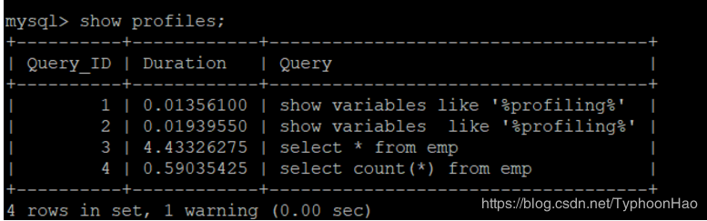
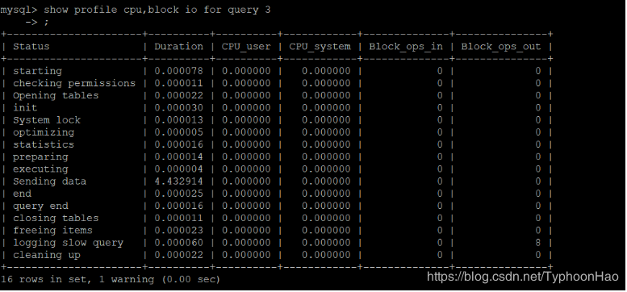

## 介绍

- MySQL的慢查询日志是MySQL提供的一种日志记录，它用来记录在MySQL中响应时间超过阀值的语句，具体指运行时间超过long_query_time值的SQL，则会被记录到慢查询日志中
- 默认情况下，MySQL数据库没有开启慢查询日志，需要我们手动来设置这个参
        SHOW VARIABLES LIKE '%slow_query_log%';
        set global slow_query_log=1;
        
- 使用set global slow_query_log=1开启了慢查询日志只对当前数据库生效

**如果MySQL重启后则会失效**

>全局变量设置，对当前连接不影响对当前连接立刻生效

- 如果要永久生效，就必须修改配置文件my.cnf（其它系统变量也是如此）修改my.cnf文件，[mysqld]下增加或修改参数
slow_query_log 和slow_query_log_file后，然后重启MySQL服务器。也即将如下两行配置进my.cnf文件
       
        slow_query_log =1
		slow_query_log_file=/var/lib/mysql/atguigu-slow.log

关于慢查询的参数slow_query_log_file ，它指定慢查询日志文件的存放路径，系统默认会给一个缺省的文件host_name-slow.log（如果没有指定参数slow_query_log_file的话）
- 慢查询时间

>这个是由参数long_query_time控制，默认情况下long_query_time的值为10秒

  - 命令：SHOW VARIABLES LIKE 'long_query_time%';
  - 可以使用命令修改，也可以在my.cnf参数里面修改。
  - 需要重新连接或新开一个会话才能看到修改值。 SHOW VARIABLES LIKE 'long_query_time%';
- 查询当前系统中有多少条慢查询记录

		show global status like '%Slow_queries%';
- 【mysqld】下配置：
		
        slow_query_log=1;
		slow_query_log_file=/var/lib/mysql/atguigu-slow.log
		long_query_time=3;
		log_output=FILE
        
## 日志分析工具mysqldumpslow
### mysqldumpslow --help

- s: 是表示按照何种方式排序；
- c: 访问次数
- l: 锁定时间
- r: 返回记录
- t: 查询行数
- al:平均锁定时间
- ar:平均返回记录数
- at:平均查询时间
- t:即为返回前面多少条的数据；
- g:后边搭配一个正则匹配模式，大小写不敏感的；

### 常用命令

- 得到返回记录集最多的10个SQL

		mysqldumpslow -s r -t 10 /var/lib/mysql/atguigu-slow.log
- 得到访问次数最多的10个SQL

		mysqldumpslow -s c -t 10 /var/lib/mysql/atguigu-slow.log
- 得到按照时间排序的前10条里面含有左连接的查询语句

		mysqldumpslow -s t -t 10 -g "left join" /var/lib/mysql/atguigu-slow.log
- 另外建议在使用这些命令时结合 | 和more 使用 ，否则有可能出现爆屏情况

		mysqldumpslow -s r -t 10 /var/lib/mysql/atguigu-slow.log | more
        
## profile

### 简介

- 是mysql提供可以用来分析当前会话中语句执行的资源消耗情况。可以用于SQL的调优的测量
- 默认情况下，参数处于关闭状态，并保存最近15次的运行结果
- Show  variables like 'profiling'; 默认是关闭，使用前需要开启
- set profiling=1; 开启
- 查看结果，show profiles;

- 诊断SQL，show profile cpu,block io for query n (n为上一步前面的问题SQL数字号码

cpu block io 等参数说明
  type: 
  
       | ALL                        --显示所有的开销信息  
       | BLOCK IO                --显示块IO相关开销  
       | CONTEXT SWITCHES --上下文切换相关开销  
       | CPU              --显示CPU相关开销信息  
       | IPC              --显示发送和接收相关开销信息  
       | MEMORY           --显示内存相关开销信息  
       | PAGE FAULTS      --显示页面错误相关开销信息  
       | SOURCE           --显示和Source_function，Source_file，Source_line相关的开销信息  
       | SWAPS            --显示交换次数相关开销的信息
- 日常开发需要注意的结论
  - 1.converting HEAP to MyISAM 查询结果太大，内存都不够用了往磁盘上搬了。
  - 2.Creating tmp table 创建临时表
        新建临时表
        拷贝数据到临时表
        用完再删除
  - 3.Copying to tmp table on disk 把内存中临时表复制到磁盘，危险！！！
  - locked
  
#### 全局查询日志

**永远不要在生产环境下使用**
- 配置启用,在mysql的my.cnf中，设置如下：
	- 开启 general_log=1   
	- 记录日志文件的路径 general_log_file=/path/logfile
	- 输出格式 log_output=FILE
- 编码启用
	- 命令 set global general_log=1;
	- 全局日志可以存放到日志文件中，也可以存放到Mysql系统表中。存放到日志中性能更好一些，存储到表中 set global log_output='TABLE'; 
    -  此后 ，你所编写的sql语句，将会记录到mysql库里的general_log表，可以用下面的命令查看
   
   
    	select * from mysql.general_log;
