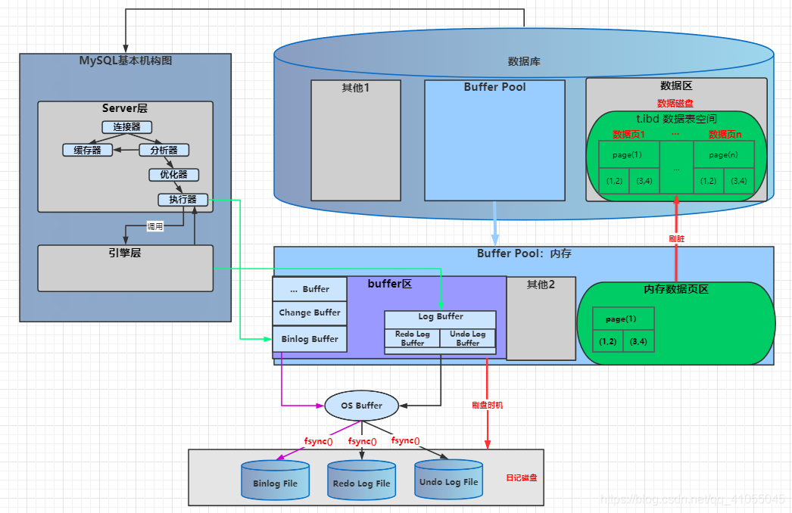
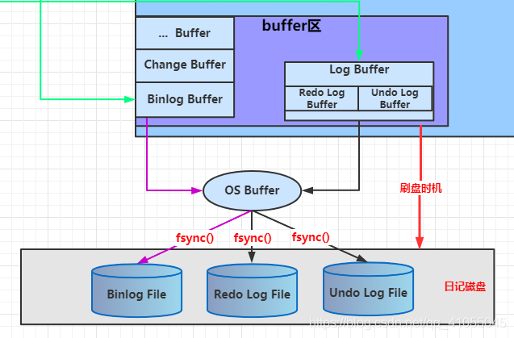
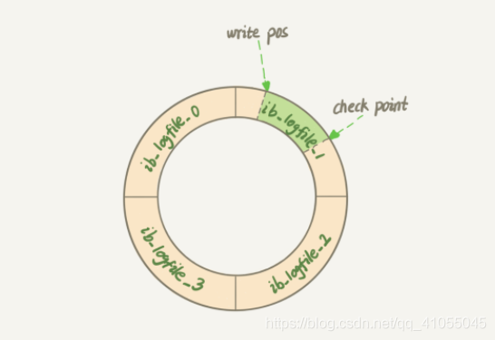
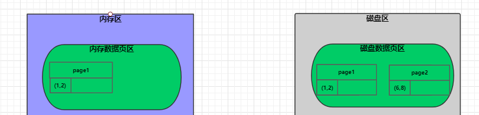
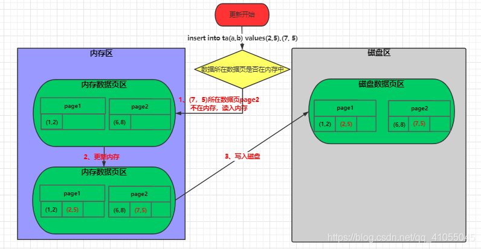
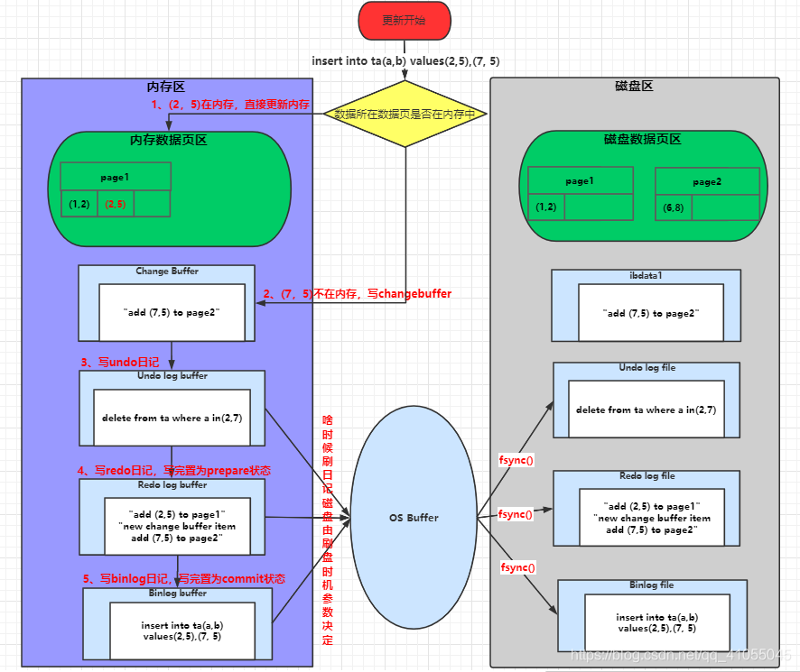
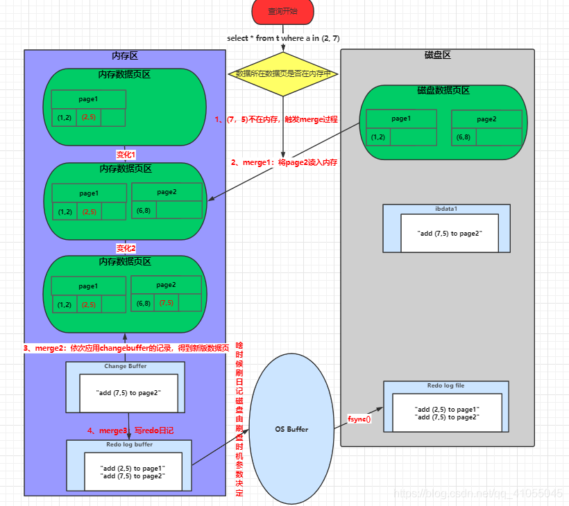
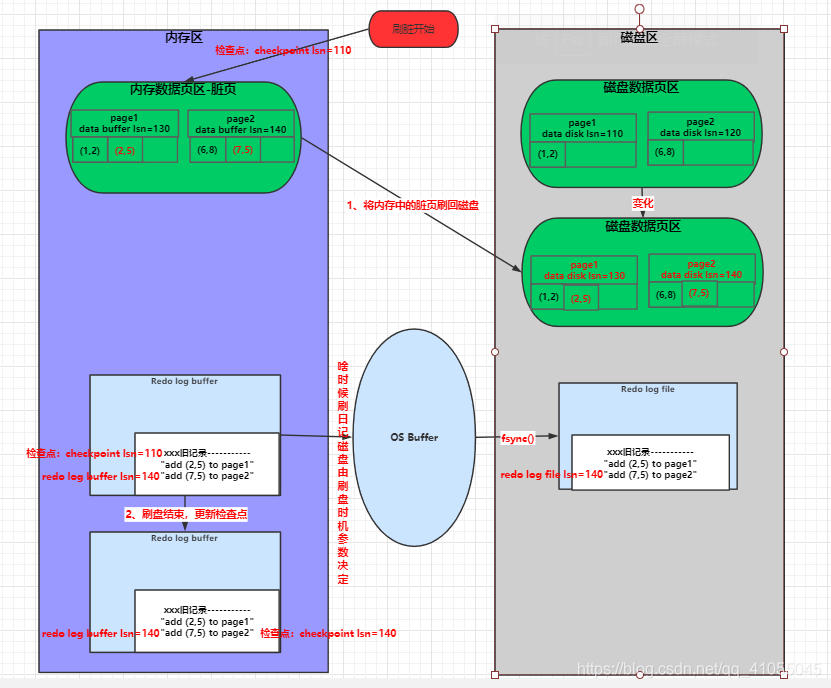

## 前言

mysql 的日志分为错误日志、查询日志、慢查询日志、事务日志(redo/undo log)、二进制日志(binlog)

其中比较重要的就是事务日志和二进制日志

## 概念介绍

### 更新数据过程
当我们想要更新一条数据的时候

1. 执行器去调数据引擎检查这条数据所在的**数据页**是否在**内存中**
2. 不在内存中，非唯一索引将这个更新的数据对应的数据页操作记录在**ChangeBuffer**中(唯一索引会读去数据磁盘将数据页读入内存，因为唯一索引要判断是否冲突)
3. **Undo Log Buffer** 记录这个更新的相反操作(sql 记录)，属于逻辑日志
4. **Redo Log Buffer** 记录Changebuffer的改变，属于物理日志，此时设置二阶段提交的第一阶段prepare，**引擎层**记录
5. **Binlog Buffer** 记录更新逻辑操作，**Server**层记录
6. 提交事务，此时更新Redo log的第二阶段为commit
7. 各个Buffer都有自己的刷盘时机，将内存中的(Buffer)的记录通过**OS Buffer**写到**磁盘文件**中，
即Redo Log File、Undo Log File、Binlog File
8. 查询数据时，对应数据不在内存中，此时需要将数据页同步到内存中，并执行**merge**过程
9. 线程空闲的时候，会将内存中最新的数据刷到磁盘上去，这个过程叫**刷脏**

### 概念解释

|概念	| 解释（红：核心，绿：过程，黄：指引）|
|----|----|
|数据页	| MySQL是按照数据页为最小单位进行存储的，b+树的特性，一页默认16k，数据属于页，页包含数据。当操作一条数据的时候，实际上就是在操作一个数据页，多条数据可能是在一个数据页也可能是在多个数据页，看数据具体分布。后面对我将会一直提到数据页。
|内存	|内存是指：InnoDB引擎内存Buffer Pool，会缓存数据页。每次更新之前查数据先会查内存中对应的数据页。由内存Buffer Pool分割出去的有ChangeBuffer、Log Buffer（Redo、Undo）和Binlog Buffer等等。
|ChangeBuffer |“ChangeBuffer” 是Buffer Pool分割出去的一块内存，记录更新操作，当更新没有用到唯一索引并且内存没有对应数据页，就不用从数据磁盘读入到内存，而是直接记录在ChangeBuffer中。
|Log Buffer	|“Log Buffer” 是Buffer Pool分割出去的一块内存总称，事务日记内存，Log Buffer又分成Redo log Buffer和Undo Log Buffer。
|数据磁盘	|“数据磁盘” 是数据库存储数据的磁盘（自称） ，为了区分日记磁盘
|Undo Log Buffer	|Log Buffer的一块缓存，写Undo是先写入Undo Log Buffer，刷盘时机，通过OS Buffer写入Undo Log File日记磁盘。
|逻辑日记	|“逻辑日记” 可以简单理解为记录的就是sql语句。Binlog和Undo log记录的是逻辑日记。
|Redo Log Buffer	|Log Buffer的一块缓存，写Rndo是先写入Redo Log Buffer，刷盘时机，通过OS Buffer写入Rndo Log File日记磁盘。
|物理日记	|“物理日志” 记录的就是数据页变更 ，因为MySQL数据最终是保存在数据页中的，Redo Log记录的是物理日记。
|二阶段提交	|“二阶段提交” 是指prepare和commit两个状态阶段，是保证Redo log 和 Binlog一致性所采取的方式。
|prepare	|“prepare” 是指预提交阶段，属于二阶段提交中的第一阶段。
|Binlog Buffer	|“Binlog Buffer” 是Buffer Pool分出的一块内存，除了查询操作的SQL都要进行记录在Binlog Buffer中，刷盘时机，通过OS Buffer写入Binlog File日记磁盘文件。
|Server	|“Server” 是MySQL基本架构的一层，MySQL基本架构分为Server层和引擎层，详细介绍可以参考--[简单记一条查询SQL语句的执行全过程](https://blog.csdn.net/qq_41055045/article/details/108375952)。
|commit	|“commit” 是指预提交阶段，属于二阶段提交中的第二阶段。
|刷盘时机	|“刷盘时机” 是指啥时候，通过什么策略将内存日记中写入到日记磁盘中。因为日记每次都是先写入内存buffer中，然后通过刷盘时机设置的参数控制刷盘时机，最后才刷入日记磁盘。这个参数设置对于Undo、Redo和Binlog都有一套参数。
|OS Buffer	|“OS Buffer" 是指操作系统内存，数据库将内存中日记写入到日记磁盘都要经过操作系统的OS Buffer来间接写入。
|日记磁盘	|“日记磁盘” 是指写入到磁盘的日记文件的统称，我将日记文件统称为日记磁盘好区分数据磁盘。
|Undo Log File、Redo Log File、BinLog File |是指写入到磁盘的日记文件，每个文件在内存中都有对应内容，最终都会写入到日记磁盘中。
|merge	|“merge” 是指将ChangeBuffer应用到内存中的，得到最新的内存页，并将数据页的改动记录到Redo中的一个过程。
|刷脏	|“刷脏” 是指将内存的脏数据页刷到数据磁盘中，内存中的数据页是最新的和数据磁盘不同步时，将内存的数据页称为脏数据，数据库会在线程空闲或者其他时机将 “内存中的脏数据页” 刷到 “数据磁盘”中。
|Log sequence number	|当前的redo log(in buffer)中的LSN，系统最大最新的LSN值，我叫它：redo log buffer lsn
|Log flushed up to	|已经刷到日记磁盘中的LSN，我叫它：redo log file lsn
|Pages flushed up	|已经刷到数据磁盘数据页上的LSN，每个数据页头部会记录一个LSN，我叫它：data disk lsn --额外加：内存中的LSN，我叫它：data buffer lsn
|Last checkpoint at	|日记磁盘上一次检查点记录的LSN，只有数据刷完才会记录。即小于此值的LSN的数据页一定已经刷入数据磁盘，大于的可能已经刷入，可能未刷入。我叫它：checkpoint sln

### mysql结构图解



## 二进制日志(binlog)

binlog是逻辑日志，记录的都是一些sql语句，是在server层记录的，并且是追加的方式写入，max_binlog_size可以设置binlog文件大小，
达到阈值以后会开启一个新的文件来保存

### 作用

- 主从复制，主库的binlog线程记录binlog，从库的I/O线程读取binlog到本地中继日志(relay log)，然后从库的sql线程读取relay log 重放sql
- 数据恢复，使用mysqlbinlog工具进行数据恢复

### 刷盘时机
刷盘流程都是通过参数控制，先刷入OS Buffer，再控制fsync()写入binlog file

sync_binlog参数控制刷盘：
- 0：表示由系统控制何时调用fsync()写入磁盘
- 1：表示每次事务commit都要调用fsync()写入磁盘
- N：表示每N个事务commit后，才会调用fsync()写入磁盘

0的性能最好，但是会出现1秒的数据丢失，1的数据是最安全，性能次之 
### 日志格式

- STATMENT:基于sql的复制，每条修改数据的sql都记录到binlog中
- ROW：记录每一行的修改，不记录sql
- MIXED：两种方式混合

STATMENT的优点是binlog记录的比较少，ROW的记录比较多，比如一条sql修改了10条数据，STATMENT就记录一个sql语句，而ROW则是记录是10条行记录的修改

STATMENT的缺点是会导致主从不一致，比如执行sysdata()、sleep()等，ROW不会造成这种情况

## Undo log

Undo log也是逻辑日志，记录内容是sql，只不过是反向更新的sql，比如事务是 update a + 3; Undo log 会记录 update a - 3,用来回滚事务

### 作用

- 回滚事务：当事务发生错误的时候，根据执行Undo log就可以恢复数据，保证原子性
- mvcc一致性视图：mvcc实现的原理就有依靠undo log的版本视图，所以undo log是保证mvcc的一致性的必要条件

### 刷盘
同 Redo log

### 总结
因为长事务的存在，会使undo log过多，是因为undo log只有在没有事务用到的时候，才会删除，
比如A事务一直存在，B、C、D事务都结束了，由于A事务还活着，导致undo log 不能删除 BCD事务，因为A事务需要BCD事务的版本快照


## Redo log

Redo log是重做日志，保存的是物理记录，比如 add xx记录 page 1

### 作用

- 前滚操作：具备crash-safe能力，提供断电重启时解决事务丢失数据的问题
- 提高性能：先写redo log记录更新，等到线程闲的时候、redo log满的时候、内存不足的时候再**刷脏**，因为redo log是顺序写
，刷脏是随机写，**节省的是随机写的I/O消耗

### 两阶段提交

更新内存后引擎层写redo log，此时修改状态为prepare，然后server层写binlog，然后再修改redo log为commit，
两阶段提交保证了redo log 和 binlog 的数据一致性问题

### 容灾恢复

1. 先判断redo log是否完整(是否有prepare但是没有commit的)，完整的话直接用redo log恢复
2. 不完整的话去查看binlog是否完整(一个完整事务的binlog有固定的格式)，binlog完整就commit redo log，
用redo log恢复，不完整就丢弃数据，回滚事务

> 只有redo log在prepare的时候才会检查binlog
### 刷盘

Undo log 与 Redo log的刷盘机制差不多  Redo log是每次先写入redo log buffer中，然后通过刷盘时机控制刷入OS buffer和刷入日记磁盘(日志文件)


MySQL是通过参数innodb_flush_log_at_trx_commit来控制刷盘时机
- 0：事务提交后，每秒写入OS Buffer并调用fsync()写入磁盘，
- 1：每次事务提交后，都写入 OS Buffer并调用fsync()写入磁盘
- 2：事务提交后都写入 OS Buffer，但是调用fsync()写入磁盘是每秒中调用一次

0的性能比较好，数据安全性不高，1的数据是最安全的，性能比较慢

### Redo log 存储方式

日记磁盘的Redo log环形设计图（从头写，写到结束又从头开始写~循环）



**write pos和check point是两个指针，write pos指针指向当前日记文件写入的位置，check point指针指向当前要擦除的开始位置**

图中绿色部分是可以写入Redo log地方，每次写入，write pos指针会顺时针推进，当然基本不会与check point指针重合，
因为MySQL有这种机制去实现，每次触发检查点checkpoint，check point会指针向前推进，
这个过程就是需要进行刷日记和数据磁盘，记录相应的LSN，引出难点LSN

#### check point 检查点

[啥时候数据库会触发检查点checkpoint](https://www.cnblogs.com/zhouwanchun/p/13141780.html)

##### MySQL的checkpoint分类
1. sharp checkpoint（激烈检查点，要求尽快将所有脏页都刷到磁盘上，对I/O资源的占有优先级高）
2. fuzzy checkpoint（模糊检查点，会根据系统负载及脏页数量适当平衡，不要求立即将所有脏页写入磁盘，这事默认的方式）

##### 触发时机
1. 数据库正常关闭时，即innodb_fast_shutdown=0时需要执行sharp checkpoint
2. redo log发生切换时或者redo log快满的时候进行fuzzy checkpoint
3. master thread每隔1秒或10秒定期进行fuzzy checkpoint
4. innodb保证有足够多的空闲page，如果发现不足，需要移除lru list末尾的page，如果这些page是脏页，那么也需要fuzzy checkpoint
5. innodb buffer pool中脏页比超过innodb_max_dirty_pages_pct时也会触发fuzzy checkpoint


有兴趣的同学可以自行研究 

### Redo log LSN
有兴趣的同学可以自行研究 

## ChangeBuffer

不要把ChangeBuffer和Redo log 混淆，两个都是巧用内存，减少磁盘I/O

### ChangeBuffer与Redo log的区别

**Redo log 主要节省的是随机写磁盘的 IO 消耗（转成顺序写），而 ChangeBuffer 主要节省的则是随机读磁盘的 IO 消耗。**

先不考虑Redo log、ChangeBuffer机制，简化抽象一个更新(insert、update、delete)流程：

1. 读取磁盘中待更新的数据页，存到内存中
2. 修改内存页中的行，执行变更操作
3. 把修改后的记录，刷到磁盘上去

其中步骤1和步骤3都设计磁盘I/O，步骤1是随机读，步骤3是随机写；刚好对应ChangeBuffer和Redo log

- ChangeBuffer机制，优化了步骤1——避免了随机读磁盘IO ，将不在内存中的数据页的操作写入ChangeBuffer中，而不是将数据页从磁盘读入内存页中
- Redo log机制， 优化了步骤3——避免了随机写磁盘IO，将随机写磁盘，优化为了顺序写磁盘(写Redo log，确保crash-safe)

**Redo log机制，为了保证crash-safe，一直都会用到。**

有无用到ChangeBuffer机制，对于redo log这步的区别在于——用到了ChangeBuffer机制时，在Redo log中记录的本次变更，
是记录new change buffer item相关的信息，而不是直接的记录物理页的变更(下面会提到)。 在我们mysql innodb中， 
、ChangeBuffer机制不是一直会被应用到，仅当待操作的数据页当前不在内存中，需要先读磁盘加载数据页时，ChangeBuffer才有用武之地。

### changeBuffer的merge过程
除了访问这个数据页会触发 merge 外，系统有后台线程会定期 merge。在数据库正常关闭（shutdown）的过程中，也会执行 merge 操作。

1. 从磁盘读入数据页到内存(老版本的数据页)
2. 从change buffer 里找出这个数据页的change buffer 记录(可能有多个)，依次应用，得到新数据页
3. 写redo log，这个redo log包含数据的变革和change buffer的变更

### 总结
前面分别讲的是Binlog、Undo log和Redo log，下面将他们都串联起来，在一些流程体现全部日记。

同样，以一些最经典的更新语句例子展开说明。

### 制造演示数据

```sql
1. insert into t(a,b) values (2,5),(7,5)
2. select * from t where a in (2,7)
```
假设原来的数据如下图，数据页page1在内存中，page2不在。插入的数据(2，5)落在page1，数据(7,5)落在page2中。


### 假如没有日记和ChangeBuffer

- 从磁盘读取待变更的行的所在数据页，读入内存页总
- 对内存页中的行，执行变更操作
- 将变更后的数据页，写入磁盘中


### 考虑所有日记和ChangeBuffer 示范--现有的Innodb流程
过程是两阶段提交 ---日记刷盘----数据刷盘

#### 两阶段提交过程

1. 数据(2,5)所在的页page1在内存中，所以直接更新内存，数据(7,5)所在内存页不在内存中，记录change buffer
(具有唯一索引或者没有使用change buffer的操作是将磁盘中的页读入内存中并做更新)
2. 写 undo log,先写到undo log buffer,后面根据参数设定决定何时刷盘，后面的redo log、binlog一样。
3. 写 redo log (此时记录的是redo log buffer)，然后记录不在内存中的change buffer的改变，**change buffer记录的是物理页的改变，不是sql**
4. redo log 修改为prepare状态
5. 写binlog
6. commit，提交事务，redo log修改为commit


#### merge过程

紧接着上文，假如现在执行查询语句 “select * from t where a in (2, 7)” ，此次查询索引a=7所在的数据页不在内存中，
并且上一步更新已经在change buffer中有记录，将会触发merge过程

1. 将page2读入内存
2. 一次应用change buffer中的记录，得到最新的数据页
3. 写入redo log，之前记录的change buffer改动，现在改成数据页的改动

至于changebuffer被应用后是删除还是标记，还有redo中原有的记录changebuffer的改动怎么调整，
是删除还是修改成数据页的改动这里下面的图是按照自己的想法描述出来，如有误望留言指正



#### 数据刷盘过程

刷盘条件：
1. redo log满了，这时候系统会停止所有更新操作，把checkpoint往前推进，redo log留出空间可以继续写
2. 系统内存不足，当需要新的内存页，而内存不够的时候，就要淘汰一些数据页，空出内存给别的数据页用，如果淘汰的是
"脏数据"，就要先把脏数据给刷到磁盘上
3. mysql认为系统空闲的时候
4. mysql正常关闭的时候

假设数据刷盘flush的四种情况发生了一种，那么联系上文的过程将如下

1. 将脏页从内存中刷回到磁盘
2. 刷完后更新检查点checkpoint的值



!> 引用 https://blog.csdn.net/qq_41055045/article/details/108681970

## 思考
### 为什么binlog没有crash-safe能力，而是需要redo log + binlog

1. redo log 是存储引擎层次innodb独有的，binlog是server层的，也就是说binlog一定有而redolog不一定有
2. binlog 是在事务commit之后写的，当事务执行一半的时候，数据库宕机，事务就丢失了，所以需要修改binlog写入时机
3. 历史原因，如果重新设计mysql，binlog如果要做crash-safe的话，也是可以的，只不过要加入checkpoint，数据库重启之后，
checkpoint之后的sql重放一遍，但是这样做让binlog耦合太严重了

### redo log为什么用两阶段提交
redo log 独自就保证了crash-safe
1. redo log和binlog 是两个文件，是两种状态，都代表了数据库的状态，两阶段提交就是为了让这两个状态一致，
如果不使用两阶段提交，那么使用其中一个日志去恢复数据，数据库的状态就有可能和用它的日志恢复出来的库的状态不一致。
2. 本质上是因为 redo log 负责事务； binlog负责归档恢复； 各司其职，相互配合，才提供(保证)了现有功能的完整性； 
现在破坏其中一个log，还想保证上述的功能，除非你从根本上 改写binlog，合并redo log 和 binlog 的 职责 和 功能！！
3. 库表恢复以及数据库扩容用的都是以“全量备份+应用binlog”的方式实现的