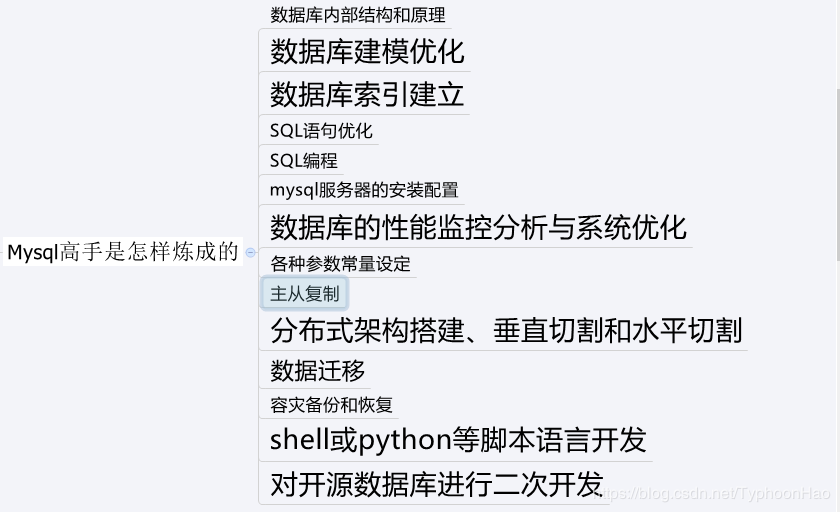
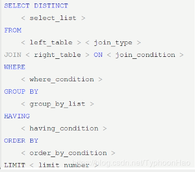
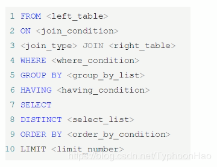

## 前言

## 基础配置

1. 二进制日志log-bin 主从复制及备份恢复

2. 错误日志log-error 默认是关闭的,记录严重的警告和错误信息，每次启动和关闭的详细信息等。

3. 慢查询日志log  默认关闭，记录查询的sql语句，如果开启会减低mysql的整体性能，因为记录日志也是需要消耗系统资源的

4. 数据文件 

   - Myisam存放方式  frm文件(framework)存放表结构；myd文件(data)存放表数据；myi文件(index)存放表索引

   - innodb存放方式    frm文件(framework)存放表结构；  ibdata1  Innodb引擎将所有表的的数据都存在这里面 /usr/share/mysql/ibdata1  而frm文件存放在库同名的包下 ；set innodb_file_per_table=on create table mmm (id int(20) auto_increment ,name varchar(20),primary key(id));设在为 on 后 单独以 table名.ibd 的文件名存储

5. /etc/my.cnf文件(配置文件)

和其它数据库相比，MySQL有点与众不同，它的架构可以在多种不同场景中应用并发挥良好作用。主要体现在存储引擎的架构上，**插件式的存储引擎架构将查询处理和其它的系统任务以及数据的存储提取相分离。**这种架构可以根据业务的需求和实际需要选择合适的存储引擎。

## 逻辑架构

### 1.连接层

数据库连接池，最上层是一些客户端和连接服务，包含本地sock通信和大多数基于客户端/服务端工具实现的类似于tcp/ip的通信。主要完成一些类似于连接处理、授权认证、及相关的安全方案。在该层上引入了线程池的概念，为通过认证安全接入的客户端提供线程。同样在该层上可以实现基于SSL的安全链接。服务器也会为安全接入的每个客户端验证它所具有的操作权限。

### 2.服务层
-  Management Serveices & Utilities： 系统管理和控制工具  

-  SQL Interface: SQL接口接受用户的SQL命令，并且返回用户需要查询的结果。比如select from就是调用SQL Interface

- Parser: 解析器   SQL命令传递到解析器的时候会被解析器验证和解析。 

- Optimizer: 查询优化器。SQL语句在查询之前会使用查询优化器对查询进行优化。 用一个例子就可以理解： select uid,name from user where  gender= 1;优化器来决定先投影还是先过滤。

- Cache和Buffer： 查询缓存。 如果查询缓存有命中的查询结果，查询语句就可以直接去查询缓存中取数据。这个缓存机制是由一系列小缓存组成的。比如表缓存，记录缓存，key缓存，权限缓存等缓存是负责读，缓冲负责写。 

### 3.引擎层

存储引擎层，存储引擎真正的负责了MySQL中数据的存储和提取，服务器通过API与存储引擎进行通信。不同的存储引擎具有的功能不同，这样我们可以根据自己的实际
需要进行选取。后面介绍MyISAM和InnoDB

### 4.存储层

数据存储层，主要是将数据存储在运行于裸设备的文件系统之上，并完成与存储引擎的交互。

### 5.查询流程图

- 首先，mysql的查询流程大致是：mysql客户端通过协议与mysql服务器建连接，发送查询语句，先检查查询缓存，如果命中(一模一样的sql才能命中)，直接返回结果，否则进行语句解析,也就是说，在解析查询之前，服务器会先访问查询缓存(query cache)——它存储SELECT语句以及相应的查询结果集。如果某个查询结果已经位于缓存中，服务器就不会再对查询进行解析、优化、以及执行。它仅仅将缓存中的结果返回给用户即可，这将大大提高系统的性能。

- 语法解析器和预处理：首先mysql通过关键字将SQL语句进行解析，并生成一颗对应的“解析树”。mysql解析器将使用mysql语法规则验证和解析查询；预处理器则根据一些mysql规则进一步检查解析数是否合法。

- 查询优化器当解析树被认为是合法的了，并且由优化器将其转化成执行计划。一条查询可以有很多种执行方式，最后都返回相同的结果。优化器的作用就是找到这其中最好的执行计划。。

- 然后，mysql默认使用的BTREE索引，并且一个大致方向是:无论怎么折腾sql，至少在目前来说，mysql最多只用到表中的一个索引。

## sql执行顺序

我们手写的语句是这样的

而机器读取顺序是这样的
<!--more-->

