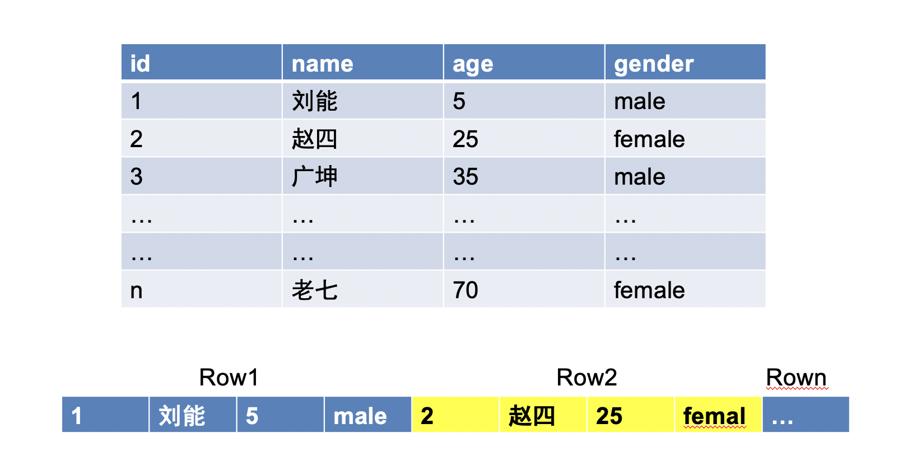
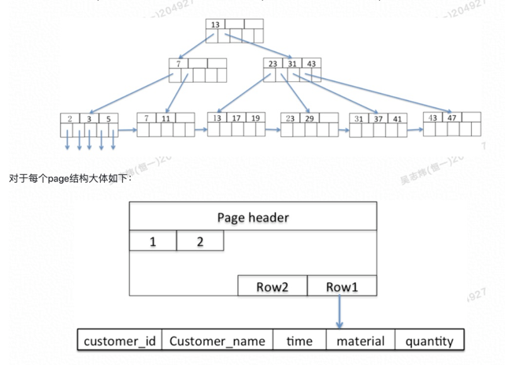
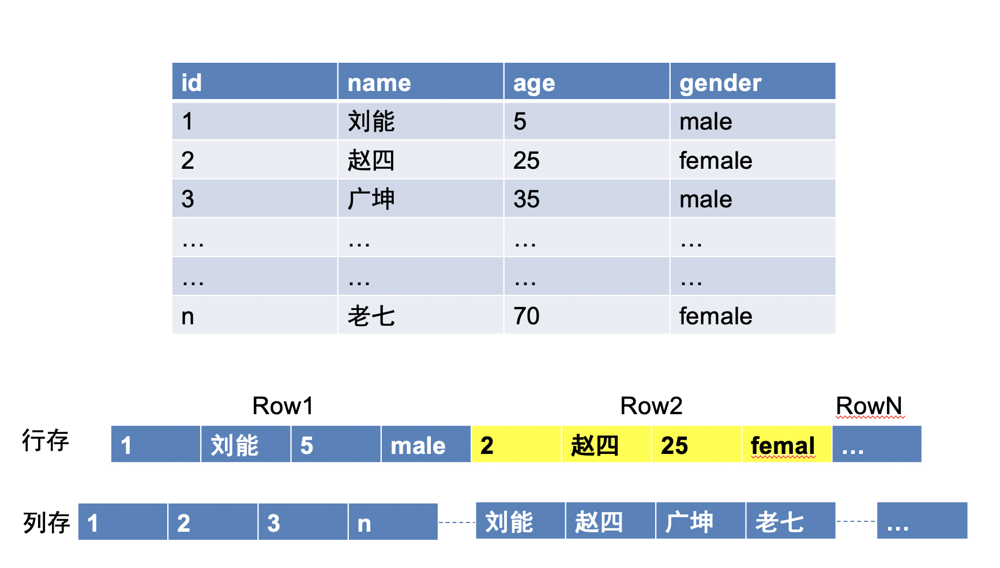
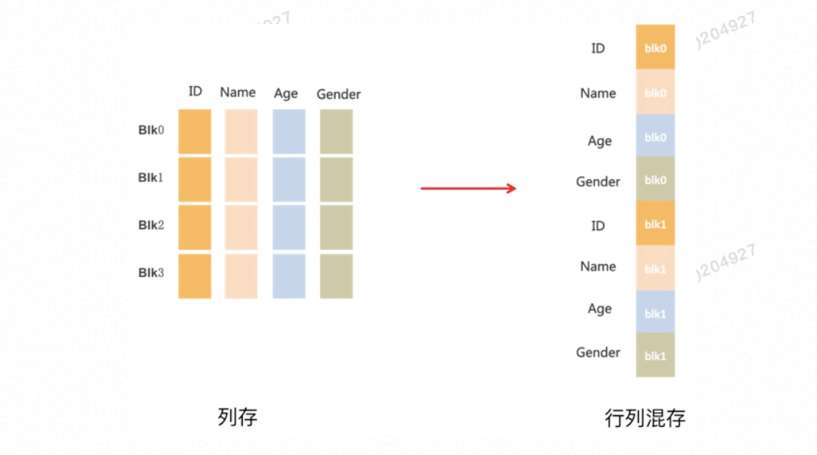

## 行存

普通的OLTP数据库比如mysql、Oracle，索引的存储方式都是行存，一条数据存储在一个地方，比如mysql的innodb索引如下所示：

多个连续的行记录，组成一个data page（大小16k），然后按照B+树的结构进行组织存储。

- 这种存储方式适合OLTP类型的业务，一次I/O就能把数据写入，实现ACID比较简单
- 适合点查询、点更新、范围查询，由于B+树的逻辑结构，千万级别数据量最少3次IO可返回结果。

## 列存
随着数据量的膨胀（亿数量级）以及在线分析业务OLAP的发展，基于行存储的mysql等关系型数据库就开始力不从心了，
基于列存储的数据库产品就开始登场。

比如es的倒排索引，这个存储方式适合OLAP类型的业务，需要对一些字段进行聚合查询，但是跟OLTP存储有一些差异
- 事务问题，列存储的一条数据需要拆分为多个I/O进行写入，难以实现ACID，行存储就需要一次写入就行了
- I/O放大问题，OLAP大多是对某一列或几列数据的一个聚合分析，比如找出年龄在18-30岁之间的人的userid ，
如果是传统的行存储模式，即使在年龄上有索引，那么在回表查询的时候，也会不得不将符合条件记录的所有列（userid之外的姓名，性别...）都读出来。
这就会造成IO放大，当数据量在亿级别的时候，这就很影响性能了，列存储就规避了这一点
- 数据压缩问题，行存储的数据无法统一数据格式，也就无法进行高效压缩，而列存储统一了数据格式，可以进行高效的数据压缩，提升I/O性能 
   

## 行列混存

OLAP场景很适合采用列存储，但是反过来，在OLTP场景，列存储又无能为力了。
比如对某一条记录的写入或者修改，行存储一次IO搞定，
可以保证数据的完整性，但是列存储就要将一条行记录的写入拆成多次的列记录写入，这就带来了写入IO的性能问题。

基于以上行存和列存的特性，在实际业务中，我们的OLTP系统一般是采用基于行存的数据库产品，像mysql oracle等，
然后将业务数据离线导入到基于列存的产品，进行后续的分析，这种模式的实时性是很差的，一般用于分析T-1的离线数据，
如果有需求要实时分析在业务系统中实时产生的数据，这种模式就无法满足了，那么有没有既能满足OLTP的写入性能要求，
又能满足OLAP的分析性能要求的存储结构呢?答案是肯定的。比如阿里的AnalyzeDB，PingCAP的TiDB
       

如图所示，AnalyticDB将30720条记录定义为一个block，数据在block中的某一列，是按列存储的。同一block的不同列，又是连续存储的。在行列混存的模式下

- 多列写入 ，列存模式的随机写变成顺序写
- OLTP明细查询，select 多列由列存的随机读，变成了block内的顺序读
- OLAP多维分析，将随机读变成顺序读

基于行列混合存储的特性，配合倒排索引，bitmap索引，范围索引，预排序、各种的Cache机制、读写分离等。AnalyticDB做到了既满足大批量高性能写入、又满足千亿量级数据实时分析毫秒级别响应，很适合大数据量实时写入，实时分析的场景。

