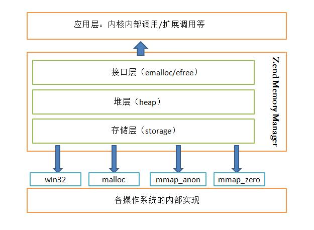
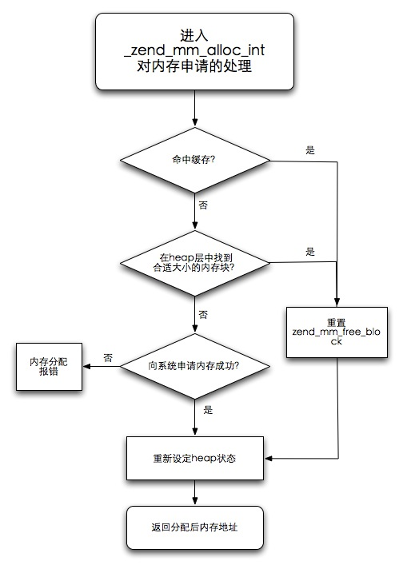
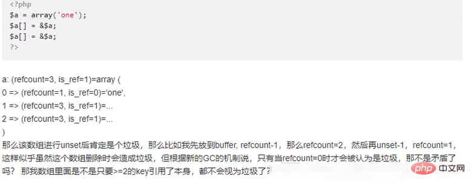

## 概述
1. 操作系统直接管理着内存，所以操作系统也需要内存管理，计算机中通常都有内存管理单元(MMU)用于处理cpu对内存的访问
2. 应用程序无法直接调用物理内存，只能向OS申请，向OS申请内存，会引发系统调用，系统调用会把cpu从用户态切换到内核态
3. 为了减少系统调用开销,通常在用户态就对内存进行管理，使用完内存不立即返回给OS，而是复用，避免每次内存释放和申请带来开销
4. PHP不需要显示的内存管理，由Zend引擎来管理
5. PHP内存限制
    - php.ini中的默认32MB
            memory_limit = 32M
    - 动态修改内存
            ini_set ("memory_limit", "128M")
    - 获取目前内存占用
            memory_get_usage() : 获取PHP脚本所用的内存大小
            memory_get_peak_usage() ：返回当前脚本到目前位置所占用的内存峰值。
    
## PHP的内存管理

### 接口层
是一些宏定义

### 堆层 

_zend_mm_heap

初始化内存，调用_zend_mm_startup,PHP内存管理维护三个列表
- 小块内存列表 free_buckets
- 大块内存列表 large_free_buckets
- 剩余内存列表 rest_buckets

### 存储层

- 内存分配的方式对堆层透明化，实现存储层和堆层的分离
- 不同的内存分配方案，有对应的处理函数

### 内存的申请

PHP对于内存的申请，围绕着小块内存列表(free_buckets)、大块内存列表(large_free_buckets)、剩余内存列表(rest_buckets) 三个列表来分层进行的

ZendMM向OS进行内存申请，首先ZendMM的最底层heap层先向OS申请一块大的内存，通过对上述三个列表的填充，建立一个类似内存池的管理机制

在程序需要内存的时候，ZendMM会在内存池中分配相应的内存供程序使用，这样的好处是避免了PHP频繁的向OS申请内存和释放内存


### ZendMM对内存分配的处理步骤

1. 内存检查
2. 命中缓存，找到内存块，调至步骤5
3. 没有命中缓存，在ZendMM管理的heap层存储中搜索大小适合的内存块，是在三个列表中小到大进行的，找到block后，调到步骤5
4. 步骤3没有找到内存，则使用ZEND_MM_STORAGE_ALLOC申请新内存块(至少为ZEND_MM_SEG_SIZE)，进行步骤6
5. 使用zend_mm_remove_from_free_list函数将依据使用block节点在zend_mm_free_block中移除
6. 内存分配完毕，对zend_mm_heap结构中的各种标识型变量进行维护，包括large_free_buckets、peak、size等
7. 返回分配的内存地址



## 内存的销毁

ZendMM在内存销毁的处理上采用与内存申请相同的策略，当程序unset一个变量或者其他的释放行为的时候，ZendMM不会立刻将内存交回给系统，而是只在自身维护的内存池中将其标志成可用，按照内存大小整理到上述三个列表(large、free、small)之中，以备下次内存申请时使用

ZendMM将内存块以整理收回到zend_mm_heap的方式回收到内存池中

程序使用的所有内存，将在进程结束的时候，统一交回给OS

## 垃圾回收

自动回收内存的过程叫做垃圾收集，PHP提供了语言层次的垃圾回收机制，让程序员不必过分担心程勋的内存分配

### PHP5.3之前

引用计数的内存动态管理

PHP中的所有变量都以zval变量的形式，变量引用计数为0，PHP将在内存中销毁这个变量。只是这里的垃圾并不能称之为垃圾，
且在一个生命周期结束后就释放此进程/线程所占的内容，这种方式决定了PHP在前期不需要过多的考虑内存泄漏问题

### PHP5.3的GC

引入GC(垃圾回收机制)的目的是为了打破引用计数中的循环引用，从而防止因为这个而产生的内存泄漏，
GC基于PHP的动态内存管理而存在，PHP5.3位引入垃圾回收机制，在变量存储的基本结构上游一些变动

```
struct _zval_struct {
  /* Variable information */ 
  zvalue_value value;/* value */ 
  zend_uint refcount__gc; 
  zend_uchar type;/* active type */ 
  zend_uchar is_ref__gc;
}
```

多了refcount__gc来用于新的垃圾回收机制

### PHP5.3垃圾回收算法
> Concurrent Cycle Collection in Reference Counted Systems

5.3依然以引用计数为基础，但不是简单的计数，而是用了一种同步回收算法，大体意思是：

1. 首先PHP会分配一个固定大小的**根缓冲区**，这个缓冲区存放固定数量的zval，这个数量默认是10,000
2. 一个zval如果有引用，要么被全局符号表的符号引用，要么被其他的表示复杂类型的zval中的符号引用，因此在zval中存在一些可能根(root)
    > 这里我们不讨论PHP如何发现这些root的，这个是复杂的问题，总之PHP有办法发现这些可能根并将它们投入到根缓冲区
3. 当缓冲区满了的时候，PHP就会进行垃圾回收，此回收算法如下：
    - 对每个缓冲区的根zval按照深度优先遍历算法遍历所有能遍历到的zval，把他们的refcount减1，同时为了避免对一个zval减多次，对某个zval减1后标记为'已减'
    - 再次对缓冲区的每个根深度优先遍历，如果某个zval的refcount不为0，那么对其+1，否则保持0
    - 情况根缓冲区的所有根(并不是销毁zval，而是从这个缓冲区清除)，然后销毁所有refcount为0的zval，并收回其内存

!> 并不是每次refcount减少都进入回收周期，只有根缓冲区满了之后才开始垃圾回收
!> 可以解决循环引用的问题，并且把内存泄漏保持在一个阈值以下

### PHP7的GC

PHP7和PHP5.3都是用的是引用计数的方式进行GC

但是PHP7对zval进行了结构上的优化，*zval需要的内存不再从堆上分配，
1. 简单的数据类型不需要单独分配呢村，也不需要计数
2. 不会再有两次计数的情况，在对象中，只有对象自身存不再自己存储引用计数，复杂数据类型(字符串、数组、对象)的引用计数由其自身来存储，这种实现的好处是：
储的计数是有效的
3. 由于现在计数由数值自身存储，所以也就可以和非zval结构的数据共享，比如zval和hashTable key之间

当一个数字类型或者静态字符串产生&引用之前，他的refcount一直是0，因为简单类型的值直接存储在value里面，也不会产生写时复制，当$b = $a 的时候回直接开辟一个新的zen_struct ，他的value保存这个值，不会产生引用

但是当产生&引用的时候，PHP就会申请一个zend_refcounted_h结构，指向原来的value，然后value的类型被修改为zend_refrence，新变量申请zval_struct 他的value指向这个zend_refcounted_h

所有的复杂类型的定义, 开始的时候都是zend_refcounted_h结构, 
这个结构里除了引用计数以外, 还有GC相关的结构. 从而在做GC回收的时候, GC不需要关心具体类型是什么, 所有的它都可以当做zend_refcounted*结构来处理.

### copy on write

PHP写时复制
```$a = 'hello';
   $b = $a;//$a赋值给$b的时候，$a的值并没有真的复制了一份
   echo xdebug_debug_zval( 'a');//$a的引用计数为2
   $a = 'world';//当我们修改$a的值为123的时候，这个时候就不得已进行复制，避免$b的值和$a的一样
   echo xdebug_debug_zval( 'a');///$a的引用计数为1
```

## 循环引用造成的内存泄漏

举个例子：


                                                                                  
回答：当zval放入根缓冲区的时候，会对zval进行深入优先遍历，这个zval的所有成员都会进行refcount -1 操作，当遍历完成之后
如果没有外部引用，这个zval的refcount一定为0，从而进行垃圾回收

1. 想要$a成为垃圾，就必须unset($a)，此时$a的refcount - 1 = 2
2. 对于$a[0] refocunt - 1 不影响外部的$a
3. 对于$a[1] refcount - 1 ,此时$a的refcount = 1
4. 对于$a[2] refcount - 1 ,此时$a的refcount = 0

模拟减结束，此时refcount = 0 那么此变量被当做垃圾进行回收

