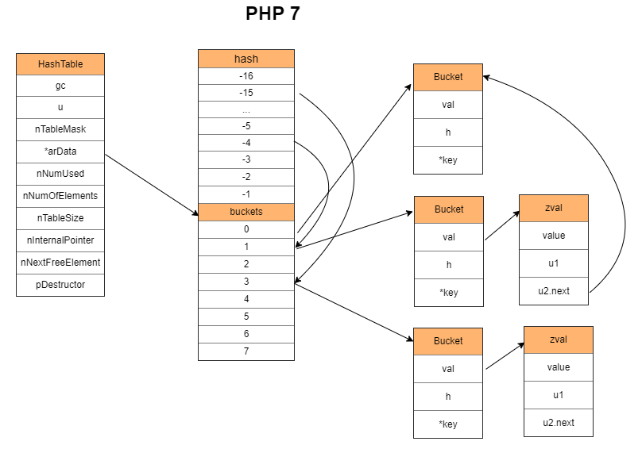

## PHP的数组

如果你用过其他语言比如c、go等，你会发现php的数组是多么的万能

## 特性

- 不像go和c里面的数组一样，会出现数组越界
- 不用指定内存，会自动分配内存，内存不够也会自动扩容
- 键可以是整数也可以是字符串甚至可以是其他数据结构
- 元素有序，循环遍历出来的顺序和插入的顺序是一样的
- 正常情况下查询的时间复杂度是O(1),冲突不严重的情况下
- 支持泛型value

## 底层数据结构

> php7.4版本

- packed array 可以为连续的整数的数组，不用1，2，3这种 只要是递增的，1，2，5，7这种也算。不会有冲突，耗时低，占用内存少
- hash array key可以为整数也可以为字符串，在冲突时使用链表解决

### _zend_array

在源码里面 用的是_zend_array 这个数据结构

	typedef struct _zend_array HashTable;
    struct _zend_array {
        zend_refcounted_h gc;
        union {
            struct {
                ZEND_ENDIAN_LOHI_4(
                    zend_uchar    flags,
                    zend_uchar    _unused,
                    zend_uchar    nIteratorsCount,
                    zend_uchar    _unused2)
            } v;
            uint32_t flags;
        } u;
        uint32_t    nTableMask;       // 根据 nTableSize 生成的负数。用于把 hash 值转化为 [nTableMask, -1] 区间内的负整数，防止越界。
        Bucket     *arData;           // 指向 Data 区的指针。
        uint32_t    nNumUsed;         // Data 区最后一个有效 Bucket 的下标 + 1。
        uint32_t    nNumOfElements;   // 存在多少个有效 Bucket。删除数组元素时，会使其减一。
        uint32_t    nTableSize;       // 总共有多少空间。
        uint32_t    nInternalPointer; // 内部指针。受到 reset() 、 end() 、 next() 等的影响。
        zend_long   nNextFreeElement;
        dtor_func_t pDestructor;
    };

### bucket

长这样，里面的zval是真正存储数据的地方，当有冲突的时候，zval的next指针指向的就是冲突链表的下一个元素

      /* 数组的基本元素 */
      typedef struct _Bucket {
          zval              val;              /* 值 */
          zend_ulong        h;                /* hash 值（或者整数索引） */
          zend_string      *key;              /* 字符串 key（如果存储时用整数索引，则该值为 NULL） */
      } Bucket;

### zval

    typedef struct _zval_struct     zval;
    struct _zval_struct {
        zend_value        value;    // 通用值结构。存储基础类型（double）或指针（数组、对象等等）
        union {
            struct {
                // 省略其他定义
            } v;
            uint32_t type_info;        // 值的类型，例如 IS_ARRAY 、IS_UNDEF
        } u1;
        union {
            uint32_t     next;         // 指向 hash 冲突链的下一个元素    <--- 就是这里
            // 省略其他定义
        } u2;                       // u2 表示第二个 union
    };

## 数组实现

首先如图所示，讲的很明白了，

- hashTable里面的arData是真正存储数组数据的地方，并且它是预申请的一块内存，跟php5的数组不一样，PHP5的数组是添加的时候再申请一个bucket，所以**php5的数据内存地址是不连续的，而PHP7的数组是一块连续的内存地址**

- arData 指向的 buckets 是一个数组，但是他指向的不是数组的开头，而是数组的中间部位，把buckets分成了hash区和data区

- hash区是数组的key经过time33等函数，与nTableMask进行**按位或**转出了一个负整数，这个负整数就是hash区的下标，这个下标表示的bucket存储当前key在data区的下标

- data区是真正存储数据的地方，当从hash区的bucket中获取到data区的下标，得到data区的这个bucket，才是真正存储数据的bucket

- bucket的zval是一个结构体，存储value，bucket->key 存储字符串key， h 是存储key的hash值，在比较key的时候，**整数key是直接比较是否相等，字符串key是先比较hash是否相等，再比较字符串是否相等**

## 顺序读取

因为在go语言里面，map的存储是无序的，没有办法顺序遍历，除非自己实现，而php帮我们做好了这份工作，由上图我们可以看出来，在hashtable里面，数据是无序的，但是在bucket里面，是有序的

当foreach的时候，直接遍历arData指向的data区可以得到有顺序的数据，hash区是无序的

## 随机读取

由于 key 有整数和字符串这两种类型，因此查找的实现也分为两种。这里以整数 key 为例。源码实现如下

    static zend_always_inline Bucket *zend_hash_index_find_bucket(const HashTable *ht, zend_ulong h)
    {
        uint32_t nIndex;
        uint32_t idx;
        Bucket *p, *arData;

        arData = ht->arData;
        nIndex = h | ht->nTableMask; // 避免 Hash 区越界
        idx = HT_HASH_EX(arData, nIndex);// 在 Hash 区取 nIndex 位置的值，结果是 Data 区某个 Bucket 的下标
        while (idx != HT_INVALID_IDX) {
            ZEND_ASSERT(idx < HT_IDX_TO_HASH(ht->nTableSize));  // 确保 Data 区没有越界
            p = HT_HASH_TO_BUCKET_EX(arData, idx);  // 用 Data 区下标获取 Bucket，即冲突链的第一个 Bucket
            if (p->h == h && !p->key) {             // 整数 key 存到 h，因此比对 h。p->key 为 NULL 表示 Bucket 的 key 为整数 key
                return p;
            }
            idx = Z_NEXT(p->val); // 没有找到的话，从当前的 Bucket 获取冲突链的下一个 Bucket
        }
        return NULL;    // 链表遍历完也没找到，那就是不存在
    }

**大致流程就是**

1. key先经过time33得到一个整数，然后与hashTable的nTableMask进行**按位或**操作得到一个负整数
2. 从第一步拿到的负整数，就是arData的hash区的下标，获取到hash去的bucket
3. hash区的bucket里面存储了data区的下标，拿到data区的下标，去data区找到存储数据的bucket
4. 然后比较当前的key，如果不相等，由bucket->zval->next找到冲突链的下个元素比较，一直遍历到结束，找到元素，没有匹配到就是没有该数据

> packed array 是没有hash区的 因为他是整数key 所以内存占用比较少，并且查询过程少了hash区那一环，也不存在冲突，所以速度也快

## 新增元素

    static zend_always_inline zval *_zend_hash_index_add_or_update_i(HashTable *ht, zend_ulong h, zval *pData, uint32_t flag)
    {
        // ... 省略代码
        idx = ht->nNumUsed++;                       // 使用空间 + 1
        nIndex = h | ht->nTableMask;                // 取 hash 值对应的 Hash 区的下标
        p = ht->arData + idx;                       // 获取指向新元素的指针
        Z_NEXT(p->val) = HT_HASH(ht, nIndex);       // 新 Bucket 指向 Hash 区下标所指的冲突链第一个 Bucket
        HT_HASH(ht, nIndex) = HT_IDX_TO_HASH(idx);  // Hash 区下标指向新 Bucket
        if ((zend_long)h >= (zend_long)ht->nNextFreeElement) {
            ht->nNextFreeElement = h < ZEND_LONG_MAX ? h + 1 : ZEND_LONG_MAX;
        }
    add:
        ht->nNumOfElements++;                       // 元素个数 + 1
        p->h = h;                                   // 整数 key 的下标就是 hash
        p->key = NULL;                              // 整数 key 时，必须把 p->key 设置为 NULL
        ZVAL_COPY_VALUE(&p->val, pData);            // 把要添加的值复制到新 Bucket 里面

        return &p->val;
    }
    
当前过程是冲突插入过程

1. 获取arData的data区最后一元素之后的合法位置(因为数组删除是把当前位定义为undefined，并不立马回收)，这里的bucket称为bucketA
2. 把要添加的元素值放入 BucketA 的 val 。
3. 把hash后的key经过(h | nTableMask) 位置指向的data下标存储的bucket称为bucketB
4. 把bucketA的val的next指向bucketB
5. 更新hash区(h | nTableMask)位置的值为bucketA的下标

这个插入过程是遇到冲突的插入过程，冲突链表采用头插法插入到链表的第一个元素，更新hash的bucket存储的下标为新的bucket的下标

> Hash 区 -1 表示 HT_INVALID_IDX

## 删除元素

php数组删除元素分为两步，删除和释放内存

### 删除元素

- 如果是冲突链表的第一个元素，就把arData的data区的一个bucket清空设置为undefined，把冲突链表的下一个元素的下标更新到hash区的bucket
- 如果是冲突链表中间元素或最后，类比链表删除中间节点

### 释放内存

- 如果key是字符串的话，尝试释放**key**的内存空间
- 把bucket的val复制到另一个临时变量data中，然后把bucket的val设置为undefined
- 尝试释放临时变量data的空间

php不会立马释放bucket所占空间，会导致内存碎片化，php的内存利用率使用rehash来保证的

## hash冲突

一般的hash冲突有三种解决方案
1. rehash
2. 开放寻址法
3. 链表法

php用的是链表发解决冲突，当新增一个key的时候，经过一系列的计算，发现bucket上面的位置已经有了数据，然后进行两步

1. 找到arData的data区最后一个合法元素--new_bucket，然后存储数据
2. 更新hash区的bucket存储的下标为new_bucket的下标

### 负载因子

负载因子会影响 hash 碰撞的概率从而影响到耗时，也会影响 Hash 区的大小来影响内存消耗。

在 PHP 中，用 nTableMask 和 nTableSize 的关系来体现：

**负载因子 = |nTableMask / nTableSize|**

- 负载因子为 1 的时候（PHP 5），nTableMask == - (nTableSize) 。
- 负载因子为 0.5 的时候（PHP 7）， nTableMask == - (nTableSize + nTableSize) 

PHP 的负载因子从 1 （PHP5） 降到 0.5 （PHP7），使得速度变快了，但同时内存消耗变大。

Hash 区一旦变小，更容易产生碰撞。也就使得冲突链更长，执行的操作会在冲突链的时间消耗变得更长。

负载因子越小，Hash 区变大，使得内存消耗更多，但冲突链变短，操作耗时变小。

针对内存消耗，PHP 还做了个改进，增加了**packed array**。相当于c语言的数组，这个之前提到了

### rehash

什么时候需要rehash

源码是：

ht->nNumUsed > ht->nNumOfElements + (ht->nNumOfElements >> 5)

这里做一个转换，方便理解：

ht->nNumUsed - ht->nNumOfElements > (ht->nNumOfElements >> 5)

**也就是被设置为 undefined 的 Bucket 数量大于当前元素个数除以 32 向下取整的值。**

例如
- 当 nNumUsed 为 2048 ， nNumOfElements 为 2000 的时候，得到 2048 - 2000 < 62 ，因此执行扩容。
- 当 nNumUsed 为 2048 ， nNumOfElements 为 1900 的时候，得到 2048 - 1900 > 59 ，因此执行 rehash。

rehash会执行以下操作

1. 清空hash区
2. 取两个指针，一个指向当前扫描位置p，一个指向迁移后的位置q，遍历知道p到底nNumUsed
	- 当p到达undefined的bucket，跳过
    - 当p到达有效bucket的时候，把这个bucket复制到当前q指向的bucket，然后p和q都向前一步(典型的双指针操作)
3. 重新创建冲突链
4. 更新内部指针，室其指向更新位置后的bucket
5. 更新nNumUsed，使其等于nNumOfElements

**PHP是一次性hash，还有渐进式hash(redis、Golang)**

### 扩容

当数组内存不够的时候，会进行扩容

1. nTableSize 变为原先的两倍(双倍扩容)
2. 重新申请一次hash区和data区的内存，
3. 然后把原先data区的数据以内存拷贝的方式复制到新的data区
4. 重新计算nTableMask
5. 释放掉原来的data区的内存
6. 做rehash，主要是重建hash区

