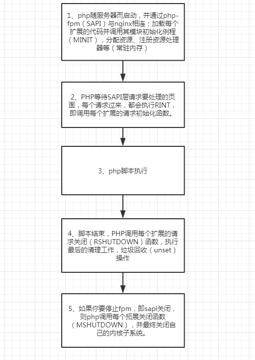

## 底层分析
php的运行模式有两种cli和web，无论是使用哪种模式，php的工作原理都是一样的，都是作为一种Sapi在运行

### Sapi
全称Server application programming interface,服务端应用编程接口，Spai通过一系列的钩子函数，使得PHP可以和外围交互数据，
通过sapi将PHP本身和上层应用解耦，PHP可以不再考虑如何针对不同应用进行兼容，而应用本身也可以针对自己的特点实现不同的处理方式

常见Sapi有cli、cgi、php-fpm以及各服务的具体api

php 的生命周期，有4个关键调用

**1.MINT->2.RINT->3.RSHUTDOWN->4.MSHUTDOWN**

以nginx服务器为例，在web模式下，生命周期流程如下：

### Sapi运行阶段

#### 1.模块初始化(MINT:module init)
这个阶段主要进行PHP框架、zend引擎的初始化操作，这个阶段一般在sapi启动时执行一次，对于FPM来说，就是fpm的master
进行启动的时候执行，PHP加载每个扩展的代码并调用其模块初始化例程(MINI),进行一些模块所需变量的申请、内存分配等

#### 2.请求初始化(RINT:request init)
当一个页面进行请求的时候，在请求前都会经历一个阶段，对于fpm来说，是在worker进程accept一个请求并读取、解析完请求
数据后的一个阶段。在这个阶段里面，sapi层将控制权交给PHP层，PHP初始化本次请求执行脚本所需的环境变量

#### 3.PHP脚本执行
PHP代码解析执行的过程，Zend引擎接管控制权，将PHP脚本代码编译成opcodes并顺序执行

#### 4.请求结束阶段(RSHUTDOWN:request shutdown)
请求处理完后就进入了请求结束阶段,PHP就会启动清理程序，这个阶段，将flush输出内容、发送http响应内容等，然后它会按顺序
调用各个模块的RSHUTDOWN函数，RSHUTDOWN用以清除程序运行时产生的符号表，也就是对每个变量滴啊用unset函数

#### 5.模块关闭阶段(MSHUTDOWN:module shutdown)
该阶段在sapi关闭时执行，与模块初始化对应，这个阶段主要是对资源的清理、PHP各模块的关闭操作，同时，将回调各个扩展的
module shutdown钩子函数，这是发生在所有请求都已经结束之后，例如关闭fpm操作(这是对cgi cli等sapi，没有"下一个请求"，
所以sapi开始关闭，fast-cgi协议的不会关闭fpm)

## Zend引擎

Zend引擎是PHP实现的核心，提供了语言实现上的基础设施 例如：PHP的语法实现，脚本的编译运行环境，扩展机制预计内存管理

目前PHP的实现和Zend引擎之间的关系非常紧密，甚至有些过于紧密了，例如很多PHP扩展都是使用的Zend API， 而Zend正是
PHP语言本身的实现，PHP只是使用Zend这个内核来构建PHP语言的，而PHP扩展大都使用Zend API， 这就导致PHP的很多扩展
和Zend引擎耦合在一起了

PHP中的扩展通常是通过Pear库或者原生扩展