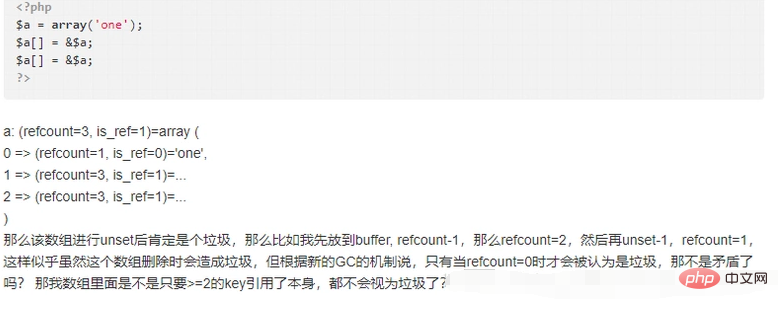

## 垃圾回收

自动回收内存的过程叫做垃圾收集，PHP提供了语言层次的垃圾回收机制，让程序员不必过分担心程序的内存分配

## PHP5.3之前

引用计数的内存动态管理

PHP中的所有变量都以zval变量的形式，变量引用计数为0，PHP将在内存中销毁这个变量。只是这里的垃圾并不能称之为垃圾，
且在一个生命周期结束后就释放此进程/线程所占的内容，这种方式决定了PHP在前期不需要过多的考虑内存泄漏问题

## PHP5.3的GC

引入GC(垃圾回收机制)的目的是为了打破引用计数中的循环引用，从而防止因为这个而产生的内存泄漏，
GC基于PHP的动态内存管理而存在，PHP5.3位引入垃圾回收机制，在变量存储的基本结构上游一些变动

```
struct _zval_struct {
  /* Variable information */ 
  zvalue_value value;/* value */ 
  zend_uint refcount__gc; 
  zend_uchar type;/* active type */ 
  zend_uchar is_ref__gc;
}
```

多了refcount__gc来用于新的垃圾回收机制

## PHP5.3垃圾回收算法
> Concurrent Cycle Collection in Reference Counted Systems

5.3依然以引用计数为基础，但不是简单的计数，而是用了一种同步回收算法，大体意思是：

1. 首先PHP会分配一个固定大小的**根缓冲区**，这个缓冲区存放固定数量的zval，这个数量默认是10,000
2. 一个zval如果有引用，要么被全局符号表的符号引用，要么被其他的表示复杂类型的zval中的符号引用，因此在zval中存在一些可能根(root)
    > 这里我们不讨论PHP如何发现这些root的，这个是复杂的问题，总之PHP有办法发现这些可能根并将它们投入到根缓冲区
3. 当缓冲区满了的时候，PHP就会进行垃圾回收，此回收算法如下：
    - 对每个缓冲区的根zval按照深度优先遍历算法遍历所有能遍历到的zval，把他们的refcount减1，同时为了避免对一个zval减多次，对某个zval减1后标记为'已减'
    - 再次对缓冲区的每个根深度优先遍历，如果某个zval的refcount不为0，那么对其+1，否则保持0
    - 清空根缓冲区的所有根(并不是销毁zval，而是从这个缓冲区清除)，然后销毁所有refcount为0的zval，并收回其内存

!> 并不是每次refcount减少都进入回收周期，只有根缓冲区满了之后才开始垃圾回收
，可以解决循环引用的问题，并且把内存泄漏保持在一个阈值以下

## PHP7的GC

PHP7和PHP5.3都是用的是引用计数的方式进行GC

但是PHP7对zval进行了结构上的优化，*zval需要的内存不再从堆上分配，
1. 简单的数据类型不需要单独分配内存，也不需要计数
2. PHP7 中复杂类型，像字符串、数组、对象等的数据结构中，头部都有一个 gc, 这个 gc 的作用就是用来对垃圾回收的支持。
当变量赋值、传递时，会增加 value 的引用数， unset、return 等释放变量时再减掉引用数，减掉后如果发现 refcount 
变为 0 则直接释放 value，这是变量的基本回收过程。

## 回收过程
如果当变量的 refcount 减小后大于 0，PHP 并不会立即对这个变量进行垃圾鉴定和回收，而是放入一个**根缓冲区**中，等这个缓冲
区满了以后 (10000 个值) 再统一进行处理，加入缓冲区的是变量 zend_value 里的 gc，**目前垃圾只会出现在数组和对象
两种类型中**，数组的情况上面已经介绍了，对象的情况则是成员属性引用对象本身导致的，其它类型不会出现这种变量中的成员
引用变量自身的情况，所以垃圾回收只会处理这两种类型的变量

gc 的结构 zend_refcounted_h 具体如下:
```
typedef struct _zend_refcounted_h {
    uint32_t         refcount; // 记录 zend_value 的引用数
    union {
        struct {
            zend_uchar    type,  // zend_value的类型, 与zval.u1.type一致
            zend_uchar    flags, 
            uint16_t      gc_info // GC信息，记录在 gc 池中的位置和颜色，垃圾回收的过程会用到
        } v;
        uint32_t type_info;
    } u;
} zend_refcounted_h;
```

> 一个变量只能被放入一次根缓冲区，所以放入变量的时候会把_zend_refcounted_h.gc_info设置为GC_PURPLE颜色，即标记为紫色，防止重复放入

- 根缓冲区是一个双向链表，等缓冲区满了之后，启动**垃圾检查过程**：遍历缓冲区，把**变量的refcount减一**，如果还包含
子成员，那么就**深度优先遍历**把refcount减1，如果减为0，那么就是垃圾，这算法的核心就是：**如果垃圾是由于自身引用导致
的，那么把他的成员都减一后，这个变量的refcount是0，那么就表示这个变量的引用来自于自身成员，那么这个变量就是垃圾**

具体过程如下：

1. 从缓冲区链表的roots开始遍历，**把当前value标记为灰色**(_zend_refcounted_h.gc_info设置为GC_GREY)，然后对当前
value进行深度优先遍历，把成员value的refcount减1，并且也标记为灰色 
2. 重复遍历缓冲区链表，检查当前value的引用是否为0，乳沟为0，表示是垃圾，**标记为白色**(GC_WHITE)，如果不是0，表示
不是垃圾，把refcount加1后(因为上一轮已经减1了)标记为黑色
3. 再次遍历变白，把标记为非白色的从roots移除，剩下的链表里面都是垃圾，最后将这些垃圾清除

## 循环引用造成的内存泄漏
上面说的垃圾回收有一种问题是这个机制无法解决的，就是循环引用的问题。

举个例子：

回答：当zval放入根缓冲区的时候，会对zval进行深入优先遍历，这个zval的所有成员都会进行refcount -1 操作，当遍历完成之后
如果没有外部引用，这个zval的refcount一定为0，从而进行垃圾回收

1. 想要$a成为垃圾，就必须unset($a)，此时$a的refcount - 1 = 2
2. 对于$a[0] refocunt - 1 不影响外部的$a
3. 对于$a[1] refcount - 1 ,此时$a的refcount = 1
4. 对于$a[2] refcount - 1 ,此时$a的refcount = 0

模拟减结束，此时refcount = 0 那么此变量被当做垃圾进行回收


当一个数字类型或者静态字符串产生&引用之前，他的refcount一直是0，因为简单类型的值直接存储在value里面，
也不会产生写时复制，当$b = $a 的时候回直接开辟一个新的zen_struct ，他的value保存这个值，不会产生引用

但是当产生&引用的时候，PHP就会申请一个zend_refcounted_h结构，指向原来的value，然后value的类型被修改
为zend_refrence，新变量申请zval_struct 他的value指向这个zend_refcounted_h

所有的复杂类型的定义, 开始的时候都是zend_refcounted_h结构, 
这个结构里除了引用计数以外, 还有GC相关的结构. 从而在做GC回收的时候, GC不需要关心具体类型是什么, 所有的它
都可以当做zend_refcounted*结构来处理.

### copy on write

PHP写时复制
```$a = 'hello';
   $b = $a;//$a赋值给$b的时候，$a的值并没有真的复制了一份
   echo xdebug_debug_zval( 'a');//$a的引用计数为2
   $a = 'world';//当我们修改$a的值为123的时候，这个时候就不得已进行复制，避免$b的值和$a的一样
   echo xdebug_debug_zval( 'a');///$a的引用计数为1
```


