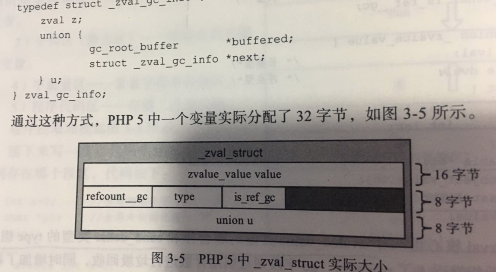
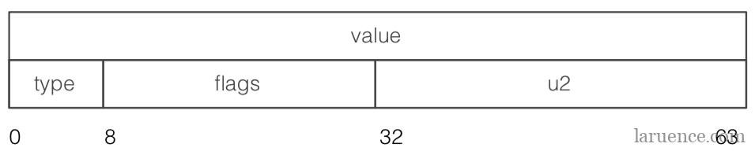
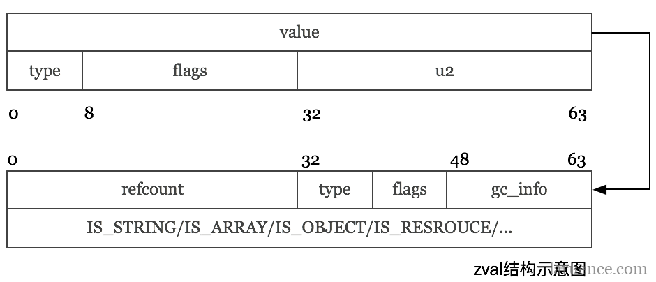

## php5的zval
```
struct _zval_struct {
     union {
          long lval;
          double dval;
          struct {
               char *val;
               int len;
          } str;
          HashTable *ht;
          zend_object_value obj;
          zend_ast *ast;
     } value;
     zend_uint refcount__gc;
     zend_uchar type;
     zend_uchar is_ref__gc;
};
```


1. php5的zval每个字段都明确定义不能修改，比如为了解决循环引用问题，用zval_gc_info劫持了zval的分配，扩充后实际占用32字节
2. 整数和浮点数不需要进行gc，导致内存浪费
3. 开启zend内存池的情况下，额外为zval_gc_info申请一个16字节的zend_mm_block结构体(存放内存信息，文末有讲),最后一个zval分配了48个字节
4. php5的所有变量在堆中申请，PHP7的临时变量在栈中申请
## php7的zval
```
struct _zval_struct {
     union {
          zend_long         lval;             /* long value */
          double            dval;             /* double value */
          zend_refcounted  *counted;
          zend_string      *str;
          zend_array       *arr;
          zend_object      *obj;
          zend_resource    *res;
          zend_reference   *ref;
          zend_ast_ref     *ast;
          zval             *zv;
          void             *ptr;
          zend_class_entry *ce;
          zend_function    *func;
          struct {
               uint32_t w1;
               uint32_t w2;
          } ww;
     } value;
    union {
        struct {
            ZEND_ENDIAN_LOHI_4(
                zend_uchar    type,         /* active type */
                zend_uchar    type_flags,
                zend_uchar    const_flags,
                zend_uchar    reserved)     /* call info for EX(This) */
        } v;
        uint32_t type_info;
    } u1;
    union {
        uint32_t     var_flags;
        uint32_t     next;                 /* hash collision chain */
        uint32_t     cache_slot;           /* literal cache slot */
        uint32_t     lineno;               /* line number (for ast nodes) */
        uint32_t     num_args;             /* arguments number for EX(This) */
        uint32_t     fe_pos;               /* foreach position */
        uint32_t     fe_iter_idx;          /* foreach iterator index */
    } u2;
};
```

看着是挺多，但其实只占了16字节(64位系统)，因为里面都是联合体，

主要分为value(8字节)和扩充字段，扩充字段又分为u1和u2两个部分，其中u1(4字节)是type_info部分，u2(4字节)是各种辅助字段(提示缓存友好性，减少内存寻址)


php7开始，**对于在zval的value字段中能保存下来的值，就不再对他们进行引用计数了，而是在拷贝的时候直接赋值**，
节省了大量的引用计数相关的操作，这部分类型有：**IS_LONG,IS-DOUBLE**，对于没有值、只有类型的类型，也不需要引用计数了：
**IS_TRUE,IS_FALSE,IS_NULL**

而对于复杂类型, 一个size_t保存不下的, 那么我们就用value来保存一个指针, 这个指针指向这个具体的值, 
引用计数也随之作用于这个值上, **而不在是作用于zval上了**.



## 实例
以IS_ARRAY为例，zval.value.arr执行下面的一个结构体，由它实际保存一个数组，引用计数部分保存在zend_refcounted_h结构中

```
array也就是hashtable的结构：
struct _zend_array {
    zend_refcounted_h gc;
    union {
        struct {
            ZEND_ENDIAN_LOHI_4(
                zend_uchar    flags,
                zend_uchar    nApplyCount,
                zend_uchar    nIteratorsCount,
                zend_uchar    reserve)
        } v;
        uint32_t flags;
    } u;
    uint32_t          nTableMask;
    Bucket           *arData;
    uint32_t          nNumUsed;
    uint32_t          nNumOfElements;
    uint32_t          nTableSize;
    uint32_t          nInternalPointer;
    zend_long         nNextFreeElement;
    dtor_func_t       pDestructor;
};

_zend_refcounted_h如下：

typedef struct _zend_refcounted_h {
    uint32_t         refcount;          /* reference counter 32-bit */
    union {
        struct {
            ZEND_ENDIAN_LOHI_3(
                zend_uchar    type,
                zend_uchar    flags,    /* used for strings & objects */
                uint16_t      gc_info)  /* keeps GC root number (or 0) and color */
        } v;
        uint32_t type_info;
    } u;
} zend_refcounted_h;
```

zend_refcounted_h结构保存了gc相关的信息，从而在gc回收过程中，gc不需要关系具体类型是什么，它都可以视为zend_refcounted*的结构来处理

## zval预先分配

php5的zval分配采用堆上分配，我们前面已经说了 本来zval有24字节，加上gc_info 32字节，再加上PHP自己的内存管理在分配内存的
时候都会在内存签名保留不部分信息也就是zend_mm_block结构体，导致我们需要24字节内存最后却分配了48字节：
```
typedef struct _zend_mm_block {
    zend_mm_block_info info;
#if ZEND_DEBUG
    unsigned int magic;
# ifdef ZTS
    THREAD_T thread_id;
# endif
    zend_mm_debug_info debug;
#elif ZEND_MM_HEAP_PROTECTION
    zend_mm_debug_info debug;
#endif
} zend_mm_block;
```

大部分的zval，接受的参数来自外部，最后返回值赋值给return_value，这个也是来自外部的zval，**而中间变量在PHP5的时候
是在堆上分配，其实完全可以在栈上分配**

所以php7的zval都不需要单独申请了，php中的zval要么存在于符号表，要么以临时变量(IS_TMP_VAR)或者编译变量(IS_CV)的
形式存在，前者存在于一个hashTable就行了，**而PHP7中hashTable默认保存的就是zval，这部分的zval完全可以在hashTable分配
的时候一次性分配出来**，后面的存在于execute_data之后, 数量也在编译时刻确定好了, 也可以随着execute_data一次性分配, 
**所以我们确实不再需要单独在堆上申请zval了.**

所以对于开发者来说最大的变化就是，之前的一些内部函数，通过一些操作获得一些信息，然后分配一个zval，返回给调用者的情况：
```
static zval * php_internal_function() {
    .....
    str = external_function();
    MAKE_STD_ZVAL(zv);
    ZVAL_STRING(zv, str, 0);
     return zv;
}
PHP_FUNCTION(test) {
     RETURN_ZVAL(php_internal_function(), 1, 1);
}
```
- 需要修改为：这个zval由调用者传递
```
static void php_internal_function(zval *zv) {
    .....
    str = external_function();
    ZVAL_STRING(zv, str);
     efree(str);
}
```
- 要么修改为，这个函数返回原始素材：
```
static char * php_internal_function() {
    .....
    str = external_function();
     return str;
}
PHP_FUNCTION(test) {
     str = php_internal_function();
     RETURN_STRING(str);
     efree(str);
}
```

## 总结

抽象的来说, 其实在PHP7中的zval, 已经变成了一个值指针, 它要么保存着原始值, 要么保存着指向一个保存原始值的指针. 
也就是说现在的zval相当于PHP5的时候的zval *. 只不过相比于zval *, 直接存储zval, 我们可以省掉一次指针解引用, 
从而提高缓存友好性.

其实PHP7的性能, 我们并没有引入什么新的技术模式, 不过就是主要来自, 
**持续不懈的降低内存占用, 提高缓存友好性, 降低执行的指令数**的这些原则而来的, 可以说PHP7的重构就是这三个原则