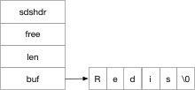
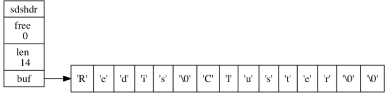
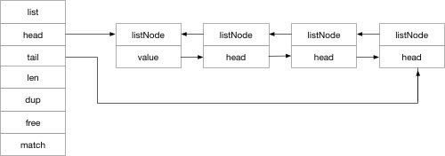
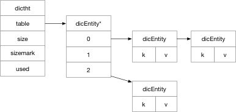
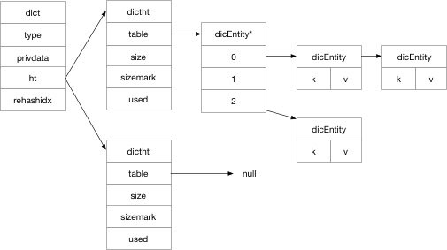
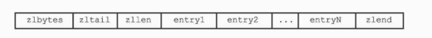
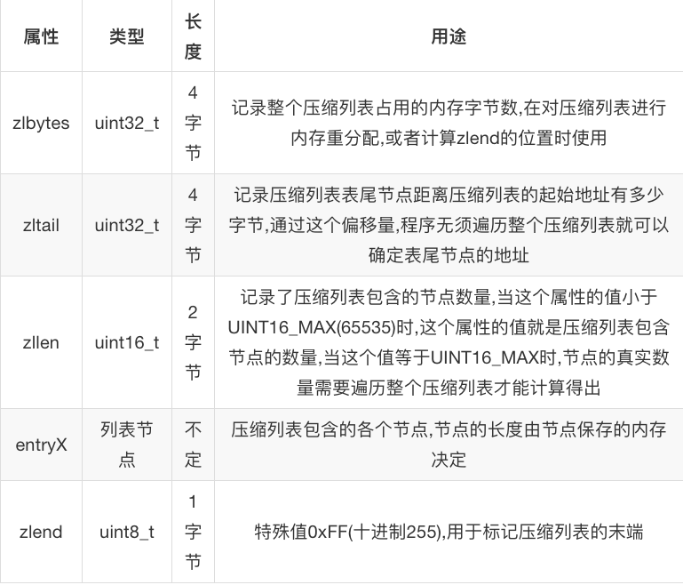
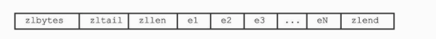

## sds
> sds是redis自主实现的数据结构-简单动态字符串

数据结构为：

    struct sdshdr {
        // buf 中已占用空间的长度
        int len;
        // buf 中剩余可用空间的长度
        int free;
        // 数据空间
        char buf[];
    };

如图所示：



### 为什么这么设计

- 可以直接获取字符串的长度，不需要像c语言一样遍历字符串得到长度，时间复杂度O(1)
- 杜绝缓冲区溢出，利用free,如果free长度不足，字符串发生自动扩容整个buf
- 减少修改字符串长度时造成的内存再分配
	redis是典型的用空间换时间的数据库，sds使用free将字符串长度和底层buf长度关系解除了，buf长度也不是字符串长度，基于这个设计了sds的空间预分配和惰性释放
    1. 预分配 
        当len小于1mb的时候，free与len相同，比如len为13字节，free也是13字节，buf实际长度为13+13=1 = 27字节(保存空字符的1字节空间不计算在len属性内) 
        当len大于1mb的时候，free只有1mb，比如len为30mb，free就是1mb，总长度为30mb+1mb+1byte
    2. 惰性释放
        字符串修改后，释放的空间放入free保存起来，不返还，等待使用，避免了频繁的内存重分配
- 二进制安全
    C字符串以空字符\0结尾，使得 C 字符串只能保存文本数据， 而不能保存像图片、音频、视频、压缩文件这样的二进制数据
- 兼容c语言
- SDS利用len来判断是否结束，而不是空字符\0

    
## 链表

```
typedef struct listNode {
// 前置节点
struct listNode *prev;
// 后置节点
struct listNode *next;
// 节点的值
void *value;
} listNode;
```
    


典型的双向链表

- 某个节点查找上一个或者下一个节点的时间复杂度为O(1)
- list记录了head和tail，寻找比表头和表尾时间复杂度也是O(1)
- 获取链表长度len也是O(1)

## 字典

字典由三个数据结构组成，下图是字典的哈希表数据结构：



与java中的hashmap很类似，就是数组加链表，hash冲突利用拉链法解决

下图才是真正的字典的数据结构



有两个dictht，一般来说只用ht[0],当发生扩容发生rehash的时候，ht[1]才产生作用

dictht的插入：
- 计算key的hash值，找到hash映射的table数组的位置
- 如果此位置没有数据直接存储到这里，有数据的话，会生成一个新节点挂在之前的节点的next指针后面
- 如果key发生了多次碰撞，造成了链表的长度越来越长，使得字典的查询越来越慢，redis会对字典进行rehash
	- 其中有一个负载因子的概念，当负载因子大于1（此处不确定）的时候发生rehash，负载因子 = 哈希表已保存节点数量 / 哈希表大小 load_factor = ht[0].used / ht[0].size
	- rehash 会根据ht[0]的数据和操作类型，为ht[1]分配内存
    - 将ht[0]的数据rehash到ht[1]上面
    - rehash完成之后，将ht[1]设置成ht[0]，生成一个新的ht[1]备用
- 渐进式哈希，数据量大的时候，rehash是一个漫长的过程，所以为了不影响redis的使用，redis使用渐进式哈希，与golang的切片扩容相似
	- 分配ht[1]的空间，字典同时拥有ht[0]和ht[1]
    - 在字典维护一个rehashidx 设置为0，表示字典正在rehash
    - 在rehash期间，每次对字典的操作出来指定操作外，都会根据ht[0]在rehashidx上对应的键值对rehash到ht[1]上
    - 随着操作进行，ht[0]的数据就会全部rehash到ht[1]上面，设置ht[0]的rehashidx为-1，渐进式扩容结束

这样保证数据能够平滑的进行 rehash。防止 rehash 时间过久阻塞线程。

>在进行rehash的时候，对自带的update和delete操作会在两个ht上面进行，如果是find的话，先在ht[0]上进行查找，没找到再去ht[1]查找，insert操作会在ht[1]中进行，这样就会保证ht[0]在不断减少,ht[1]在不断增加

## 整数集合
```
typedef struct intset {
        // 编码方式
        uint32_t encoding;
        // 集合包含的元素数量
        uint32_t length;
        // 保存元素的数组
        int8_t contents[];
    } intset;
```
    
>其实 intset 的数据结构比较好理解。一个数据保存元素，length 保存元素的数量，也就是contents的大小，encoding 用于保存数据的编码方式。    
    
实际上我们可以看出来。 Redis encoding的类型，就是指数据的大小。作为一个内存数据库，采用这种设计就是为了节约内存。

既然有从小到大的三个数据结构，在插入数据的时候尽可能使用小的数据结构来节约内存，如果插入的数据大于原有的数据结构，就会触发扩容。

整数集合不支持降级操作，一旦扩容升级数据类型后就不能降级了

## 跳跃表

[跳跃表详解](/Redis/redis-跳跃表.md)

## 压缩列表

压缩列表是Redis为了节约内存而开发的,是由一系列特殊编码的连续内存块组成的顺序型(sequential)数据结构







### 节点


- previous_entry_length:每个节点都会用一个或者五个字节来描述前一个节点占用的总字节数，如果前一个字节占用总字节数小于254，那么就用一个字节存储，如果超过254，那么一个字节就不够了，这里会用五个字节存储并将第一个字节的值存储为固定的254用于区分
- encoding：压缩列表可以存储16位，32位、64位的整数以及字符串，encoding就是用来区分后面content字段中存储的到底是哪种内容，分别占多少字节
- content：没什么特别的，存储的就是具体的二进制内容，整数或者字符串

### encoding

>分为两种

字节数组编码：

|  编码   | 编码长度  | content类型 |
|  ----  | ------  | ----- |
| 00xxxxxx  | 1字节 | 长度小于 63 字节的字节数组
   |
| 01xxxxxx xxxxxxxx	  | 2字节 | 长度小于 16383 字节的字节数组
   |
| 10xxxxxx xxxxxxxx xxxxxxxx xxxxxxxx xxxxxxxx	  | 4字节 | 长度小于 4294967295 的字节数组
   |

整数编码：

|  编码   | 编码长度  | content类型 |
|  ----  | ------  | ----- |
| 11000000  | 1字节 | int16_t类型的整数   |
| 11010000  | 1字节 | int32_t类型的整数   |
| 11100000  | 1字节 | int64_t类型的整数   |
| 11110000  | 1字节 | 24位有符号整数      |
| 11111110  | 1字节 | 8位有符号整数       |
| 1111xxxx  | 1字节 | 没有相应的content属性  |

### content

节点的content属性负责保存节点的值,节点值可以是一个字节数组或者整数,值的类型和长度由节点的encoding属性决定

- 编码的最高两位00表示节点保存的是一个字节数组
- 编码的后六位001011记录了字节数组的长度11
- content属性保存着节点的值

注意,整型数据的编码是固定11开头的八位二进制,而字符串类型的编码都是非固定的,因为它还需要通过后面的二进制位得到字符串的长度,稍有区别

### 连锁更新

previous_entry_length属性记录了前一个节点的长度,如果前一个节点长度小于254个字节,那么previous_entry_length属性需要用一个字节长度来保存这个长度值

现在假如一个压缩列表,有许多连续的,长度介于250~253字节之间的节点e1至eN



现在这些节点的previous_entry_length都只需要1字节长的,如果这时候我将长度为254的新节点new设置为压缩列表的表头节点,那么new就是e1的前置节点..

那么此时e1的previous_entry_length需要进行扩展,因为1节点肯定不够的,更新后,e1超出了254,所以e2的previous_entry_length也需要更新...

这样就会导致所有节点都会发生更新..

Redis将这种在特殊情况下产生的连续多次空间扩展操作称之为 "连锁更新"

因为连锁更新在最坏的情况下需要对压缩列表执行N次空间重分配操作,而每次空间重分配的最坏复杂度为O(N),所以连锁更新最坏的复杂度为O(N²)

但是,尽管连锁更新的复杂度较高,但它真正造成性能问题的几率非常低.因为很难恰好所有节点连续且长度都介于250字节到253字节之间..一般对几个节点进行连锁更新是不会影响性能的!

## 总结

1. 压缩列表是一种为节约内存而开发的顺序型数据结构
2. 压缩列表被用作列表键和哈希键的底层实现之一
3. 压缩列表可以包含多个节点,每个节点可以保存一个字节数组或者整数值
4. 添加新节点到压缩列表,或者从压缩列表中删除节点,可能会引起连锁更新操作,但这种操作出现的几率并不高

## 参考

- http://zhangtielei.com/posts/blog-redis-skiplist.html
- https://wiki.jikexueyuan.com/project/redis/
- http://interview.wzcu.com/Redis/%E8%B7%B3%E8%B7%83%E8%A1%A8.html