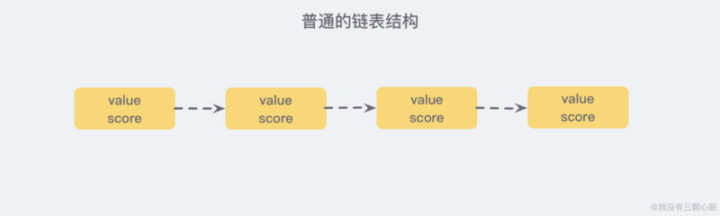
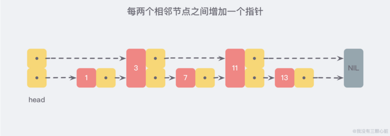
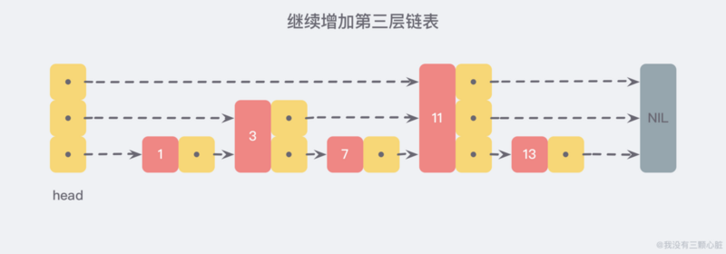
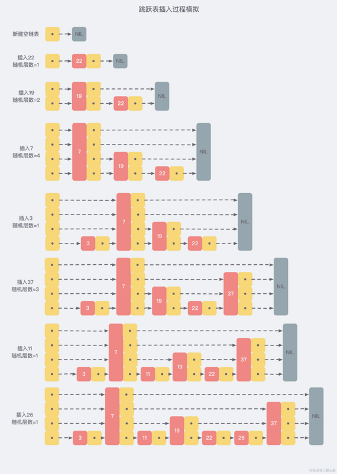
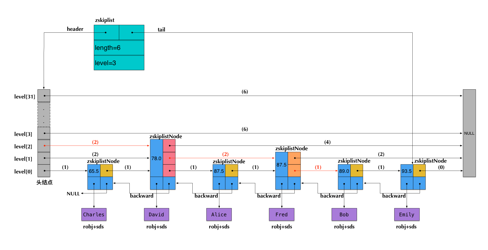

## 跳跃表

当我们设计一个支持随机插入/删除、并且有序的数据结构的时候，首先会想到红黑树/平衡树，然而为什么redis实现zset确用了skiplist
1. 性能考虑，当高并发的时候，红黑树/平衡树需要执行一个rebalance的操作，这个操作涉及整个红黑树/平衡树，而skiplist只涉及局部
2. 实现考虑，在时间复杂度与红黑树相同的情况下，skiplist的实现要比红黑树简单的多

## 本质是解决查找问题

链表的查找是O(n),当我们在每两个相邻接点增加一个指针的话，就变成了二分查找







可以想象，当链表足够长，这样的多层结构就可以帮助我们跳过很多的下层节点，从而加快查找的效率

## 跳跃表

### 查询过程


### 插入原理

当插入数据的时候，会打乱上下两层的节点个数2:1的关系，如果要保持这种关系，就要对后面的所有节点进行调整，就会让时间复杂度退化成0(n),删除数据也是

所以skiplist为了避免这种问题，他不要求相邻两层的节点数具有严格的对应关系，而是**为每一个节点随机出一个层数(level)**

比如随机出来的层数是3，那么就插入第一层到第三层



从上图可以看出来，每个节点的层数(level)是随机出来的，而且插入一个节点只需要修改节点的前后指针，
而不需要对所有节点进行调整(红黑树的rebalance)，所以这个随机算法就很重要了

### 随机层数算法

在分析之前，我们还需要着重指出的是，执行插入操作时计算随机数的过程，是一个很关键的过程，
它对skiplist的统计特性有着很重要的影响。这并不是一个普通的服从均匀分布的随机数，它的计算过程如下：

1. 首先，所有的层都有第一层的指针(每个节点都在第1层链表里)
2. 如果一个节点有第i层(i>=1)指针（即节点已经在第1层到第i层链表中），那么它有第(i+1)层指针的概率为p
3. 节点最大的层数不允许超过一个最大值，记为MaxLevel

!> 在redis中，p = 1/4 ,MaxLevel = 32

这个计算随机层数的伪码如下所示：
```
randomLevel()
    level := 1
    // random()返回一个[0...1)的随机数
    while random() < p and level < MaxLevel do
        level := level + 1
    return level
```

## 平衡树与skiplist

1. 经过一系列的计算，在redis的p = 1/4的情况下，每个节点的平均指针为1.33个，而平衡树有左右两个指针，
所以在这一点上skiplist占优
2. skiplist在范围查找比较有优势，因为每一层都有指向下一层的指针(第一层),范围查找只需要顺序遍历第一层指针就行，
逆序遍历有backward 后退指针，而平衡树的范围查找只能使用中序遍历得到，中序遍历并不容易实现
3. 平衡树的插入和删除可能引发子树的调整，逻辑复杂，而skiplist只需要修改前后节点即可
4. 时间复杂度相同的条件下，算法实现上skiplist比平衡树更简单

## zset的实现

1. 数据较少时，zset使用ziplist实现
2. 数据多的时候，zset使用dict+skiplist实现，dict用来查询数据对应的分数，skiplist实现根据分数查询数据(可能是范围查询)

- zscore的查询，不是由skiplist来提供的，而是由那个dict来提供的。
- 为了支持排名(rank)，Redis里对skiplist做了扩展，使得根据排名能够快速查到数据，或者根据分数查到数据之后，也同时很容易获得排名。而且，根据排名的查找，时间复杂度也为O(log n)。
- zrevrange的查询，是根据排名查数据，由扩展后的skiplist来提供。
- zrevrank是先在dict中由数据查到分数，再拿分数到skiplist中去查找，查到后也同时获得了排名。


所以 redis里面的skiplist是做了一些扩展的，跟传统的skiplist有以下不同

1. score允许重复，即skiplist的key允许重复
2. 在比较时，不仅比较分数(相当于skiplist的key)，还比较数据本身，多个数据分数相同时，会按字典序排序
3. skiplist的第一层是一个双向链表，这是方便以倒序的方式获取一个范围内的元素
4. 在skiplist里面可以很方便的计算出每个元素的排名

```
typedef struct zskiplistNode {
    robj *obj;
    double score;
    struct zskiplistNode *backward;
    struct zskiplistLevel {
        struct zskiplistNode *forward;
        unsigned int span;
    } level[];
} zskiplistNode;

typedef struct zskiplist {
    struct zskiplistNode *header, *tail;
    unsigned long length;
    int level;
} zskiplist;
```

这段代码出自server.h，我们来简要分析一下：

- 开头定义了两个常量，ZSKIPLIST_MAXLEVEL和ZSKIPLIST_P，分别对应我们前面讲到的skiplist的两个参数：一个是MaxLevel，一个是p。
- zskiplistNode定义了skiplist的节点结构。
    - obj字段存放的是节点数据，类型是string robj,zadd命令将数据插入到skiplist的时候，会先进行解码，所以这里一定存储的是一个sds，也方面查找的时候对数据进行字典序比较
    - score 是数据对应的分数
    - backword 是指向链表前一个节点的指针，节点只有一个前向指针，所以只有第一层是双向链表
    - level[] 存放各层链表的下个节点的指针，用forward标识，span表示当前指针跨越了多少个节点，span用于计算排名
- zskiplist定义了真正的skiplist结构，它包含：
    - 头指针header和尾指针tail
    - 链表长度length，即链表总节点个数，新建的skiplist包含一个空的头指针，不计算在length里面
    - level表示skiplist的总层数，即所有节点层数的最大值 
    


上图括号里面的数字代表span的值，也就是该指针跨越了多少个节点，这个技术不包括头指针，所以如果计算Bob的排名的话，score=89.0 
在查找过程中，会累加span的值，找到Bob后，排名=(2+2+1)-1 = 4 减1是因为rank值以0起始，逆序排名的话用skiplist的长度-rank就行了：6-(2+2+1) = 1 


