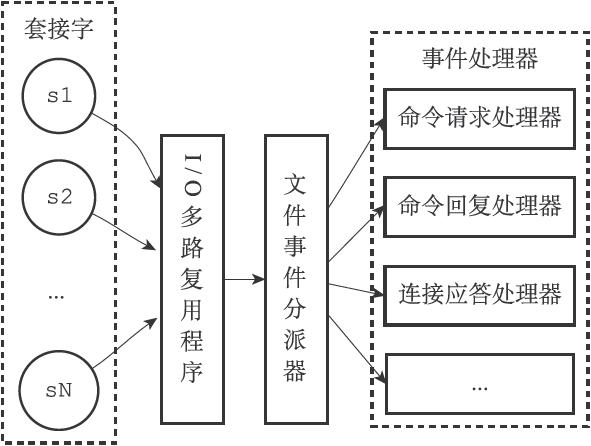
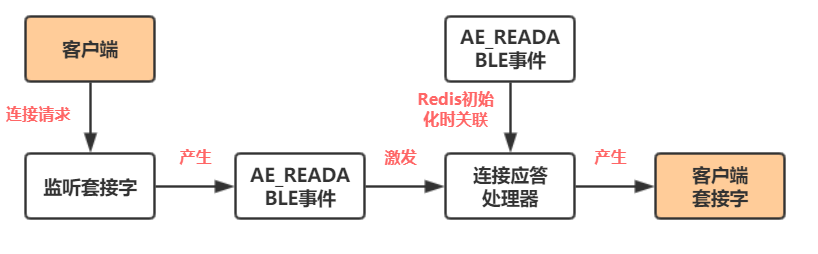
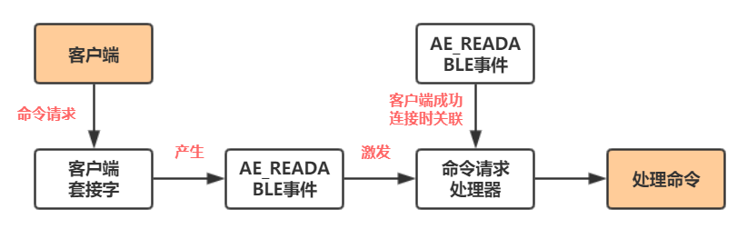
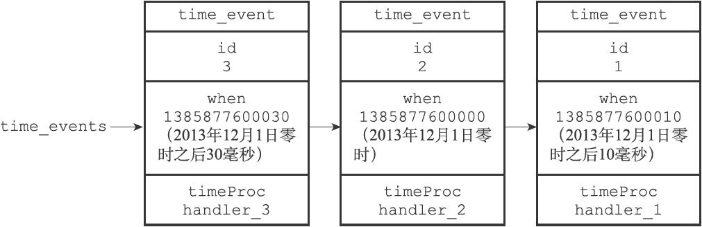
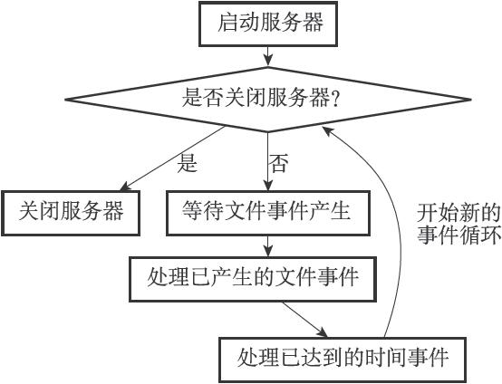
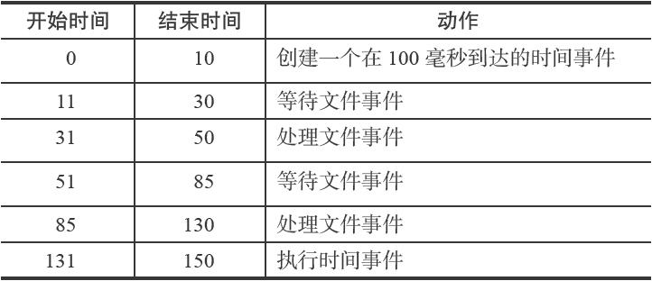

## 前言
redis处理命令是使用单线程处理的，是一个事件驱动程序，分为文件事件和时间事件

- 文件事件:redis服务器通过套接字与客户端进行连接，而文件事件就是服务器对套接字操作的抽象
- 时间事件:一些操作会在给定时间点进行，对这列定时操作的抽象叫做时间事件

## 文件事件
基于Reactor模型开发出来了自己的网络事件分发器，这个处理器叫做：**文件事件处理器**
> Reactor模式用于高并发，依靠事件驱动。传统的线程连接中，IO连接后需要等待客户的请求。而事件驱动中，IO可以干别的事情，等客户发来请求后再处理。

- 文件事件处理器使用I/O多路复用程序来监听多个套接字，并根据套接字目前只需的任务来为套接字关联不同的事件处理器
- 当被监听的套接字准备好只需连接应答(accept)、读取(read)、写入(write)、关闭(close)等操作时,与操作相对应的文件
事件就会产生，这是文件事件处理器就会调用套接字之前关联好的事件处理器来处理这些事件

虽然文件时间处理器是**以单线程方式运行**，但是配合**I/O多路复用**技术，实现了高性能的网络通信模型，又可以很好的与redis服务器
中其他同样以单线程方式运行的模块进行对接，这保持了**redis内部单线程设计的简单性**

### 构成

**套接字、I/O多路复用程序、文件事件分派器（dispatcher），以及事件处理器。**

尽管多个时间会并发的出现，但是I/O多里复用程序会**将所有的事件的套接字都放到一个队列里面，**，然后通过这个队列
，**有序、同步、每次一个套接字**的方式向文件事件分派器传送套接字，**只有上个套接字处理完毕之后，I/O复用程序才会
向分派器传送下一个套接字**

> redis的I/O多路复用程序的所有功能都是包装常见的select、epoll、evport、kqueue这个函数库来实现的

### 事件类型

I/O多路复用程序可以同时监听多个套接字的**ae.h/AE_READABLE**和**ae.h/AE_WRITABLE**这两种事件

- 客户端对套接字执行write操作,客户端对服务器的监听套接字执行connect操作，此时套接字对服务器**变为可读状态**，就会产生**AE_READABLE**事件
- 客户端对套接字执行read操作，此时套接字变为可写状态，产生**AE_WRITABLE**事件

!> 优先处理可写状态

### 事件处理器
**通信的连接应答处理器、命令请求处理器和命令回复处理器**

#### 连接应答处理器
当redis服务器初始化的时候，会将**连接应答处理器**与**服务器监听套接字的AE_READABLE事件**关联起来，当有客户端connect
服务器监听的套接字的时候，就会产生**AE_READABLE事件，引发连接应答器执行**，产生一个**客户端套接字**

#### 命令请求处理器

如上所说，当客户端**通过连接应答处理器成功连接到服务器后**，服务器会将**客户端套接字的AE_READABLE事件**和**命令请求处理器**
关联起来，当客户端向服务器发送命令请求的时候，**套接字就会产生生AE_READABLE事件，引发命令请求处理器执行**

#### 命令回复处理器

**这个处理器负责将服务器执行命令后得到的命令通过套接字返回给客户端**

当服务器有命令回复需要传送给客户端的时候，服务器会将**客户端的套接字的AE_WRITABLE事件**和**命令回复处理器**关联
起来，当客户端准备好接受服务器传回的命令回复时，就会**产生AE_WRITABLE事件**，**引发命令回复处理器执行**

### 时间事件

- **定时事件**：程序在指定事件执行一次
- **周期性事件**：程序每隔一段就执行一次，循环往复

一个时间事件的组成有：
- id：服务器为时间事件创造的全局唯一id，新事件比旧事件号码大
- when：毫秒级UNXI时间戳，记录时间事件到达事件
- timeProc：时间事件处理器，到时间后处理时间

#### 构成
服务器将所有时间事件都放在一个**无序链表**中，每当时间事件执行器运行时，它就**遍历整个链表，查找所有已到达的时间事件**，
并调用相应的事件处理器。

!> 我们说保存时间事件的链表为无序链表，指的不是链表不按ID排序，而是说，**该链表不按when属性的大小排序**

#### severCron函数

持续运行的Redis服务器需要定期对自身的资源和状态进行检查和调整，这些定期操作由redis.c/serverCron函数负责执行，它的主要工作包括：
- 更新服务器统计信息，包括事件、内存占用等情况
- 清理过期键值对
- 关闭和清理失效的客户端连接
- AOF和RDB持久化操作
- 如过sever是主服务器，则对从服务器进行定期同步
- 如果是集群模式，对集群进行定期同步和连接测试

**默认100毫秒执行一次**，用户可以在redis.conf中修改hz选项来改变

#### 事件调度与执行
因为服务器中同时存在文件事件和时间事件两种事件类型，所以服务器必须对这两种事件进行调度，**决定何时应该处理什么文件，
以及花多少时间来处理它们等等**。事件的调度和执行由ae.c/aeProcessEvents函数负责。

对事件处理的原则是：

- 如果等待并处理一次文件事件之后，仍未有任何时间事件到达，那么服务器**再次等待并处理文件事件**
- 对两种事件处理都是**同步、有序、原子**的执行的，服务器**不会中途中断事件处理，也不会对事件进行抢占**，因此需要
尽可能的减少程序的阻塞时间，并且在有需要时主动让出执行权(如果写入字节过多，命令回复器就会break跳出，将余下的数据留到下次)
- 由于不能抢占，时间事件到达后需要等到文件事件处理完成，所以一般会稍晚于到达事件

