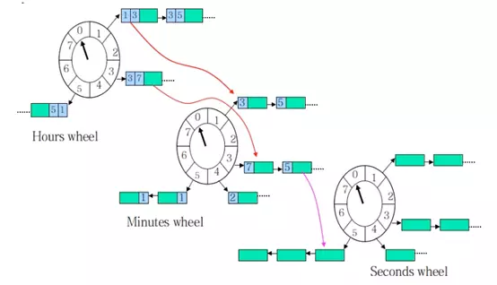

## 前言

因为拼团的业务，需要延迟处理未拼团成功的订单，所以需要一个延迟队列，而larave框架自己实现了延迟队列，用的也是redis的zset，所以就想着自己实现了一个

## 解决方案

### 扫表

就是起一个进程，不断的扫描表，这个方法对数据库的压力太大了，所以就不考虑了

### 时间片轮询

用环形队列做成时间片，环形队列的每个格子里维护一个链表。每个时刻有一个当前指针指向环形队列某个格子，定时器每超时一次，就把当前指针指向下环形队列的下一个格子。然后处理这个格子保存的链表里的任务。如果只是这样维护，如果要做到秒级的粒度，时间长度最长一天，那么这个环形队列就会非常大。因此，有人又有人改进了一下，当存在任务进入队列时，就用时间长度除以环形队列的长度，记为圈数。这样每次遍历到该元素时，将圈数减一，如果减一后为0就执行改任务，否者不执行。

kafka的延时消息的内部实现就是采用时间片轮询的方式来实现的。

但是如果数据量太大的话，链表的元素就非常多，导致遍历链表的时间较长，甚至一个时间片内完不成，因此有人改进了一下，按时间粒度不同划分，粒度为小时的时间轮，粒度为分钟的时间轮，粒度为秒钟的时间轮。小时里的时间轮达到触发的条件后会放到分钟的时间轮里，分钟的时间轮到达触发的条件后会放到秒的时间轮里。(图片来自网络，侵删)

该方案时间片存放在内存，因此轮询起来效率非常高，也可以根据不同的粒度调整时间片，因此也非常灵活。但是该方案需要自己实现持久化与高可用，以及对储存的管理，如果没有现成的轮子开发耗时会比较长。

### Redis的ZSET实现

Redis实现延时任务，是通过其数据结构ZSET来实现的。ZSET会储存一个score和一个value，可以将value按照score进行排序，而SET是无序的。

延时任务的实现分为以下几步来实现：

- 将任务的执行时间作为score，要执行的任务数据作为value，存放在zset中，我这里用订单号作为member，延迟时间作为score
- 用一个进程定时查询zset的score分数最小的元素，可以用ZRANGEBYSCORE key -inf +inf limit 0 1 withscores命令来实现; 
- 如果最小的分数小于等于当前时间戳，就将该任务取出来执行，否则休眠一段时间后再查询

## 具体实现

https://github.com/the-stardust/delay-queue 这是我的github，简单写了一个流程，还无法直接使用，但是核心思想都实现了，可以拿去参考一下，如果有问题可以联系我 wangyuhao2580@gmail.com

大致流程是：
- 启动了多个进程，一个进程对应一个zset的key，不断的从zset里面取出任务，然后分发给一个list队列，这里只做任务的分发，不执行任务，没有任务就休眠
- 启动多个进程，一个进程对应一个key的job，也就是上一步分发任务的list的key，不断取出任务消费
- 如果害怕单点故障，可以对进程进行多机部署，这点我不是很了解，但是是一个解决方案，大家可以自己Google一下
- 如果执行任务失败，可以起一个守护进程专门处理失败的任务，进行重试或者补偿机制

因为业务上拼团成功了，还需要把延迟任务给删除了，所以只有redis最适合我的需求，至于用其他中间件来实现，比如rabbit mq 和kafka，我不太了解这两个东西，所以不做评价，大家自己可以实现一下

## redis的hash环

redis我是使用一致性hash来实现的，网上有很多教程我就不多说了，大概步骤可以参考这个：https://learnku.com/articles/30269

## 参考

https://juejin.im/post/5caf45b96fb9a0688b573d6c
https://learnku.com/articles/30269