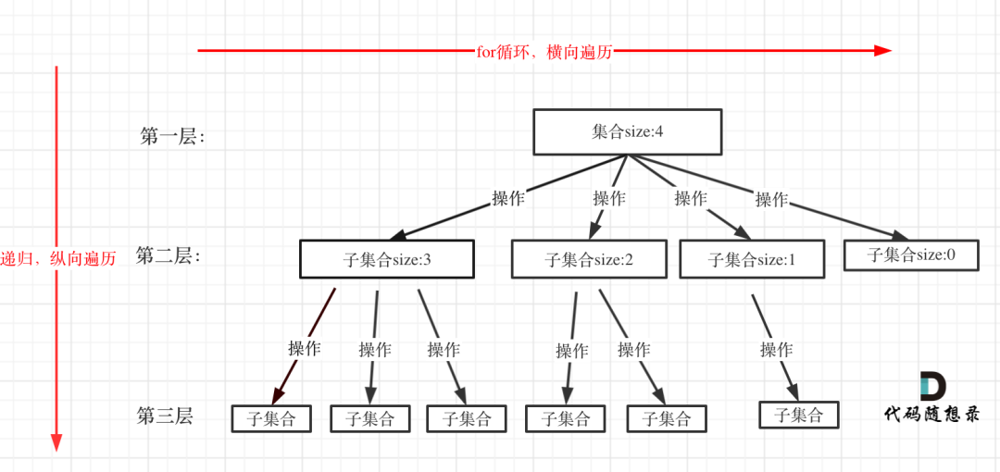

## 概述

回溯就是暴力枚举，可以添加剪枝操作，

!> 回溯问题都可以抽象成一个多叉树,集合的大小构成了树的宽度，递归的深度构成了树的深度

一般来解决
- 组合问题：N个数里面按一定规则找出k个数的组合
- 排列问题：N个数按照一定的规则排序
- 切割问题：一个字符串按一定规则有几种切割方式
- 子集问题：一个N个数的集合，有多少种符合规则的子集
- 棋盘问题：N皇后，解数独等

!> 组合是不强调顺序的，排序是强调顺序的 {1,2}与{2,1}在组合上就是一个集合，在排序问题上就是两个

## 回溯法模板

```
func abc(){
    res := 返回值结构
    // 0 有时候是不需要的
    // 组合问题一般需要 startIndex = 0
    // 全排列问题不需要 startIndex，但是需要 userd 记录以及使用过的元素
    backTracking(参数,startIndex,path,&res)
    return res
}

func backTracking(参数,startIndex,path,res) {
    if 终止条件 {
        tmp := make(数据结构)
        copy(tmp,path)
        *res = append(*res,tmp)
        return 
    }
    // index 有时候是不需要的
    // 如下图 for循环可以理解是横向遍历，backtracking（递归）就是纵向遍历
    for i := startIndex;i < len();i++ { // 做选择
        path = append(path,i) // 处理节点
        backTracking(参数,i+1,path,res)
        path = path[:len(path)-1] // 回溯,撤销处理结果
    }
}
```



## 去重

去重分为树层去重和树枝去重

### 树层去重

比如 leetcode 40题，组合求和

.png)

树层去重表示，在同一层，已经使用过了，就不能再使用了 ,第二层中，第一次取了1，第二次就不能取1了

一般都是先对参数进行排序 然后在for 循环里面进行判断 i > 0 && nums[i] == nums[i-1] continue

### 树枝去重

树枝去重一般表示给定参数中有重复数据，在结果集中，同一个元素不能出现在同一个结果里面
```
    [
      [1, 7],
      [1, 2, 5],
      [2, 6],
      [1, 1, 6] // 这个结果就不行 [1,6才行]
    ]
``` 

## 总结

- 组合问题一般需要 startIndex = 0; 一个集合求组合需要startIndex，但是多个集合求组合就不需要了 比如 电话号码组合
``` 
    for i = index;i < size;i++ 
```
- 排列问题不需要 startIndex; for i = 0;i < size;i++ 但是需要一个visit map 记录以及使用过的元素 
``` 
    for i = index;i < size;i++ {
        if visit[i] {
            continue
        }
    }
```
- 排序问题如果给定集合包含重复元素，一般需要对集合进行排序，然后在 backTracking里面的for循环里面 
进行判断,相邻元素如果相等,因为程序是从左往右进行选择的，所以相等元素一定是第一个先选择
```
    if visit[i] == true || (i > index && nums[i] == nums[i-1] && visit[i-1] == false) {
        continue
    }
```

- 切割问题，可以抽象为组合问题，需要一个startIndex，并且 终止条件是切割完毕 也就是 startIndex = len(s) 的时候

- 子集问题，需要startIndex就是求所有树的节点值，并不是叶子节点值，如果给定集合有重复数据的话，进行sort后，然后在for里面判断是否使用过，
visit[i] == true  或者是 i > startIndex && nums[i] == nums[i-1] && visit[i-1] == false 就continue ，
因为遍历是从左到右，如果元素相同并且左边元素还没使用，就需要跳过


