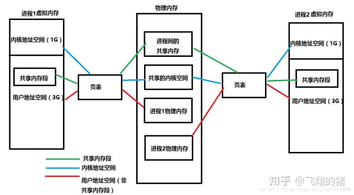

## 进程、线程、协程

- 进程是系统资源分配(cpu时间，内存等资源)的最小单位，线程是系统调度(cpu调度)的最小单位，进程主要由程序、数据集合、进程控制块三部分组成，协程是用户态线程，本质上就是一个结构体(数据结构)，大概只有几kb
- 进程间通信的方法有：共享内存、信号、信号量、消息队列、管道、套接字socket
- 进程崩溃了不会影响其他进程，线程崩溃了，整个进程就崩溃了
- 进程拥有自己的内存空间，在传统的32位机器上，是4g，0-3g是用户内存空间，第4g是内核空间，linux利用虚拟内存技术，把进程的
内存空间地址映射到真正的物理内存地址，解决了在小内存机器上运行多个进程的问题
- 线程是操作系统的内核对象，线程共享进程的内存空间，线程有独立的堆栈空间和局部变量
- 进程的切换涉及内核栈和硬件上下文，切换页目录以使用新的地址空间
- 线程的切换不需要切换地址空间，线程共享进程的地址空间，但是需要内核态和用户态的频繁切换，寄存器、pc、sp、等寄存器的刷新，因为只有内核可以进行线程的调度，资源消耗也不小
而协程是用户程序进行调度，内核无感知，内核根本不知道协程的存在，所以少了很多上下文的切换开销，goruntine只需要修改三个寄存器的值oc/sp/dx

!> golang的协程和linux的协程不一样，goruntine比协程更强大

## 虚拟内存

物理内存是有限的，程序寻址如果使用物理内存，那么在32位平台下，最大寻址空间是4g，如果没有虚拟内存，
每个程序都需要给4g的物理内存，但是物理内存是有限的，那么一台机器上运行多个进程，就需要等待，并且程序直接修改物理内存，
这样子也不安全

- 虚拟内存空间其实就是用户空间，进程分配了4g内存，3g给用户空间，1g给内核空间，因为程序有需要系统调用，需要内核来跑，
这一部分必须要留给内核,内核空间是是所有进程共享的，用户空间是私有的
- 进程访问内存空间的某个地址，则需要把虚拟地址翻译成实际的物理内存地址
- 所有进程共享一个物理内存地址，每个进程只把自己目前需要的虚拟内存空间映射并存储到物理内存上
- 进程需要知道哪些内存地址上的数据在物理内存上，哪些不在，就需要一个东西来记录，这就是页表，
页表分为两部分，一部分代表是否在物理内存上，第二部分记录物理内存也的地址(如果在的话)
- 当进程访问某个虚拟内存，去看页表，发现对应的数据不在页表上，会发生缺页异常，系统进入内核态
- 缺页异常的处理就是把进程需要的数据从磁盘拉取到内存，如果内存已经满了，就选择一个页进行覆盖，如果被覆盖的页被修改过，需要先将此页写回磁盘

### 虚拟内存的好处

- 既然每个进程的内存空间都是一致而且固定的，所以链接器在链接可执行文件时，可以设定内存地址，而不用去管这些数据最终实际的内存地址，这是有独立内存空间的好处
- 当不同进程使用相同的代码的时候，比如库文件的代码，物理内存中只需要存储一份就行了，然后不同的进程只需要把自己的虚拟内存映射到同一物理内存上就可以了，节省内存
- 当程序需要分配连续的内存空间的时候，只需要在虚拟内存空间分配连续空间，而不需要实际物理内存的连续空间，可以利用碎片

### 页表

虚拟内存与物理内存进行映射，需要一个东西来存储他们的映射关系，于是设计了页表

- 一般linux的页大小为4kb，程序拥有4gb的虚拟内存，如果一一对应的话，需要4gb/4kb = 1mb页的页表，这对于程序也是一种负担
，所以就出现了多级页表
- linux一般是三级页表 pgb(页目录，顶级页表)、pmb(中间页目录)、pte(页表)
- PGD为顶级页表，是一个pgd_t数据类型（定义在文件linux/include/page.h中）的数组，每个数组元素指向一个中间页目录；
PMD为二级页表，是一个pmd_t数据结构的数组，每个数组元素指向一个页表；PTE则是页表，是一个pte_t数据类型的数组，每个元素中含有物理地址。
