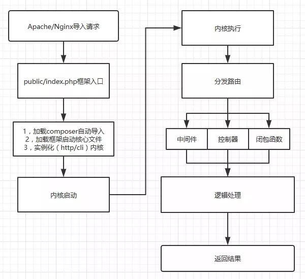

## 生命周期
流程图如下：


laravel的index.php代码如下：
```php
define('LARAVEL_START', microtime(true));

require __DIR__.'/../vendor/autoload.php';

$app = require_once __DIR__.'/../bootstrap/app.php';

$kernel = $app->make(Illuminate\Contracts\Http\Kernel::class);

$response = $kernel->handle(
    $request = Illuminate\Http\Request::capture()
);

$response->send();

$kernel->terminate($request, $response);
```
1. 定义了laravel的请求开始时间 
2. composer自动加载
3. 启动了Ioc容器
    - 注册基础服务
    - 注册基础服务提供者
    - 注册容器核心别名
4. 绑定内核，注册异常处理，
5. 创建内核实例 kernel
6. 通过Request获取一个request实例，然后输入内核处理，最后输出一个http响应
    - 解析内核，实例化内核
    - 将中间件组注册到路由器
    - 创建请求实例
    - 处理请求 handel
        - 首先将$request注册打破APP容器
        - 清除之前$request实例缓存
        - 启动引导程序(环境检测、配置加载、异常处理、Facades 注册、服务提供者注册、启动服务)
        - 发送请求至路由，通过管道技术将$request进行中间件过滤(array_reduce)
        - 处理业务逻辑
7. 返回结果给控制器
8. 执行比较耗时的请求    
 
## 服务提供者
### 依赖注入与控制翻转

简单来讲就是一个实例需要依赖另一个实例的话，就把依赖关系通过构造函数或者参数传入到实例中去，而不是在一个实例里面创建
的，这就叫依赖注入，把依赖关系交给外部，这就是控制翻转

### 服务容器Ioc

laravel其实就是一个大容器，当框架启动的时候，把我们编写的服务提供者，先bind起来，但是不实例化，所以bind的时候是返回
一个创建实例的闭包，当真正需要使用的实例的时候，进行make解析，也就是调用实例的闭包函数创建实例

下面简单写一个通过反射机制来创建的ioc容器实例

```php
// 日志记录接口
interface log
{
    public function write();
}

// 文件记录日志
class FileLog implements Log
{
    public function write(){
        echo 'file log write...';
    }
}

// 数据库记录日志
class DatabaseLog implements Log
{
    public function write(){
        echo 'database log write...';
    }
}
// 服务提供者User
class User
{
    protected $log;
    public function __construct(Log $log)
    {
        $this->log = $log;
    }
    public function login()
    {
        // 登录成功，记录登录日志
        echo 'login success...';
        $this->log->write();
    }
}
// 简单Ioc实现流程
class Ioc
{
    public $binding = [];

    public function bind($abstract, $concrete)
    {
        //这里为什么要返回一个closure呢？因为bind的时候还不需要创建User对象，所以采用closure等make的时候再创建FileLog;
        $this->binding[$abstract]['concrete'] = function ($ioc) use ($concrete) {
            return $ioc->build($concrete);
        };

    }

    public function make($abstract)
    {
        // 根据key获取binding的值
        $concrete = $this->binding[$abstract]['concrete'];
        return $concrete($this);
    }

    // 创建对象
    public function build($concrete) {
        $reflector = new ReflectionClass($concrete);
        $constructor = $reflector->getConstructor();
        // 如果没有构造函数，就直接返回 new 的实例
        if(is_null($constructor)) {
            return $reflector->newInstance();
        }else {
            // 如果有构造函数，获取他的参数
            $dependencies = $constructor->getParameters();
            // 这里递归的调用，查看参数是否也需要反射 
            $instances = $this->getDependencies($dependencies);
            return $reflector->newInstanceArgs($instances);
        }
    }

    // 获取参数的依赖
    protected function getDependencies($paramters) {
        $dependencies = [];
        foreach ($paramters as $paramter) {
            $dependencies[] = $this->make($paramter->getClass()->name);
        }
        return $dependencies;
    }

}

//实例化IoC容器
$ioc = new Ioc();
// 使用日志记录就bind log
// 使用数据库记录就bind database
$ioc->bind('log','FileLog');
$ioc->bind('user','User');
$user = $ioc->make('user');
$user->login();
```

1. Ioc容器维护binding数组记录bind方法传入的键值对如:log=>FileLog, user=>User
2. 在ioc->make('user')的时候，通过反射拿到User的构造函数，拿到构造函数的参数，发现参数是User的构造函数参数log,然后根据log得到FileLog。
3. 这时候我们只需要通过反射机制创建 $filelog = new FileLog();
4. 通过newInstanceArgs然后再去创建new User($filelog);


