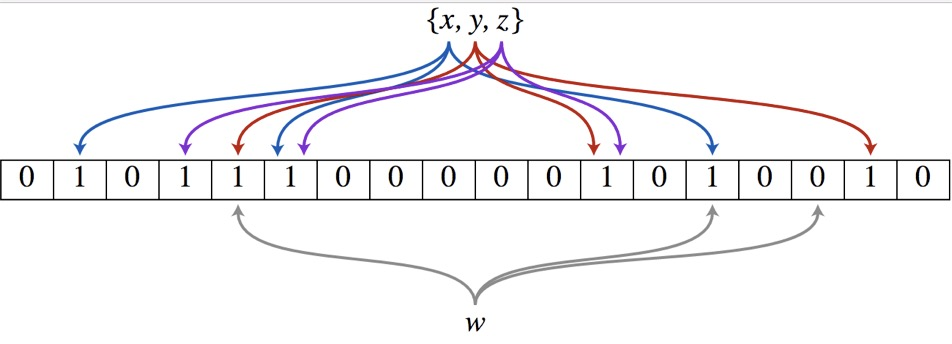

## 前言

当我们网站遇到大并发量当时候，都会选择使用缓存来缓解数据库当压力，比如memcache、redis等非关系型数据库，但是缓存也会存在一些问题比如缓存击穿、缓存穿透、缓存雪崩、热点数据集中失效等问题

## 缓存穿透

### 什么是缓存穿透

正常我们访问数据的时候，会先去查询缓存，如果缓存存在的话，正常返回，如果缓存不存在的话，就会去查询数据库

但是当有人恶意查询一个缓存中永远不会存在的一个key的时候，请求就一值打到数据库上面，从而拖垮数据库，这就是缓存穿透

### 解决方案

#### 缓存空值

	之所以我们会查询数据库，是因为缓存中没有这个数据，数据库也没有，所以才会一直查询数据库，所以不如我们把空值也给缓存起来，下次查询的时候返回缓存的空值就行来，这样就解放了数据库，但是也别忘了设置过期时间，不然这些key越来越多会占用大量的内存空间

#### 布隆过滤器(BloomFilter)

	这种方案可以加在第一种方案中，在缓存之前在加一层 BloomFilter ，在查询的时候先去 BloomFilter 去查询 key 是否存在，如果不存在就直接返回，存在再走查缓存 -> 查 DB。
    
#### 布隆过滤器
    
- 巴顿.布隆于一九七零年提出
- 一个很长的二进制向量 （位数组）
- 一系列随机函数 (哈希)
- 空间效率和查询效率高
- 有一定的误判率（哈希表是精确匹配）

布隆过滤器是一个 bit 向量或者说 bit 数组 也叫 位数组，长这样：

1. 首选初始化一个bit数组，把每一位都设置成0
2. 如果想要存储值{x,y,z}到位数组中，依次把x,y,z每个元素分别经过多个不同的哈希函数生成多个哈希值，每个哈希值对应一个数组下标，把数组当前下标的值设置为1
3. 判断w是否在集合中也是先经过多个不同的哈希函数生成多个哈希值，通过哈希值判断位数组下标的值，如果全部都为1，说明这个值存在于集合中，只要有一个不为1，我们就说这个值不存在于这个集合中

!> 所以说布隆过滤器存在一定的误判率，当数组越大时，误判率越低，数组越小误判率越高

## 缓存击穿

### 什么是缓存击穿

缓存击穿也是我们使用缓存经常需要面临的一个问题，他产生原因是，某一时刻大量的请求都查询同一个key，并且这个key在这个时间点刚好失效，所以这个时刻大量的请求就会打到数据库上面

### 解决方案

产生的原因是大量的请求去请求缓存中失效的key，然后都去查询了数据库，所以我们可以使用一个分布式锁来控制，只有一个请求去请求数据库，请求完成之后就缓存到redis里面，其他请求没有拿到锁的话，就阻塞等待缓存重新生效

## 缓存雪崩

### 什么是缓存雪崩

缓存雪崩和缓存击穿非常相似，缓存雪崩是在同一时刻，大量的key同时失效，所以请求都会打到数据库上面，从而拖垮数据库

与缓存击穿的区别在于是多个key而缓存击穿是一个key

### 解决方案

我们可以在给缓存添加过期时间但时候，可以随机加上1-5分钟，使大量但key但过期时间分散开来，这样就可以缓解数据库但压力了，这样每一个缓存的过期时间的重复率就会降低，就很难引发集体失效的事件。

    