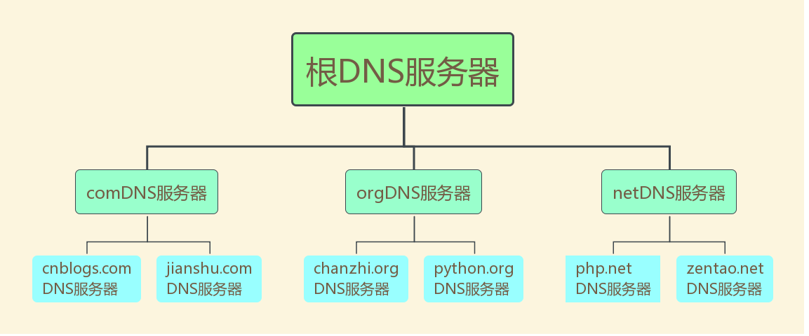
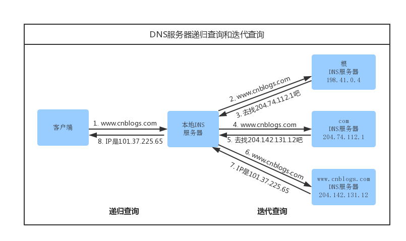
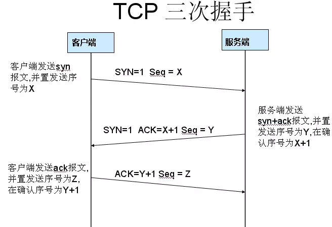
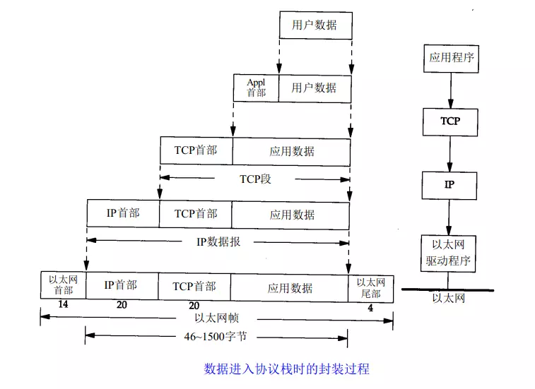
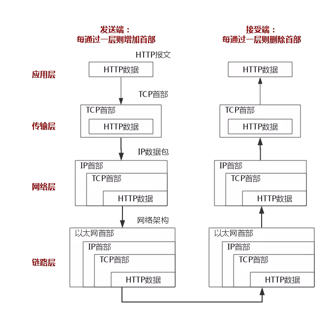
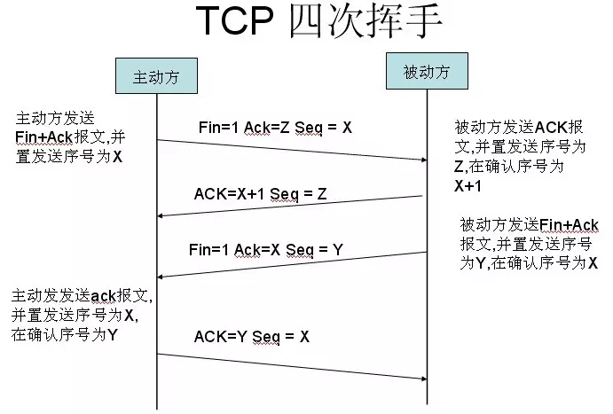

## 前言

这个问题在面试中，特别是web开发，有很大几率被问到，并且这是一个考察一个软件工程师全面素质的面试题

## DNS

一个条url从浏览器输入之后，首先进入到DNS阶段

1. 首先电脑会先到你到hosts文件中去，查询这条url有没有对应到域名，如果有的花，就直接解析这个域名到ip地址如果没有到花，就去找DNS服务器

2. DNS分为好几级，会进行递归查询，如下图：

3. 现在本地DNS服务器查找，如果本地有DNS缓存会直接返回ip地址

4. 本地DNS服务器没有，就去会根DNS服务器找

5. 根名称服务器收到DNS请求后，把所查询得到的所请求的DNS域名中顶级域名所对应的顶级DNS服务器地址返回给本地名称服务器

6. 本地名称服务器根据根名称服务器所返回的顶级名称服务器地址，向对应的顶级名称服务器发送与前面一样的DNS域名查询请求

7. 对应的顶级名称服务器在收到DNS查询请求后，也是先查询自己的缓存，如果有所请求的DNS域名的记录项，则相接把对应的记录项返回给本地DNS服务器，然后再由本地名称服务器返回给DNS客户端，否则向本地名称服务器返回所请求的DNS域名中的二级域名所对应的二级名称DNS服务器地址

8. 然后本地名称服务器继续按照前面介绍的方法一次次地向三级、四级名称服务器查询，直到最终的对应域名所在区域的权威名称服务器返回到最终的记录给本地名称服务器。然后再由本地名称服务器返回给DNS客户，同时本地名称服务器会缓存本次查询得到的记录项。

## TCP阶段

费尽心思拿到了服务器到ip地址后，就会开始建立tcp连接

建立tcp连接要经过三次握手，首先服务器肯定要处于监听的状态 listen

1. 客户端发送包含syn=1，seq=x 到syn数据包给服务器，这是第一次握手，客户端现在的状态变为syn_send
2. 服务端接收到syn数据包之后，如果没有什么问题，就发送一个包含syn=1,seq=y,ack=1,acknum=x+1的 syn/ack数据包给客户端，这是服务端的状态变为 syn_rcvd
3. 客户端收到这个包之后，会发送一个握手结束的ack数据包，内容大致有ack=1，ack=y+1, 发送完之后客户端状态变为established，服务器也变为established状态，第三次握手结束

为什么要三次握手

**为了防止已失效的连接请求报文段突然又传送到了服务端，因而产生错误。**

## http请求阶段

>如果使用https协议的花，还要进行tls/ttl协议的验证，证书验证等，有兴趣的同学自己可以查询相关知识

下图展示一次完成的http请求过程

1. 首先进入http协议的包装，请求行包含请求方法、url、http版本等信息，请求头部会附加一些比如host、user-agent、connection属性等等，当请求方法为post的时候会携带请求数据，当请求方法为get的时候没有请求数据部分，
2. 然后发送到tcp协议层，tcp协议会为数据包添加tcp首部，包含源端口号和目的端口号等信息
3. 然后到了ip协议层，ip协议会添加ip首部，包含源ip地址和目的ip地址等信息
4. 然后到了链路层，会添加以太网首部和以太网尾部信息，上图并没有画出，大致包含源mac地址新和目标mac地址信息
	- 这里的目标mac信息并不是最终的服务器的mac信息，因为现在还不知道呢，我们知道ttl,意思是数据包在网络里面传递的多少跳，这里的每一跳大致代表一个路由器信息，而目的mac地址填写的就是下一跳的mac地址
5. 然后数据包就会在网络世界里面进行寻址，每经过一跳，当时的路由器会把以太网协议封装的那一层给剥开，查看目的mac信息，然后指定下一跳的mac信息，重新包装一层以太网协议信息，发送到下一跳
6. 然后信息发送到了目标服务器的目标端口上面

## 服务器处理阶段

服务器端接收到了这个请求，准确应该说是web服务器，类似nginx、apache、IIS等，web服务器会解析用户请求，进行请求转发，如果是静态文件请求，直接会返回给客户端，如果是动态请求，会转发给上游服务器进行处理，拿到上游服务器的响应后返回给客户端

我有篇博客是详细介绍 nginx、php-fpm、php是如何协作处理请求的，讲解了cgi fast-cgi等知识，需要的话请移步到 http://blogs.xinghe.art/post/8bb2eeea.html ，这里不做详细赘述

## 返回响应阶段

在http里，有请求就有响应，错误也会有错误响应

响应结果会包含一个状态码，有100/200/301/404/502等分类

1. 1xx 代表请求已经正在处理了
2. 2xx 代表正常响应，成功状态码，代表请求正常处理完毕
3. 3xx 一般代表重定向的状态码
	- 302 临时重定向 
    - 301 永久重定向
4. 4xx 代表错误响应码
	- 400 bad request 请求参数有误、语义有误，服务器无法处理
	- 401 Unauthorized 用户认证失败或者未认证 
    - 403 forbidden 请求被服务器拒绝
    - 404 not found 请求资源不存在，资源错误
    - 405 method not allow 请求方法不被允许
    - 408 request timeout 请求超时
    - 429 too many request laravel框架  一分钟内请求太多次数
5. 5xx 服务器错误
	- 500 internal server error 服务器内部错误，一般是代码错误
    - 501 请求方法不被服务器支持，只有GET和HEAD是要求服务器支持的，它们必定不会返回此错误代码。
    - 502 bad gateway 错误网关，一般是nginx挂了 或者类似php-fpm的进程管理没有启动
    - 503 service unavailable 服务器没有准备好处理请求。 常见原因是服务器因维护或重载而停机
    - 504 gateway time 网关超时 php如果执行超过配置的脚本执行时间就会报504
    
## 关闭连接阶段

tcp四次挥手阶段，客户端和服务端都可以主动关闭tcp连接，因为tcp是全双工的，一方关闭一方不关闭，代表半关闭状态，此时主动关闭一方可以接收消息不能发送消息

这里暂定客户端为主动关闭，服务端为被动关闭，其实都一样的

1. 客户端主动关闭，发送fin=1，seq=x的数据包，然后状态变成fin_wait1

2. 服务器接收到客户端发来到fin包之后，然后发送一个确定关闭包ack=1,acknum=x+1，表示我接收到了你到断开请求了，此时处理半关闭状态，服务器还可以发送消息给客户端，客户端可以接收消息但不能发送消息，
	- 但并不是服务端就会马上关闭请求
    - 如果此时服务器还有为发送完成到报文，会继续发送，等到发送完了之后，才会再次发送给客户端到关闭请求

3. 客户端接收到服务端到ack数据包后，就会进入到fin_wait2阶段，此状态很难观察到，因为服务端一般会马上发送关闭请求

4. 服务端主动发送fin=1,seq=y确认包，此时状态变为last_ack，等待最后一个ack包

5. 客户端接收到服务端发送到fin包后，状态变为close_wait

6. 然后客户端马上就会发送一个确认关闭连接到包ack=1，acknum=y+1,然后进入到time-wait状态，等待2msl时间后才close连接

7. 服务端接收到客户端到ack数据包后，关闭连接，close，如果服务端因为网络等原因没有收到ack，会重新发送一个消息给客户端，要求客户端重新发送ack

8. 这是客户端处于time_wait状态，就是为了解决这样的问题，此时会重新发送一个ack数据包，服务端接收到之后关闭连接，然后客户端等待2msl后也会关闭连接

**time_wait就是为了让关闭连接更加可靠，可以重新编译linux内核修改msl的值**

## 浏览器解析响应阶段

浏览器接收到响应之后，比如有html、css、js等，还要加载图片、视频等信息

浏览器解析html，生成DOM树，解析CSS生成CSS规则树，然后结合生成渲染树，这一阶段就不细讲了，我也不是专业前端人事，不是很懂，有兴趣的同学可以自行Google
    
## 参考

https://blog.csdn.net/lycb_gz/article/details/11720247
https://www.imooc.com/article/21340
https://juejin.im/entry/58ce00c5ac502e00589b4bde
https://blog.csdn.net/prsniper/article/details/6762145