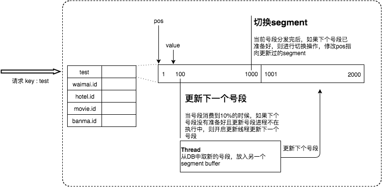

## 背景

在复杂分布式系统中，往往需要对大量的数据和消息进行唯一标识。此时一个能够生成全局唯一ID的系统是非常必要的，以下对id的要求有：
- 全局唯一性
- 趋势递增，mysql的索引机制要求我们尽量使用短小并且有序的主键，可以提高写入性能
- 单调递增：保证下一个id比上一个大
- 信息安全：如果id是连续的，恶意用户爬取工作就很容易了

这个id生成系统也要有指标：
- 平局延迟和TP999要尽可能低
- 可用性99999
- 高qps

## UUID

UUID是业界早已出现的方式，包含32个16进制数字，形式为8-4-4-4-12的36个字符，例如 550e8400-e29b-41d4-a716-446655440000
优点：
- 性能高，本地生成，没有网络消耗
缺点：
- 不易于存储，16字节128位，通常以36长度的字符串表示，很多场景不适用
- 信息不安全：基于mac地址生成的uuid算法可能会造成mac地址泄漏
- id作为主键在特定环境下会有问题
    1. mysql官方明确表示主键要越短越好，明显UUID36个字符不符合
    2. mysql索引不利，如果作为主键，innodb引擎下，UUID的无序性可能会引起数据位置的频繁波动，严重影响性能

## 类snowflake方案
这种方案把64-bit分别划分成多段，分开来标示机器、时间等


41-bit的时间可以表示（1L<<41）/(1000L*3600*24*365)=69年的时间，10-bit机器可以分别表示1024台机器。
如果我们对IDC划分有需求，还可以将10-bit分5-bit给IDC，分5-bit给工作机器。这样就可以表示32个IDC，
每个IDC下可以有32台机器，可以根据自身需求定义。12个自增序列号可以表示2^12个ID，
**理论上snowflake方案的QPS约为409.6w/s**，这种分配方式可以保证在任何一个IDC的任何一台机器在任意毫秒内生成的ID都是不同的

优点：
- 毫秒数在高位，自增序列在低位，真个id都是趋势递增的
- 不依赖数据库等第三方系统，以服务的方式部署，稳定性更高，生成id的性能也是非常高的
- 可以根据自身业务特性分配bit位，非常灵活
缺点：
- 强依赖机器时钟，如果机器时钟回拨，会导致发号重复或者服务会处于不可以状态

### 应用举例
[Mongdb objectID](https://docs.mongodb.com/manual/reference/method/ObjectId/#description)：可以算作是和snowflake类似方法，通过“时间+机器码+pid+inc”共12个字节，通过4+3+2+3的方式
最终标识成一个24长度的十六进制字符

## 数据库生成
以MySQL举例，利用给字段设置auto_increment_increment和auto_increment_offset来保证ID自增，
每次业务使用下列SQL读写MySQL得到ID号。
```sql
begin;
REPLACE INTO Tickets64 (stub) VALUES ('a');
SELECT LAST_INSERT_ID();
commit;
```
优点：
- 非常简单，不用加入其他第三方系统，成本小
- id单调自增，可以实现对对id有特殊要求的业务
缺点：
- 强依赖DB，当DB异常时整个系统不可用，属于致命问题，配置主从复制尽可能的增加可用性，但是数据一致性在特殊情况下
难以保证，主从切换时的不一致可能导致重复发号
- id发号性能瓶颈限制在单台mysql的读写性能

对于MySQL性能问题，可用如下方案解决：在分布式系统中我们可以多部署几台机器，每台机器设置不同的初始值，且步长和机器数相等。
比如有两台机器。设置步长step为2，TicketServer1的初始值为1（1，3，5，7，9，11…）、TicketServer2的初始值为2（2，4，6，8，10…）

这种架构貌似能够满足性能的需求，但有以下几个缺点：

- 水平扩展比较难
- id没有了单调递增的特性，只能趋势递增
- 数据库压力还是很大，每次获取id就读写一次数据库

## 美团leaf方案

### Leaf-segment数据库方案

既然数据库方案的数据库读写压力较大，那就给中间加个proxy层，每次获取一批id到本地缓存，然后慢慢发放，发放完了再去数据库获取

表设计如下：
```sql
+-------------+--------------+------+-----+-------------------+-----------------------------+
| Field       | Type         | Null | Key | Default           | Extra                       |
+-------------+--------------+------+-----+-------------------+-----------------------------+
| biz_tag     | varchar(128) | NO   | PRI |                   |                             |
| max_id      | bigint(20)   | NO   |     | 1                 |                             |
| step        | int(11)      | NO   |     | NULL              |                             |
| desc        | varchar(256) | YES  |     | NULL              |                             |
| update_time | timestamp    | NO   |     | CURRENT_TIMESTAMP | on update CURRENT_TIMESTAMP |
+-------------+--------------+------+-----+-------------------+-----------------------------+
```
- biz_tag用来区分不同业务
- max_id代表当前已分配的最大id
- step表示每次分配的长度：只要把step设置的足够大，读写压力就变为原来的1/step


更新号段的SQL语句如下：
```sql
Begin
UPDATE table SET max_id=max_id+step WHERE biz_tag=xxx
SELECT tag, max_id, step FROM table WHERE biz_tag=xxx
Commit
```
优点：
- Leaf服务可以很方便的线性扩展，性能完全能够支撑大多数业务场景。
- ID号码是趋势递增的8byte的64位数字，满足上述数据库存储的主键要求。
- 容灾性高：Leaf服务内部有号段缓存，即使DB宕机，短时间内Leaf仍能正常对外提供服务。
- 可以自定义max_id的大小，非常方便业务从原有的ID方式上迁移过来
缺点：
- ID号码不够随机，能够泄露发号数量的信息，不太安全。
- TP999数据波动大，当号段使用完之后还是会hang在更新数据库的I/O上，tg999数据会出现偶尔的尖刺。
- DB宕机会造成整个系统不可用。

### 双buffer优化
针对TP999的缺点，进行优化

在当前一批号段使用完之前，就去获取一批id，缓存到第二个segment中，等到用完了这一批号段，直接切换segment为第二个，
然后在第二批用完之前，再去获取一批，循环往复，可以降低系统的TP999指标


### 高可用容灾

针对DB可用性可以部署一主两从，同事分机房部署，master和slave采用**半同步复制**

